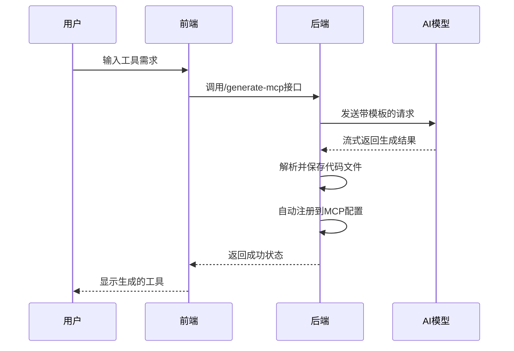
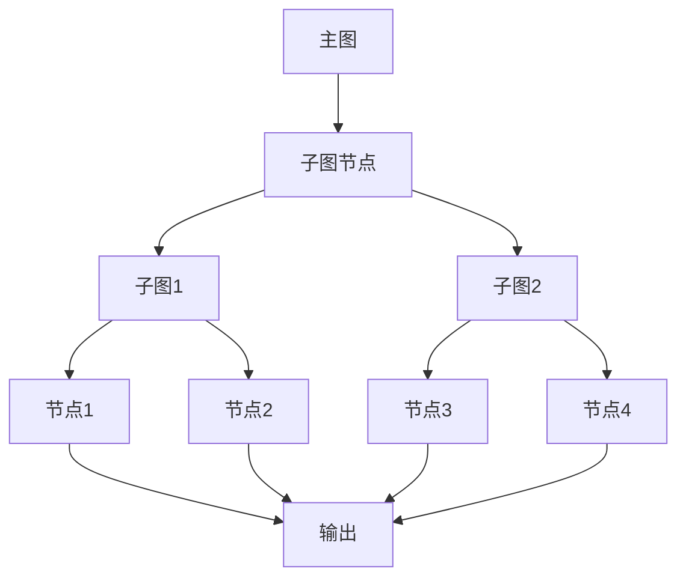
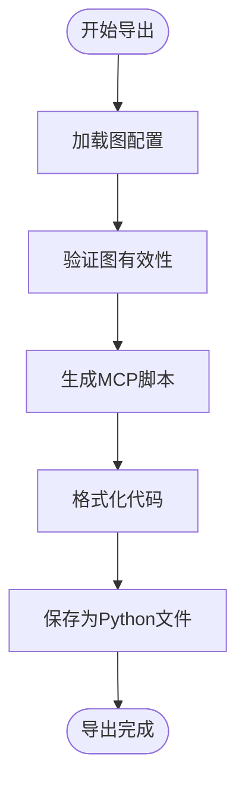

# 核心功能

<cite>
**本文档引用的文件**  
- [ai_graph_generator.py](file://mag/app/services/graph/ai_graph_generator.py)
- [ai_mcp_generator.py](file://mag/app/services/mcp/ai_mcp_generator.py)
- [graph_processor.py](file://mag/app/services/graph/graph_processor.py)
- [graph_service.py](file://mag/app/services/graph_service.py)
- [graph_gen_routes.py](file://mag/app/api/graph_gen_routes.py)
- [mcp_routes.py](file://mag/app/api/mcp_routes.py)
- [GraphCanvas.tsx](file://frontend/src/components/graph-editor/GraphCanvas.tsx)
- [graph.ts](file://frontend/src/types/graph.ts)
- [mcp_generator_template.md](file://mag/app/templates/mcp_generator_template.md)
- [prompt_template.md](file://mag/app/templates/prompt_template.md)
</cite>

## 目录
1. [需求到Agent生成](#需求到agent生成)
2. [AI生成MCP工具](#ai生成mcp工具)
3. [图嵌套图](#图嵌套图)
4. [图导出为MCP服务](#图导出为mcp服务)
5. [功能协同与开发闭环](#功能协同与开发闭环)

## 需求到Agent生成

该功能允许用户通过自然语言描述需求，系统利用AI自动生成可视化的工作流图（Agent）。用户无需手动创建节点或配置流程，只需输入需求，系统即可自动完成图的生成。

系统通过`AIGraphGenerator`类实现AI图生成逻辑，结合多轮交互式对话，逐步完善图的配置。生成过程包括需求分析、节点规划、工具选择、模型配置等阶段，最终生成包含完整节点、连接关系和提示词的可执行工作流。前端通过`GraphCanvas`组件渲染生成的图，每个节点包含名称、描述、模型、调用的MCP工具等信息。

**Section sources**
- [ai_graph_generator.py](file://mag/app/services/graph/ai_graph_generator.py#L1-L587)
- [graph_gen_routes.py](file://mag/app/api/graph_gen_routes.py#L243-L301)
- [GraphCanvas.tsx](file://frontend/src/components/graph-editor/GraphCanvas.tsx#L334-L381)
- [graph.ts](file://frontend/src/types/graph.ts#L0-L65)

## AI生成MCP工具

该功能允许用户通过自然语言描述来生成符合MCP协议的工具代码。用户无需了解MCP协议细节或编写代码，只需描述工具的功能需求，系统即可自动生成完整的Python代码、依赖配置和文档。

系统通过`AIMCPGenerator`类实现AI生成MCP工具的逻辑。生成过程基于`mcp_generator_template.md`模板，结合现有工具信息，引导AI生成符合规范的代码。生成的工具包含主脚本、虚拟环境配置、依赖列表和README文档，并自动注册到系统配置中，供其他Agent调用。

**Diagram sources**
- [ai_mcp_generator.py](file://mag/app/services/mcp/ai_mcp_generator.py#L1-L619)
- [mcp_routes.py](file://mag/app/api/mcp_routes.py#L465-L501)
- [mcp_generator_template.md](file://mag/app/templates/mcp_generator_template.md#L0-L65)

## 图嵌套图

该功能实现"图中图"的分层建模能力，允许将一个完整的图作为另一个图中的单个节点使用。这使得复杂系统可以被分解为多个可复用的子模块，实现真正的模块化开发。

系统通过`GraphProcessor`类的`_expand_subgraph_node`方法实现子图展开逻辑。当节点的`is_subgraph`属性为`true`时，系统会递归加载子图配置，并将其节点展开到父图中，同时处理输入输出连接关系。子图的"start"节点被替换为父图的输入连接，"end"节点被替换为父图的输出连接，实现无缝集成。

**Diagram sources**
- [graph_processor.py](file://mag/app/services/graph/graph_processor.py#L401-L429)
- [graph.ts](file://frontend/src/types/graph.ts#L0-L65)
- [intro_zh.md](file://appendix/intro_zh.md#L358-L372)

## 图导出为MCP服务

该功能允许将设计好的工作流图一键导出为标准的MCP服务Python脚本。导出的脚本完全符合MCP协议，可以在其他支持MCP的系统中直接运行，实现智能体的标准化和生态化。

系统通过`GraphService`类的`generate_mcp_script`方法实现导出功能。该方法基于`mcp_sequential_template.py`模板，将图的节点、连接关系和配置信息转换为可执行的Python代码。导出的脚本包含完整的依赖管理、配置文件和安装说明，接收方可以立即部署使用。

**Diagram sources**
- [graph_service.py](file://mag/app/services/graph_service.py#L200-L220)
- [graph_routes.py](file://mag/app/api/graph_routes.py#L243-L283)

## 功能协同与开发闭环

上述功能共同构建了一个完整的智能体开发闭环。用户首先通过"需求到Agent生成"功能快速创建工作流原型，然后利用"AI生成MCP工具"功能扩展系统能力，通过"图嵌套图"实现复杂系统的分层设计，最后通过"图导出为MCP服务"实现成果的标准化和共享。

这一闭环极大地降低了智能体开发的门槛，从需求描述到可部署服务的整个过程实现了高度自动化。开发者可以专注于业务逻辑的设计，而将技术实现细节交给AI处理，显著提升了开发效率和系统可维护性。

**Section sources**
- [ai_graph_generator.py](file://mag/app/services/graph/ai_graph_generator.py#L1-L587)
- [ai_mcp_generator.py](file://mag/app/services/mcp/ai_mcp_generator.py#L1-L619)
- [graph_processor.py](file://mag/app/services/graph/graph_processor.py#L1-L554)
- [graph_service.py](file://mag/app/services/graph_service.py#L1-L221)