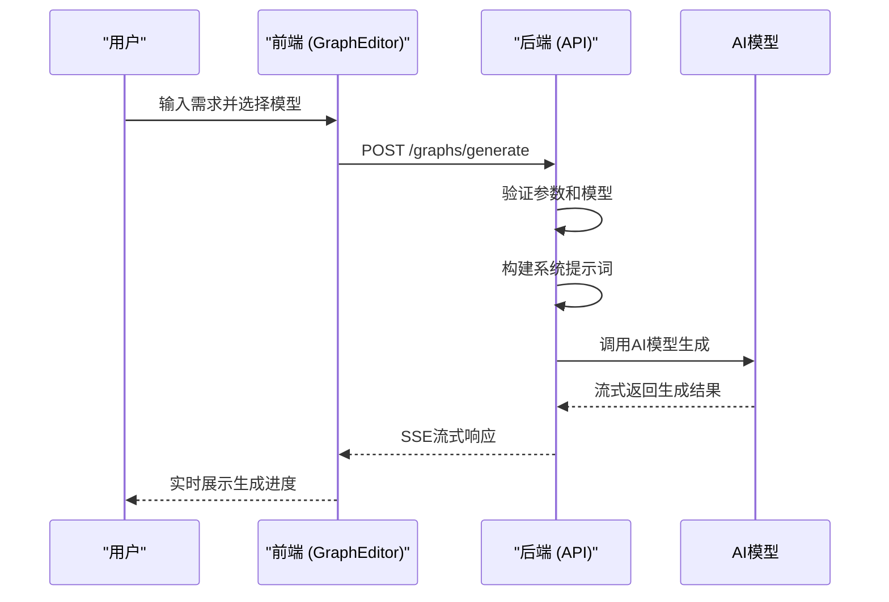
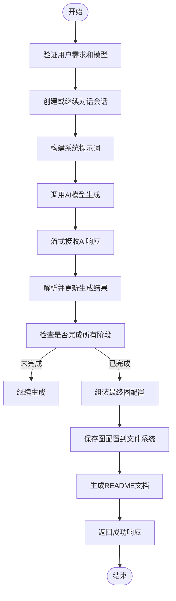
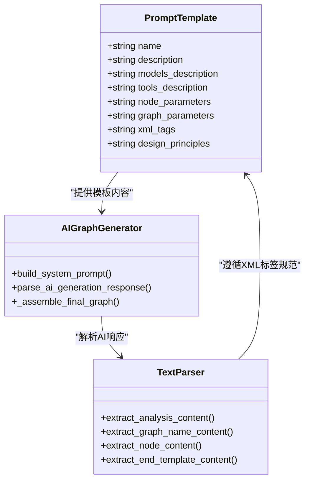
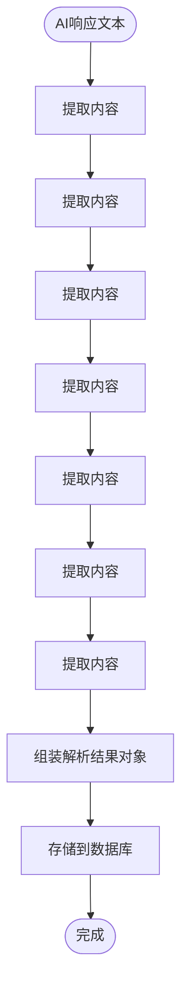
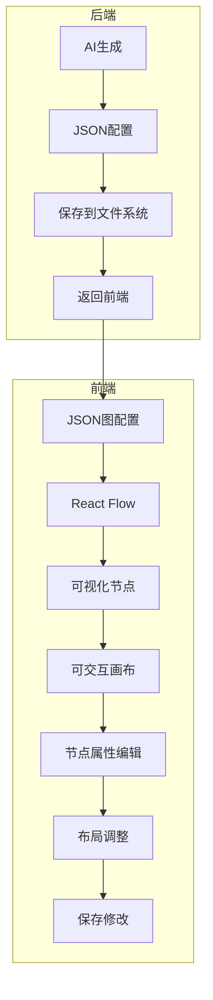
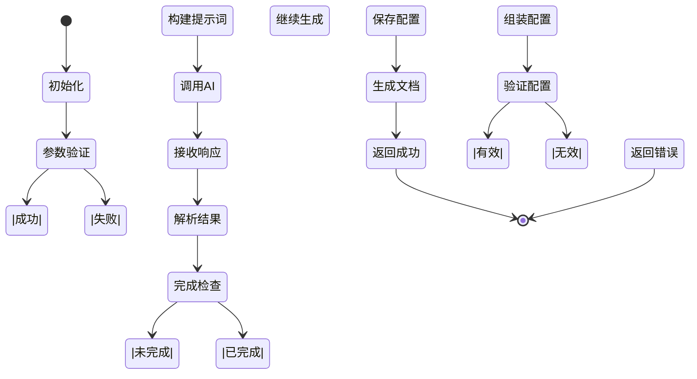

# 需求到Agent生成

<cite>
**本文档引用的文件**
- [graphService.ts](file://frontend/src/services/graphService.ts)
- [graph_gen_routes.py](file://mag/app/api/graph_gen_routes.py)
- [ai_graph_generator.py](file://mag/app/services/graph/ai_graph_generator.py)
- [prompt_template.md](file://mag/app/templates/prompt_template.md)
- [optimize_prompt_template.md](file://mag/app/templates/optimize_prompt_template.md)
- [text_parser.py](file://mag/app/utils/text_parser.py)
- [GraphEditor.tsx](file://frontend/src/pages/GraphEditor.tsx)
</cite>

## 目录
1. [功能概述](#功能概述)
2. [前端交互流程](#前端交互流程)
3. [后端生成机制](#后端生成机制)
4. [提示词模板解析](#提示词模板解析)
5. [图结构语义解析](#图结构语义解析)
6. [可视化渲染流程](#可视化渲染流程)
7. [错误处理与优化策略](#错误处理与优化策略)
8. [完整流程示例](#完整流程示例)

## 功能概述

本功能实现了从用户自然语言需求到可视化Agent工作流图的完整自动化生成过程。系统通过前后端协同工作，将用户输入的需求描述转化为结构化的JSON图配置，并最终在前端渲染为可交互的可视化编辑器。该功能的核心在于利用AI模型对提示词模板的理解能力，结合系统可用的模型和工具信息，智能地生成符合业务逻辑的工作流图。

**Section sources**
- [graph_gen_routes.py](file://mag/app/api/graph_gen_routes.py#L201-L239)
- [ai_graph_generator.py](file://mag/app/services/graph/ai_graph_generator.py#L0-L586)

## 前端交互流程

前端通过调用`/graph-gen/generate`接口与后端进行交互。当用户在图形编辑器中输入需求并选择模型后，前端会通过`graphService.ts`中的`generateGraph`函数发起请求。该函数构建包含用户需求、模型名称、会话ID等信息的请求体，并通过HTTP POST请求发送到后端。前端采用流式SSE（Server-Sent Events）方式接收响应，能够实时展示AI生成过程中的中间结果，提供更好的用户体验。

**Diagram sources**
- [graphService.ts](file://frontend/src/services/graphService.ts#L109-L156)
- [GraphEditor.tsx](file://frontend/src/pages/GraphEditor.tsx#L0-L658)

**Section sources**
- [graphService.ts](file://frontend/src/services/graphService.ts#L0-L223)
- [GraphEditor.tsx](file://frontend/src/pages/GraphEditor.tsx#L0-L658)

## 后端生成机制

后端的图生成核心逻辑位于`ai_graph_generator.py`文件中的`AIGraphGenerator`类。该类通过多轮交互式方式生成图配置，支持流式响应。生成过程首先验证模型是否存在，然后创建或继续对话会话。系统会构建包含可用模型和MCP工具信息的系统提示词，并将其与用户需求一起发送给AI模型。AI模型的响应被流式接收并逐步解析，最终组装成完整的图配置。

**Diagram sources**
- [ai_graph_generator.py](file://mag/app/services/graph/ai_graph_generator.py#L0-L586)
- [graph_gen_routes.py](file://mag/app/api/graph_gen_routes.py#L201-L239)

**Section sources**
- [ai_graph_generator.py](file://mag/app/services/graph/ai_graph_generator.py#L0-L586)
- [graph_gen_routes.py](file://mag/app/api/graph_gen_routes.py#L201-L239)

## 提示词模板解析

系统使用两个关键的提示词模板文件：`prompt_template.md`和`optimize_prompt_template.md`。`prompt_template.md`定义了图设计助手的角色和可用资源，包括可用模型列表和MCP工具信息。模板中包含了详细的节点参数指南和XML标签规范，指导AI模型如何生成结构化的图配置。`optimize_prompt_template.md`则用于图优化场景，包含现有图配置的上下文信息，使AI能够基于现有设计进行改进。

**Diagram sources**
- [prompt_template.md](file://mag/app/templates/prompt_template.md#L0-L152)
- [optimize_prompt_template.md](file://mag/app/templates/optimize_prompt_template.md#L0-L91)
- [ai_graph_generator.py](file://mag/app/services/graph/ai_graph_generator.py#L0-L586)
- [text_parser.py](file://mag/app/utils/text_parser.py#L0-L611)

**Section sources**
- [prompt_template.md](file://mag/app/templates/prompt_template.md#L0-L152)
- [optimize_prompt_template.md](file://mag/app/templates/optimize_prompt_template.md#L0-L91)

## 图结构语义解析

AI生成的响应通过`text_parser.py`中的`parse_ai_generation_response`函数进行语义解析。该函数使用正则表达式提取XML标签中的结构化内容，包括分析内容、待办事项、图名称、节点配置、删除节点指令和结束模板等。解析过程严格按照预定义的XML标签规范进行，确保能够准确提取AI生成的各种信息。解析后的结果被存储在数据库中，用于后续的图配置组装。

**Diagram sources**
- [text_parser.py](file://mag/app/utils/text_parser.py#L0-L611)
- [ai_graph_generator.py](file://mag/app/services/graph/ai_graph_generator.py#L0-L586)

**Section sources**
- [text_parser.py](file://mag/app/utils/text_parser.py#L0-L611)

## 可视化渲染流程

生成的图配置通过React Flow库在前端渲染为可视化编辑器。前端`GraphEditor.tsx`组件使用React Flow Provider包装图画布，将JSON格式的图配置转换为可视化的节点和连接线。每个节点的属性可以通过侧边栏进行编辑，用户可以拖拽节点调整布局，或通过自动布局功能优化图的视觉呈现。生成的图配置包含节点位置信息，确保在重新加载时能够保持原有的布局。

**Diagram sources**
- [GraphEditor.tsx](file://frontend/src/pages/GraphEditor.tsx#L0-L658)
- [graphService.ts](file://frontend/src/services/graphService.ts#L0-L223)

**Section sources**
- [GraphEditor.tsx](file://frontend/src/pages/GraphEditor.tsx#L0-L658)

## 错误处理与优化策略

系统实现了完善的错误处理机制和优化策略。在生成过程中，系统会检查是否完成了所有必需阶段，包括分析、待办事项、图名称、描述、节点和结束模板等。如果检测到缺失，会返回相应的错误信息。优化策略包括上下文感知调整和节点依赖关系校验，确保生成的图配置逻辑正确。`graph_processor.py`中的`GraphProcessor`类负责验证图配置的有效性，检查节点引用、模型存在性和服务器连接状态。

**Diagram sources**
- [ai_graph_generator.py](file://mag/app/services/graph/ai_graph_generator.py#L0-L586)
- [graph_processor.py](file://mag/app/services/graph/graph_processor.py#L0-L553)

**Section sources**
- [ai_graph_generator.py](file://mag/app/services/graph/ai_graph_generator.py#L0-L586)
- [graph_processor.py](file://mag/app/services/graph/graph_processor.py#L0-L553)

## 完整流程示例

从用户输入到最终可视化图的完整流程如下：用户在前端输入"创建一个新闻摘要Agent，能够从网页抓取新闻，生成摘要，并保存为Markdown文件"的需求。前端调用`/graphs/generate`接口，后端构建包含可用模型和工具信息的系统提示词，调用AI模型生成响应。AI模型返回包含`<graph_name>`、`<node>`等XML标签的响应，后端解析这些标签并组装成JSON格式的图配置。最终，图配置被保存到文件系统，并在前端渲染为可视化编辑器中的节点图。

**Section sources**
- [graph_gen_routes.py](file://mag/app/api/graph_gen_routes.py#L201-L239)
- [ai_graph_generator.py](file://mag/app/services/graph/ai_graph_generator.py#L0-L586)
- [text_parser.py](file://mag/app/utils/text_parser.py#L0-L611)
- [GraphEditor.tsx](file://frontend/src/pages/GraphEditor.tsx#L0-L658)