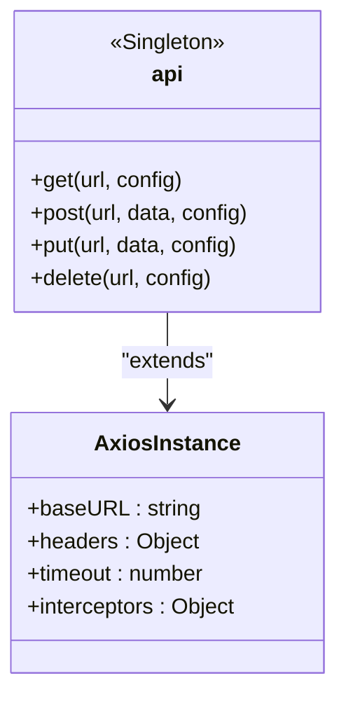
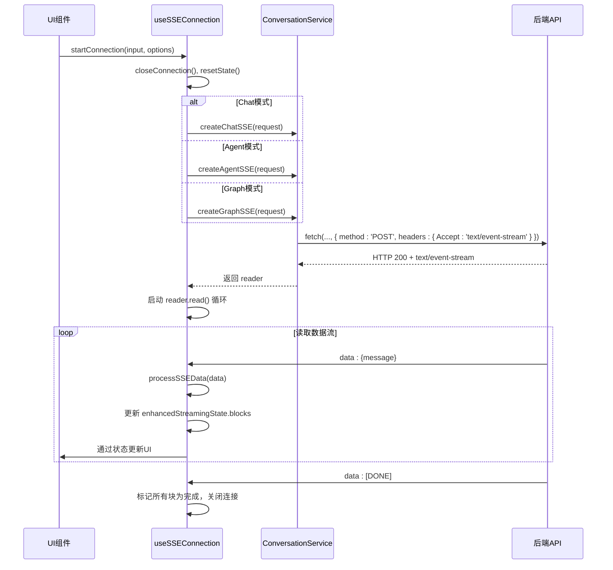

# API客户端

<cite>
**本文档引用的文件**
- [api.ts](file://frontend/src/services/api.ts)
- [graphService.ts](file://frontend/src/services/graphService.ts)
- [mcpService.ts](file://frontend/src/services/mcpService.ts)
- [modelService.ts](file://frontend/src/services/modelService.ts)
- [conversationService.ts](file://frontend/src/services/conversationService.ts)
- [useSSEConnection.ts](file://frontend/src/hooks/useSSEConnection.ts)
- [conversation.ts](file://frontend/src/types/conversation.ts)
- [graph.ts](file://frontend/src/types/graph.ts)
- [mcp.ts](file://frontend/src/types/mcp.ts)
- [model.ts](file://frontend/src/types/model.ts)
</cite>

## 目录
1. [简介](#简介)
2. [API基础配置](#api基础配置)
3. [图服务接口封装](#图服务接口封装)
4. [MCP服务接口封装](#mcp服务接口封装)
5. [模型服务接口封装](#模型服务接口封装)
6. [会话服务与SSE流式处理](#会话服务与sse流式处理)
7. [SSE连接管理机制](#sse连接管理机制)
8. [服务调用时序与健壮性设计](#服务调用时序与健壮性设计)
9. [典型使用场景示例](#典型使用场景示例)
10. [结论](#结论)

## 简介
本文档详细描述了 `mcp-agent-graph-p` 前端项目中基于 Axios 封装的 RESTful API 客户端体系。重点分析了 `api.ts` 中的全局配置、各服务模块（`graphService.ts`、`mcpService.ts`、`modelService.ts`、`conversationService.ts`）对后端接口的封装方式，以及 `useSSEConnection.ts` 如何协调常规 HTTP 请求与 SSE 长连接。文档旨在为开发者提供清晰的 API 调用指南和内部机制理解。

## API基础配置

`api.ts` 文件是整个前端应用与后端通信的核心，它基于 Axios 创建了一个预配置的实例，统一管理基础 URL、请求头等公共设置。



**Diagram sources**
- [api.ts](file://frontend/src/services/api.ts#L1-L13)

**Section sources**
- [api.ts](file://frontend/src/services/api.ts#L1-L13)

## 图服务接口封装

`graphService.ts` 模块封装了所有与“图”（Graph）相关的操作，包括图的增删改查、导入导出、AI提示词模板获取等功能。该模块对请求参数进行了严格的清洗和结构化处理，确保数据的完整性。

### 核心功能
- **图管理**：`getGraphs`, `getGraph`, `createGraph`, `deleteGraph`, `renameGraph`
- **导入导出**：支持从 JSON 文件或 ZIP 包导入/导出图，`importGraphFromFile`, `exportGraph`
- **AI辅助**：`getPromptTemplate`, `getOptimizePromptTemplate` 用于获取 AI 生成图的提示词模板
- **元数据获取**：`getGraphCard`, `getGraphReadme` 获取图的卡片信息和 README 内容

### 请求参数处理
在创建或更新图时，`createGraph` 函数会对传入的 `BackendGraphConfig` 对象进行深度清洗和结构化：
1.  使用 `sanitizeForJson` 函数移除字符串中的注释和非法字符。
2.  确保 `input_nodes`、`output_nodes` 等数组字段存在且有效。
3.  过滤掉不存在的节点引用，防止数据不一致。
4.  根据 `is_subgraph` 字段决定 `model_name` 和 `subgraph_name` 的赋值。

**Section sources**
- [graphService.ts](file://frontend/src/services/graphService.ts#L1-L223)
- [graph.ts](file://frontend/src/types/graph.ts#L1-L113)

## MCP服务接口封装

`mcpService.ts` 模块负责与 MCP（Model Control Protocol）服务器进行交互，实现了服务器的注册、连接、工具管理等核心功能。

### 核心功能
- **配置管理**：`getMCPConfig` 获取当前 MCP 配置，`updateMCPConfig` 更新配置。
- **服务器管理**：`addMCPServer` 添加新服务器，`removeMCPServers` 批量移除服务器。
- **连接控制**：`connectServer` 和 `disconnectServer` 用于建立和断开与 MCP 服务器的连接。
- **工具管理**：`getMCPTools` 获取所有已注册工具的列表，`registerMCPTool` 用于注册新的 MCP 工具，`testMCPTool` 提供工具测试功能。

该模块通过 `MCPServerConfig` 类型定义了服务器配置的完整结构，包括传输类型（`transportType`）、URL、环境变量等。

**Section sources**
- [mcpService.ts](file://frontend/src/services/mcpService.ts#L1-L67)
- [mcp.ts](file://frontend/src/types/mcp.ts#L1-L34)

## 模型服务接口封装

`modelService.ts` 模块提供了对 AI 模型配置的完整 CRUD（创建、读取、更新、删除）操作，是模型管理功能的后端接口桥梁。

### 核心功能
- **模型列表**：`getModels` 获取所有已配置的模型列表。
- **模型详情**：`getModelForEdit` 获取指定模型的详细配置，用于编辑。
- **模型增删改**：`addModel`, `updateModel`, `deleteModel` 分别实现模型的创建、更新和删除。

所有操作均通过模型名称（`modelName`）进行，且在 URL 中使用 `encodeURIComponent` 进行编码，以确保特殊字符的安全传输。

**Section sources**
- [modelService.ts](file://frontend/src/services/modelService.ts#L1-L30)
- [model.ts](file://frontend/src/types/model.ts#L1-L30)

## 会话服务与SSE流式处理

`conversationService.ts` 是聊天功能的核心，它不仅提供常规的会话管理 API，还专门封装了用于处理流式响应的 SSE（Server-Sent Events）连接创建方法。

### 常规会话管理
`ConversationService` 类提供了以下静态方法：
- `getConversations`: 获取用户会话列表。
- `getConversationDetail`: 获取会话详情。
- `updateConversationTitle`, `updateConversationStatus`, `updateConversationTags`: 更新会话元数据。
- `deleteConversationPermanent`: 永久删除会话。
- `compactConversation`: 压缩会话历史。

### SSE流式连接
该模块的关键在于提供了四个创建 SSE 连接的方法，它们直接返回 `ReadableStream` 的 `reader`，供上层 Hook 使用：
- `createChatSSE`: 用于 Chat 模式的消息流。
- `createAgentSSE`: 用于 Agent 模式的任务流。
- `createGraphSSE`: 用于执行现有图的流。
- `createGraphGenerateSSE`: 用于通过 AI 生成新图的流。

这些方法直接使用 `fetch` API，手动构建了包含 `text/event-stream` 头的请求，绕过了 Axios，因为 Axios 不支持原生的流式数据处理。

**Section sources**
- [conversationService.ts](file://frontend/src/services/conversationService.ts#L1-L254)
- [conversation.ts](file://frontend/src/types/conversation.ts#L1-L174)

## SSE连接管理机制

`useSSEConnection.ts` 是一个自定义 Hook，它利用 `conversationService.ts` 中创建的 SSE 连接，实现了对流式数据的完整生命周期管理和状态解构。

### 核心功能
- **连接管理**：`startConnection` 函数根据不同的 `mode`（chat, agent, graph）调用相应的 `createSSE` 方法，并管理 `reader` 的读取循环。
- **状态管理**：维护 `enhancedStreamingState` 状态，该状态包含 `isStreaming`（是否在流）、`blocks`（分块内容）、`error`（错误信息）和 `nodeInfo`（图执行节点信息）。
- **数据分块**：将流式数据解析为不同类型的块（`StreamingBlock`），如 `reasoning`（推理内容）、`content`（普通内容）、`tool_calls`（工具调用）和 `node_start`（图节点开始），实现分块渲染。
- **事件处理**：`processSSEData` 函数处理接收到的每一条 SSE 消息，根据消息类型（`node_start`, `node_end`, `graph_complete`, `choices` 等）更新状态或触发回调。



**Diagram sources**
- [useSSEConnection.ts](file://frontend/src/hooks/useSSEConnection.ts#L1-L522)
- [conversationService.ts](file://frontend/src/services/conversationService.ts#L1-L254)

**Section sources**
- [useSSEConnection.ts](file://frontend/src/hooks/useSSEConnection.ts#L1-L522)

## 服务调用时序与健壮性设计

整个 API 客户端体系通过分层设计和精心的状态管理，实现了高健壮性。

### 协同工作机制
1.  **配置层** (`api.ts`): 提供统一的 HTTP 客户端，处理基础配置。
2.  **服务层** (`*Service.ts`): 封装业务逻辑，处理数据结构和特定请求。
3.  **状态层** (`useSSEConnection.ts`): 管理复杂的状态（如流式数据），提供给 UI 组件。

### 健壮性设计
- **错误处理**：所有 `try-catch` 块捕获网络和解析错误，并通过 `onError` 回调或状态更新通知上层。
- **连接管理**：`useSSEConnection` 在每次 `startConnection` 前会 `closeConnection`，防止连接泄漏。
- **数据清洗**：`graphService` 中的 `sanitizeForJson` 函数确保了数据的有效性。
- **状态兼容**：`useSSEConnection` 维护了新旧两种状态（`enhancedStreamingState` 和 `streamingState`），保证了接口的向后兼容。

## 典型使用场景示例

以下代码片段展示了如何在组件中使用 `useSSEConnection` 发起一个图执行请求：

```typescript
// 在组件中
const { startConnection, enhancedStreamingState } = useSSEConnection();

const handleExecuteGraph = async () => {
  try {
    await startConnection("用户输入的初始问题", {
      mode: "graph",
      graph_name: "example_graph",
      onMessage: (msg) => console.log("SSE消息:", msg),
      onComplete: () => console.log("执行完成"),
      onError: (error) => console.error("执行出错:", error)
    });
  } catch (err) {
    // 处理连接建立失败
  }
};

// enhancedStreamingState.blocks 可以直接用于渲染流式内容
return (
  <div>
    {enhancedStreamingState.blocks.map(block => (
      <div key={block.id}>
        {block.type === 'content' && <p>{block.content}</p>}
        {block.type === 'tool_calls' && <ToolCallDisplay toolCalls={block.toolCalls} results={block.content} />}
      </div>
    ))}
  </div>
);
```

**Section sources**
- [useSSEConnection.ts](file://frontend/src/hooks/useSSEConnection.ts#L1-L522)
- [conversationService.ts](file://frontend/src/services/conversationService.ts#L1-L254)

## 结论
`mcp-agent-graph-p` 的前端 API 客户端设计清晰、层次分明。通过 `api.ts` 统一入口，各 `*Service.ts` 模块专注业务，`useSSEConnection.ts` 高效管理复杂的流式交互，共同构建了一个稳定、易用且功能强大的前端通信体系。开发者可以基于此文档快速理解并使用相关 API。