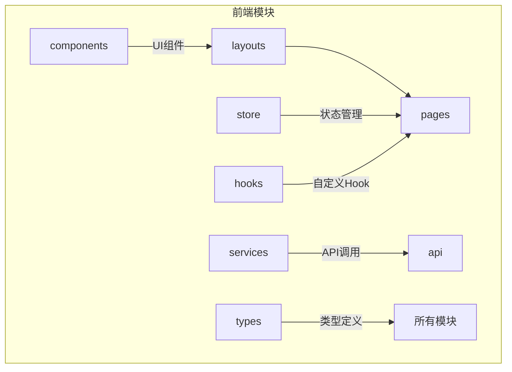
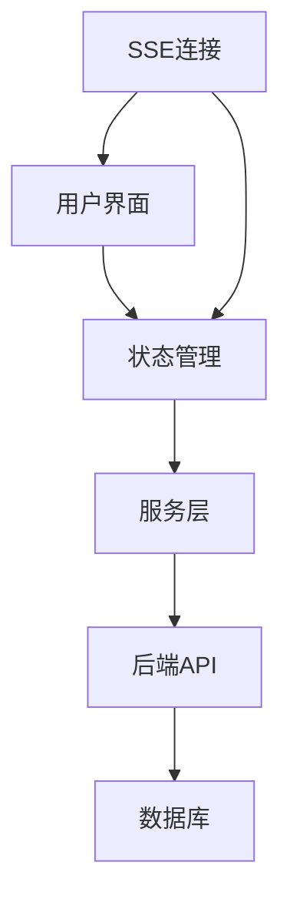
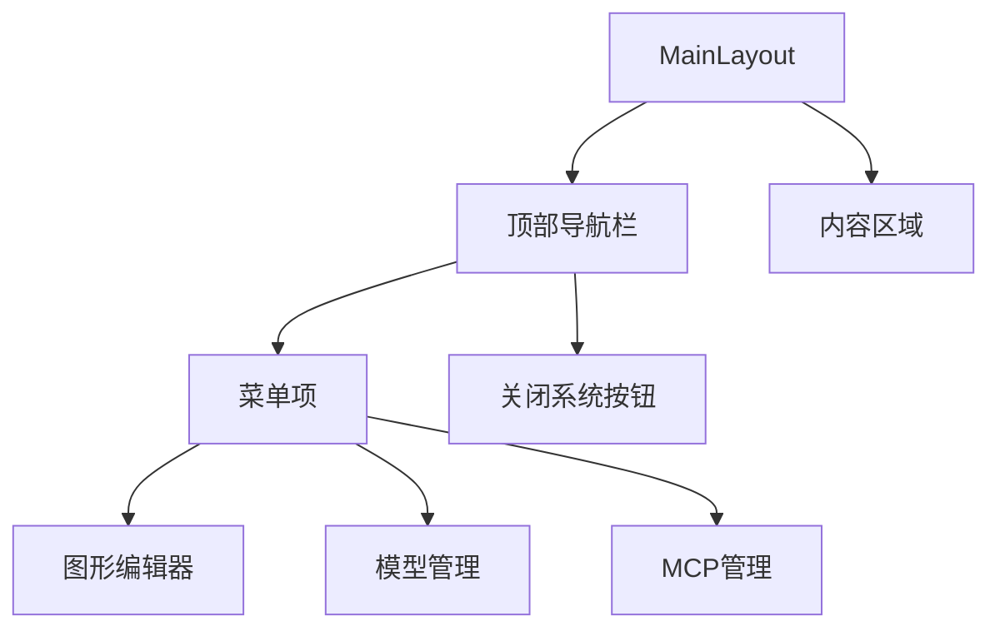
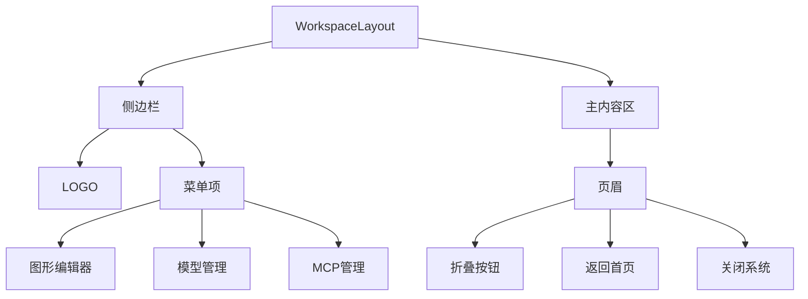
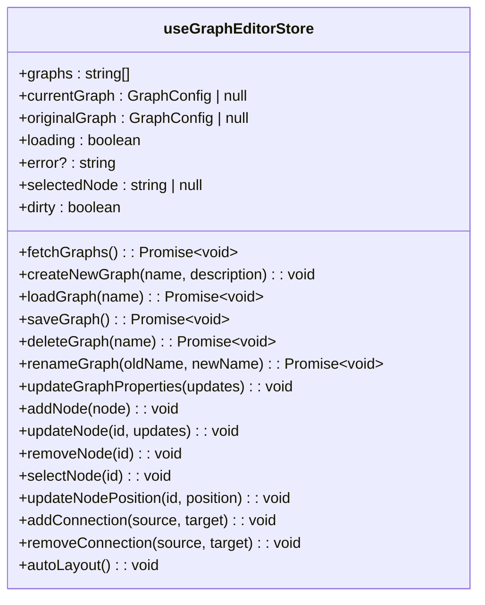
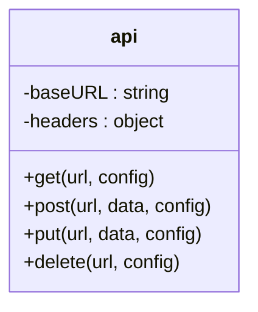
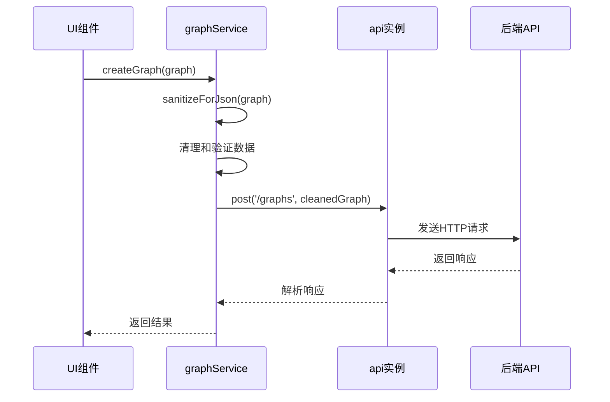
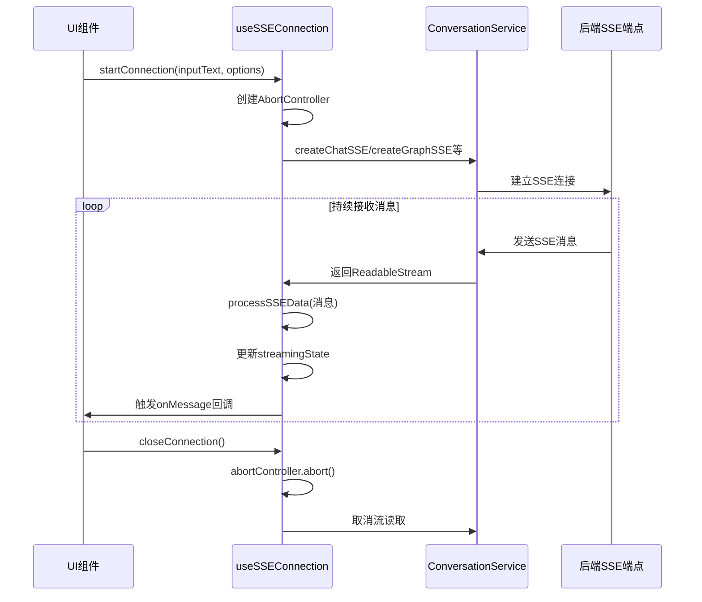
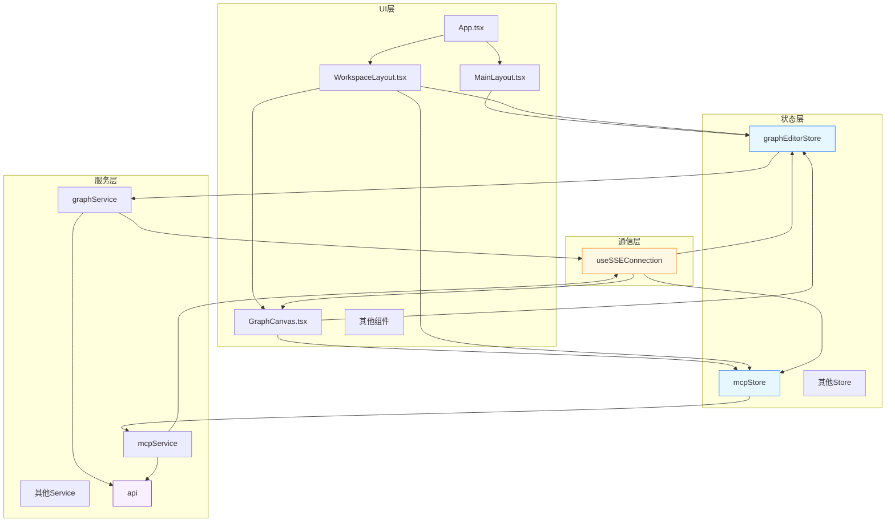

# 前端架构

<cite>
**本文档引用文件**  
- [App.tsx](file://frontend/src/App.tsx)
- [MainLayout.tsx](file://frontend/src/layouts/MainLayout.tsx)
- [WorkspaceLayout.tsx](file://frontend/src/layouts/WorkspaceLayout.tsx)
- [graphEditorStore.ts](file://frontend/src/store/graphEditorStore.ts)
- [mcpStore.ts](file://frontend/src/store/mcpStore.ts)
- [api.ts](file://frontend/src/services/api.ts)
- [graphService.ts](file://frontend/src/services/graphService.ts)
- [useSSEConnection.ts](file://frontend/src/hooks/useSSEConnection.ts)
- [GraphCanvas.tsx](file://frontend/src/components/graph-editor/GraphCanvas.tsx)
</cite>

## 目录
1. [项目结构](#项目结构)
2. [核心组件](#核心组件)
3. [架构概述](#架构概述)
4. [详细组件分析](#详细组件分析)
5. [状态管理方案](#状态管理方案)
6. [服务层与API通信](#服务层与api通信)
7. [实时事件流通信](#实时事件流通信)
8. [前端架构图](#前端架构图)

## 项目结构

前端项目基于React + Vite构建，采用模块化设计，目录结构清晰，职责分明。主要模块包括组件、布局、页面、服务、状态存储、类型定义等。



**图示来源**  
- [frontend/src](file://frontend/src)

## 核心组件

前端应用以`App.tsx`为入口，通过React Router实现路由控制，`MainLayout.tsx`和`WorkspaceLayout.tsx`提供不同层级的布局管理，`GraphCanvas.tsx`基于React Flow实现图可视化编辑。

**本节来源**  
- [App.tsx](file://frontend/src/App.tsx#L1-L67)
- [MainLayout.tsx](file://frontend/src/layouts/MainLayout.tsx#L1-L115)
- [WorkspaceLayout.tsx](file://frontend/src/layouts/WorkspaceLayout.tsx#L1-L189)
- [GraphCanvas.tsx](file://frontend/src/components/graph-editor/GraphCanvas.tsx#L1-L744)

## 架构概述

系统采用单页应用架构，通过React Router管理路由，Zustand进行状态管理，Axios封装API调用，SSE实现服务器实时通信。整体架构分为UI层、状态层、服务层和数据层。



**图示来源**  
- [App.tsx](file://frontend/src/App.tsx#L1-L67)
- [store](file://frontend/src/store)
- [services](file://frontend/src/services)
- [hooks](file://frontend/src/hooks)

## 详细组件分析

### 主入口App.tsx分析

`App.tsx`作为应用主入口，使用React Router定义路由规则，将不同路径映射到对应页面组件，并通过`WorkspaceLayout`包装工作区子页面，实现统一布局。

```mermaid
graph TD
A[App.tsx] --> B[路由定义]
B --> C[/]
B --> D[/chat]
B --> E[/workspace]
E --> F[/workspace/graph-editor]
E --> G[/workspace/model-manager]
E --> H[/workspace/mcp-manager]
F --> I[GraphEditor]
G --> J[ModelManager]
H --> K[MCPManager]
```

**图示来源**  
- [App.tsx](file://frontend/src/App.tsx#L1-L67)

### 布局管理组件分析

#### MainLayout.tsx布局机制

`MainLayout.tsx`提供顶部导航布局，包含图形编辑器、模型管理、MCP管理等菜单项，以及系统关闭按钮，适用于非工作区页面。



**图示来源**  
- [MainLayout.tsx](file://frontend/src/layouts/MainLayout.tsx#L1-L115)

#### WorkspaceLayout.tsx工作区作用

`WorkspaceLayout.tsx`提供侧边栏导航的工作区布局，包含折叠/展开功能、返回首页和关闭系统按钮，专为工作区页面设计。



**图示来源**  
- [WorkspaceLayout.tsx](file://frontend/src/layouts/WorkspaceLayout.tsx#L1-L189)

## 状态管理方案

采用Zustand实现全局状态集中管理，避免组件层级过深导致的prop drilling问题，支持跨组件状态共享。

### graphEditorStore状态管理

`graphEditorStore.ts`管理图形编辑器的全局状态，包括图列表、当前图、节点选择、脏检查等，提供完整的图操作API。



**图示来源**  
- [graphEditorStore.ts](file://frontend/src/store/graphEditorStore.ts#L1-L707)

### mcpStore状态管理

`mcpStore.ts`管理MCP配置、状态、工具等全局状态，提供服务器连接、断开、工具注册等操作接口。

```mermaid
classDiagram
class useMCPStore {
+config : MCPConfig
+status : Record~string, any~
+tools : Record~string, any[]~
+loading : boolean
+error? : string
+fetchConfig() : Promise~void~
+updateConfig(config) : Promise~void~
+fetchStatus() : Promise~void~
+connectServer(serverName) : Promise~void~
+disconnectServer(serverName) : Promise~void~
+fetchTools() : Promise~void~
+connectAllServers() : Promise~{ success : string[], failed : string[] }~
+addServer(serverName, serverConfig) : Promise~void~
+updateServer(serverName, serverConfig) : Promise~void~
+deleteServer(serverName) : Promise~void~
+registerMCPTool(toolData) : Promise~void~
+testTool(serverName, toolName, params) : Promise~any~
+getUsedPorts() : number[]
}
```

**图示来源**  
- [mcpStore.ts](file://frontend/src/store/mcpStore.ts#L1-L221)

## 服务层与API通信

### API服务层封装

`api.ts`封装Axios实例，配置基础URL和请求头，为所有API调用提供统一的HTTP客户端。



**图示来源**  
- [api.ts](file://frontend/src/services/api.ts#L1-L13)

### graphService API调用逻辑

`graphService.ts`封装图形相关的API调用，包括图的增删改查、导入导出、MCP脚本生成等功能，处理请求数据的清洗和格式化。



**图示来源**  
- [graphService.ts](file://frontend/src/services/graphService.ts#L1-L223)
- [api.ts](file://frontend/src/services/api.ts#L1-L13)

## 实时事件流通信

### useSSEConnection实时通信

`useSSEConnection.ts`封装SSE（Server-Sent Events）连接，实现与后端的实时通信，支持消息推送和执行状态更新。



**图示来源**  
- [useSSEConnection.ts](file://frontend/src/hooks/useSSEConnection.ts#L1-L522)
- [conversationService.ts](file://frontend/src/services/conversationService.ts)

## 前端架构图

综合展示UI组件、状态存储、服务接口之间的依赖关系。



**图示来源**  
- [App.tsx](file://frontend/src/App.tsx#L1-L67)
- [layouts](file://frontend/src/layouts)
- [components](file://frontend/src/components)
- [store](file://frontend/src/store)
- [services](file://frontend/src/services)
- [hooks](file://frontend/src/hooks)