# 状态管理

<cite>
**本文档引用的文件**
- [graphEditorStore.ts](file://frontend/src/store/graphEditorStore.ts)
- [mcpStore.ts](file://frontend/src/store/mcpStore.ts)
- [modelStore.ts](file://frontend/src/store/modelStore.ts)
- [conversationStore.ts](file://frontend/src/store/conversationStore.ts)
- [useGlobalNotification.ts](file://frontend/src/hooks/useGlobalNotification.ts)
- [GlobalNotification.tsx](file://frontend/src/components/common/GlobalNotification.tsx)
</cite>

## 目录
1. [简介](#简介)
2. [Zustand状态管理架构](#zustand状态管理架构)
3. [图编辑器状态管理](#图编辑器状态管理)
4. [MCP服务器状态管理](#mcp服务器状态管理)
5. [AI模型配置状态管理](#ai模型配置状态管理)
6. [对话上下文状态管理](#对话上下文状态管理)
7. [全局通知系统](#全局通知系统)
8. [状态流与数据流动](#状态流与数据流动)
9. [状态切片组织与最佳实践](#状态切片组织与最佳实践)
10. [结论](#结论)

## 简介
本项目采用Zustand作为核心状态管理解决方案，实现了高效、简洁的全局状态管理。Zustand以其轻量级、无样板代码和Hooks原生集成的特性，相比Redux等传统方案显著降低了复杂度。通过多个独立的状态切片（store），系统实现了关注点分离，每个store负责特定领域的状态管理，包括图编辑器、MCP服务器、AI模型配置和对话上下文等核心功能模块。

## Zustand状态管理架构

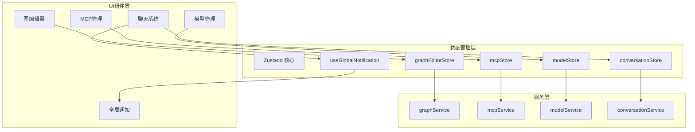

**Diagram sources**
- [graphEditorStore.ts](file://frontend/src/store/graphEditorStore.ts)
- [mcpStore.ts](file://frontend/src/store/mcpStore.ts)
- [modelStore.ts](file://frontend/src/store/modelStore.ts)
- [conversationStore.ts](file://frontend/src/store/conversationStore.ts)
- [useGlobalNotification.ts](file://frontend/src/hooks/useGlobalNotification.ts)

**Section sources**
- [graphEditorStore.ts](file://frontend/src/store/graphEditorStore.ts)
- [mcpStore.ts](file://frontend/src/store/mcpStore.ts)
- [modelStore.ts](file://frontend/src/store/modelStore.ts)
- [conversationStore.ts](file://frontend/src/store/conversationStore.ts)

## 图编辑器状态管理

### 核心状态结构
图编辑器状态(store)管理着图的完整生命周期，包括图列表、当前编辑图、节点连接关系和选中状态等核心数据。

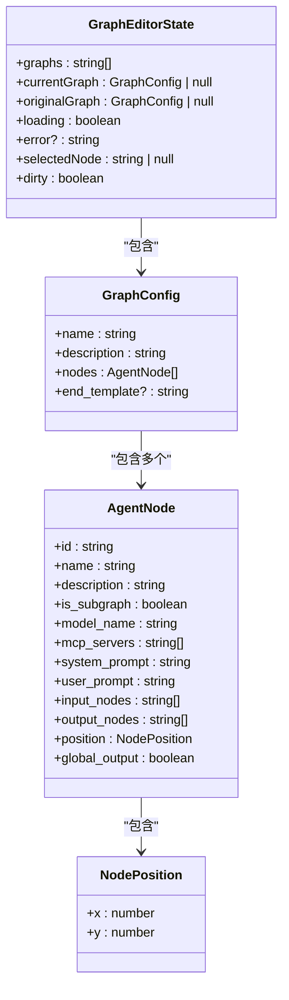

**Diagram sources**
- [graphEditorStore.ts](file://frontend/src/store/graphEditorStore.ts#L40-L100)

**Section sources**
- [graphEditorStore.ts](file://frontend/src/store/graphEditorStore.ts)

### 状态更新机制
图编辑器提供了丰富的操作方法来管理图的状态，所有状态更新都通过Zustand的`set`函数进行，确保状态变更的可追踪性和响应性。

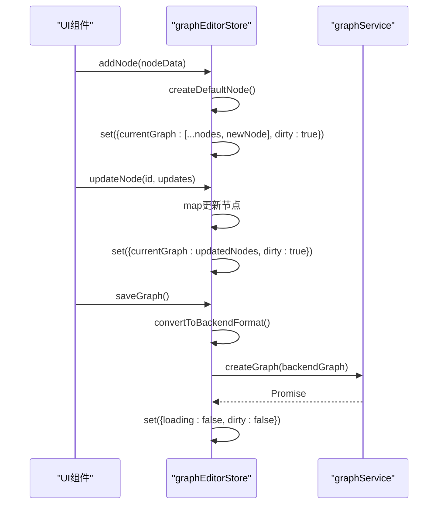

**Diagram sources**
- [graphEditorStore.ts](file://frontend/src/store/graphEditorStore.ts#L300-L500)

### 持久化策略
图编辑器实现了完整的CRUD操作和持久化策略，通过前后端格式转换确保数据一致性。

**Section sources**
- [graphEditorStore.ts](file://frontend/src/store/graphEditorStore.ts#L200-L300)

## MCP服务器状态管理

### 服务器配置与状态同步
MCP状态管理(store)负责管理MCP服务器的配置、连接状态和工具信息，实现了配置与运行时状态的分离。

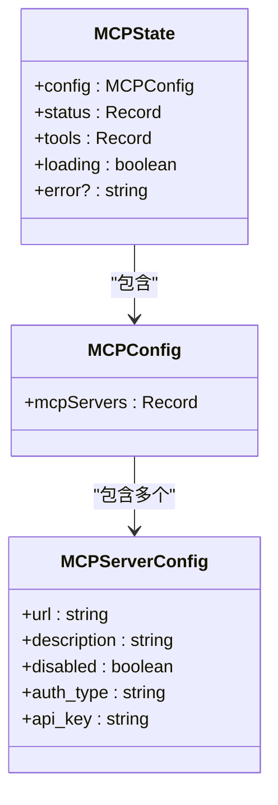

**Diagram sources**
- [mcpStore.ts](file://frontend/src/store/mcpStore.ts#L40-L60)

**Section sources**
- [mcpStore.ts](file://frontend/src/store/mcpStore.ts)

### 连接管理机制
MCP状态管理提供了细粒度的连接控制，支持单个服务器连接/断开以及批量连接所有启用的服务器。

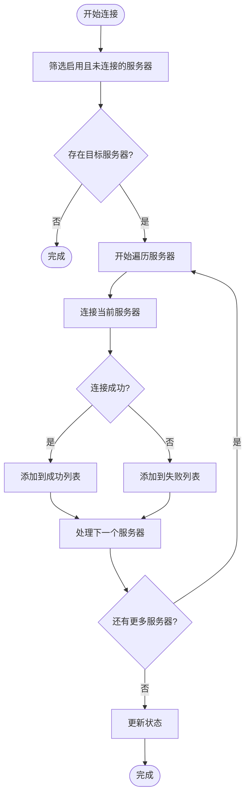

**Diagram sources**
- [mcpStore.ts](file://frontend/src/store/mcpStore.ts#L150-L200)

## AI模型配置状态管理

### 模型CRUD操作封装
模型状态管理(store)提供了对AI模型配置的完整增删改查操作，所有操作都通过服务层与后端交互。

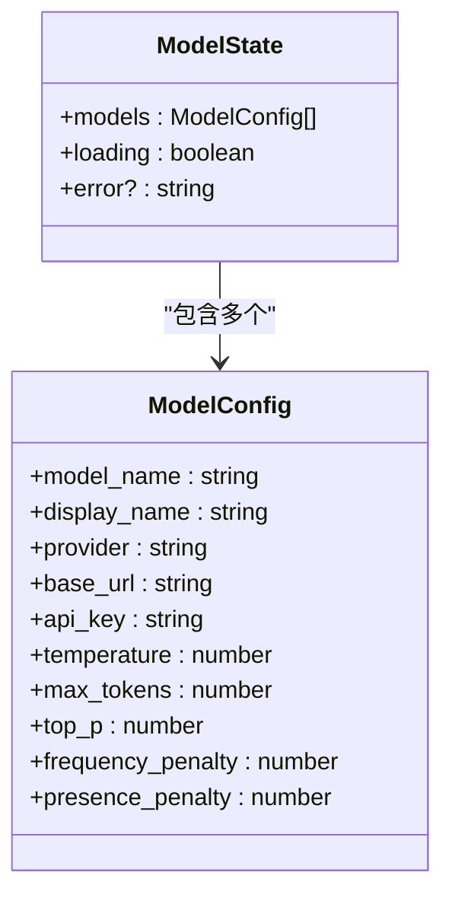

**Diagram sources**
- [modelStore.ts](file://frontend/src/store/modelStore.ts#L40-L50)

**Section sources**
- [modelStore.ts](file://frontend/src/store/modelStore.ts)

### 操作流程
模型管理的操作流程设计简洁高效，每个操作都包含加载状态管理和错误处理。

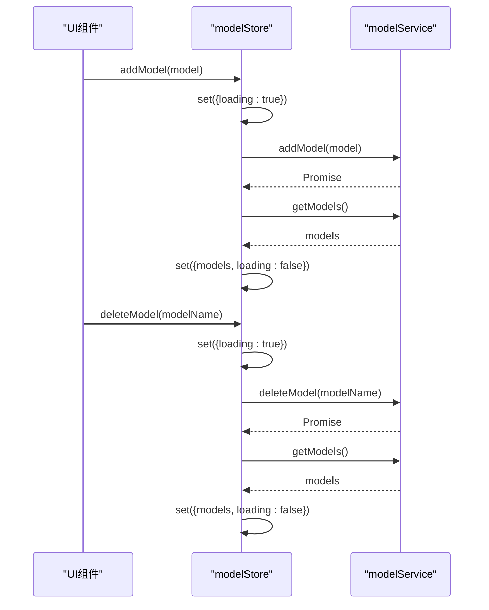

**Diagram sources**
- [modelStore.ts](file://frontend/src/store/modelStore.ts#L60-L75)

## 对话上下文状态管理

### 多轮对话管理
对话状态管理(store)负责维护多轮对话的完整上下文，包括对话列表、当前对话和会话切换逻辑。

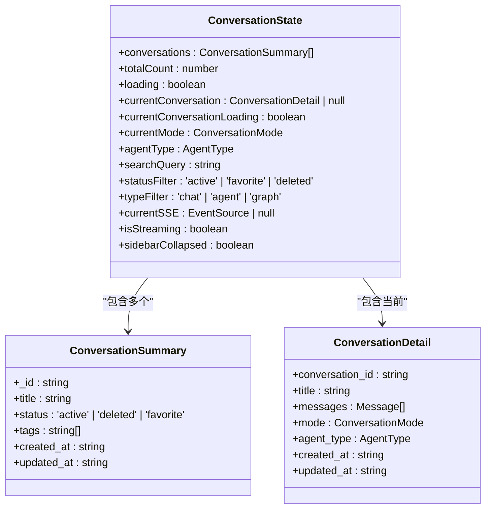

**Diagram sources**
- [conversationStore.ts](file://frontend/src/store/conversationStore.ts#L40-L80)

**Section sources**
- [conversationStore.ts](file://frontend/src/store/conversationStore.ts)

### 消息队列与会话切换
对话管理实现了消息队列的维护和会话切换的完整逻辑，支持本地缓存和静默更新。

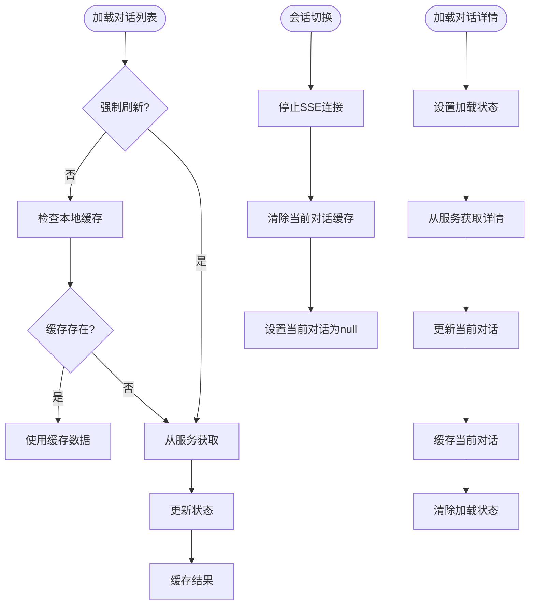

**Diagram sources**
- [conversationStore.ts](file://frontend/src/store/conversationStore.ts#L100-L200)

## 全局通知系统

### 自定义Hook设计
`useGlobalNotification`自定义Hook提供了统一的全局通知管理接口，支持多种通知类型。

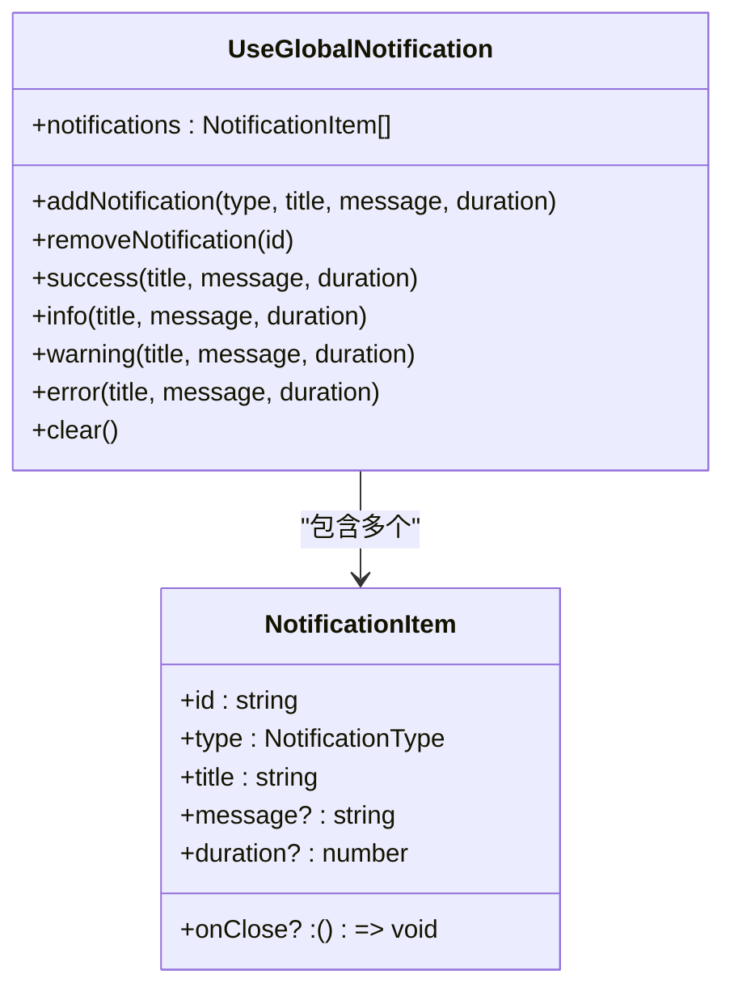

**Diagram sources**
- [useGlobalNotification.ts](file://frontend/src/hooks/useGlobalNotification.ts#L10-L30)

**Section sources**
- [useGlobalNotification.ts](file://frontend/src/hooks/useGlobalNotification.ts)

### 通知组件实现
`GlobalNotification`组件负责渲染通知列表，支持自动关闭和手动关闭功能。

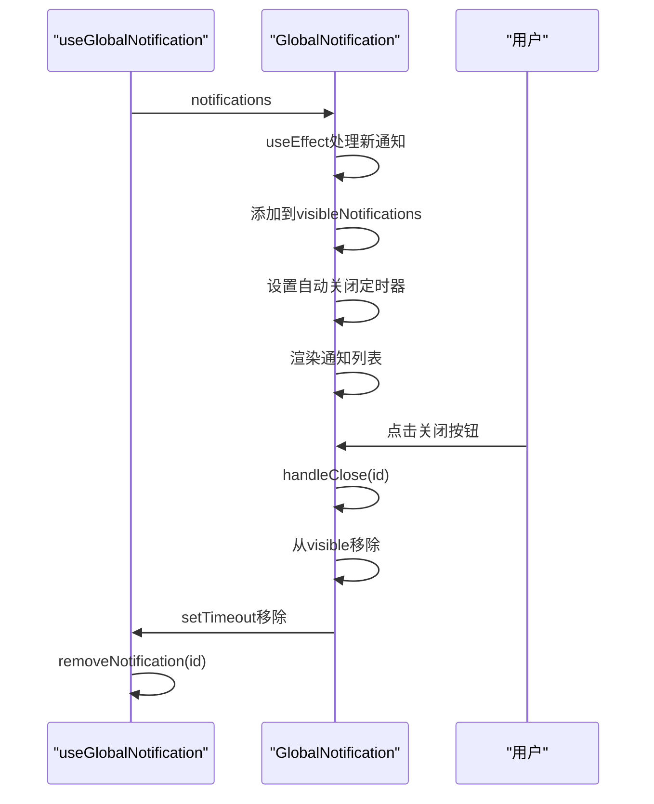

**Diagram sources**
- [GlobalNotification.tsx](file://frontend/src/components/common/GlobalNotification.tsx#L50-L100)

## 状态流与数据流动

### 用户操作状态流
展示了用户操作如何触发store更新和组件重渲染的完整数据流动路径。

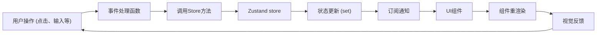

**Diagram sources**
- [graphEditorStore.ts](file://frontend/src/store/graphEditorStore.ts)
- [mcpStore.ts](file://frontend/src/store/mcpStore.ts)
- [modelStore.ts](file://frontend/src/store/modelStore.ts)
- [conversationStore.ts](file://frontend/src/store/conversationStore.ts)

### 数据持久化流程
描述了前端状态如何通过服务层与后端进行数据同步的完整流程。

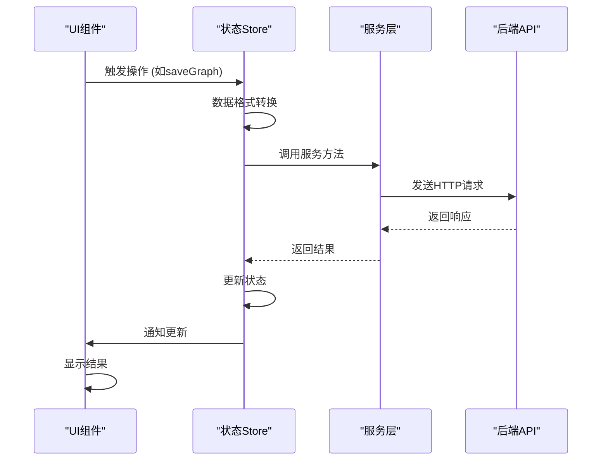

**Diagram sources**
- [graphEditorStore.ts](file://frontend/src/store/graphEditorStore.ts#L250-L300)
- [mcpStore.ts](file://frontend/src/store/mcpStore.ts#L100-L150)

## 状态切片组织与最佳实践

### 状态切片设计原则
项目采用了状态切片(state slices)的组织方式，每个store负责特定领域的状态管理。

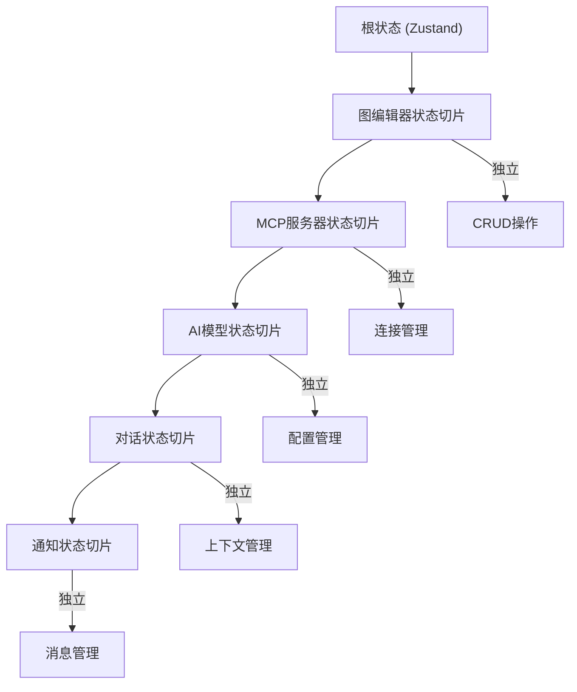

**Diagram sources**
- [graphEditorStore.ts](file://frontend/src/store/graphEditorStore.ts)
- [mcpStore.ts](file://frontend/src/store/mcpStore.ts)
- [modelStore.ts](file://frontend/src/store/modelStore.ts)
- [conversationStore.ts](file://frontend/src/store/conversationStore.ts)
- [useGlobalNotification.ts](file://frontend/src/hooks/useGlobalNotification.ts)

### 最佳实践总结
1. **单一职责原则**: 每个store只负责一个特定领域的状态管理
2. **数据与UI分离**: store只管理数据状态，不包含UI逻辑
3. **异步操作封装**: 所有异步操作都在store内部处理，对外提供同步接口
4. **错误处理**: 每个操作都有完善的错误处理和用户反馈机制
5. **性能优化**: 使用Zustand的选择器(selectors)避免不必要的重渲染
6. **类型安全**: 全面使用TypeScript，确保状态结构的类型安全

**Section sources**
- [graphEditorStore.ts](file://frontend/src/store/graphEditorStore.ts)
- [mcpStore.ts](file://frontend/src/store/mcpStore.ts)
- [modelStore.ts](file://frontend/src/store/modelStore.ts)
- [conversationStore.ts](file://frontend/src/store/conversationStore.ts)

## 结论
本项目通过Zustand实现了高效、可维护的状态管理架构。相比Redux等传统方案，Zustand的轻量级设计和Hooks原生集成显著降低了代码复杂度和样板代码量。状态切片的组织方式实现了关注点分离，每个store独立管理特定领域的状态，提高了代码的可读性和可维护性。通过统一的错误处理、加载状态管理和用户反馈机制，系统提供了良好的用户体验。全局通知系统和对话上下文管理等高级功能的实现，展示了Zustand在复杂应用场景下的强大能力。整体架构设计遵循了现代前端状态管理的最佳实践，为项目的持续发展奠定了坚实的基础。