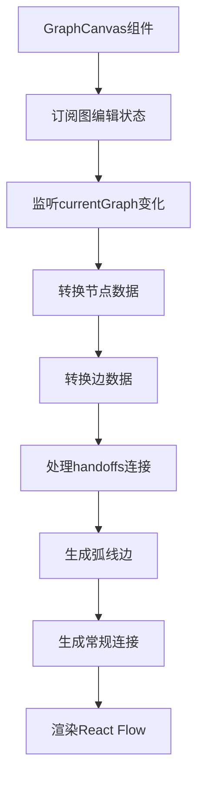
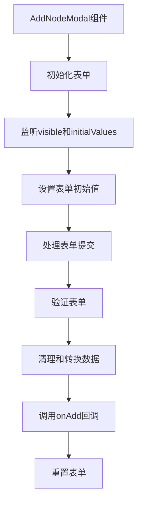
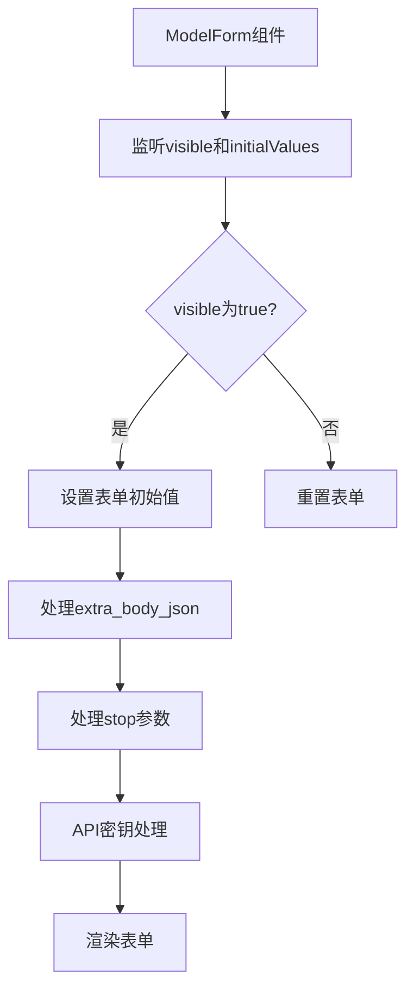
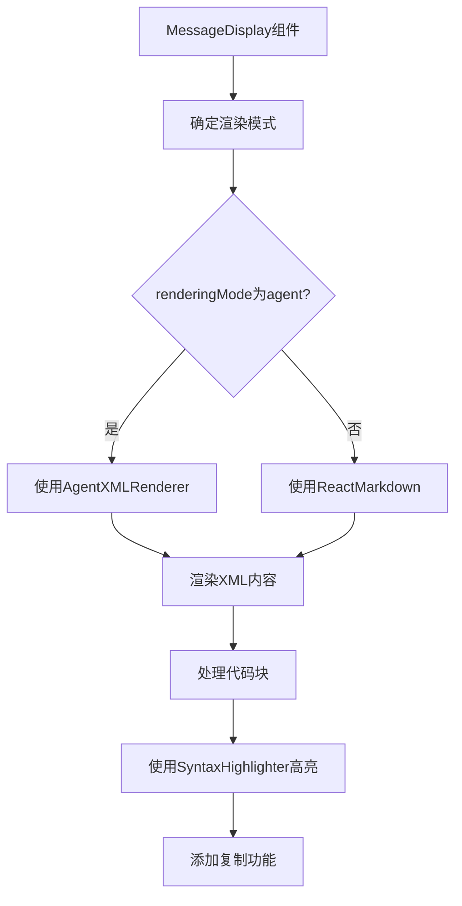
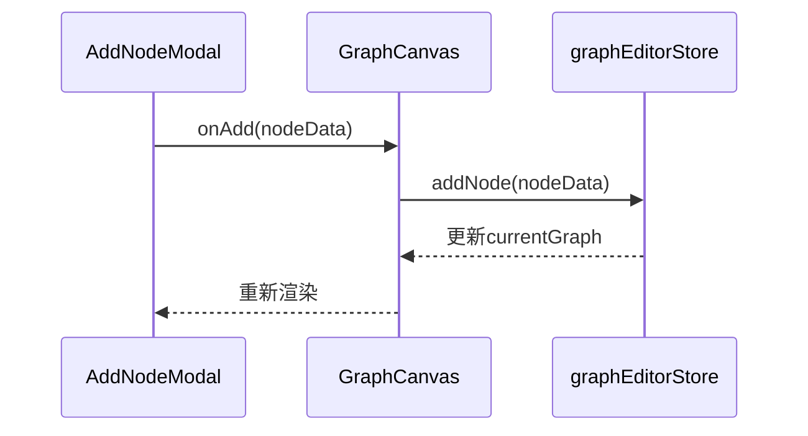

# 组件架构

<cite>
**本文档引用的文件**
- [GraphCanvas.tsx](file://frontend/src/components/graph-editor/GraphCanvas.tsx)
- [AddNodeModal.tsx](file://frontend/src/components/graph-editor/AddNodeModal.tsx)
- [MCPServerCard.tsx](file://frontend/src/components/mcp-manager/MCPServerCard.tsx)
- [ModelForm.tsx](file://frontend/src/components/model-manager/ModelForm.tsx)
- [MessageDisplay.tsx](file://frontend/src/components/chat/MessageDisplay.tsx)
- [graphEditorStore.ts](file://frontend/src/store/graphEditorStore.ts)
</cite>

## 目录
1. [项目结构](#项目结构)
2. [核心组件](#核心组件)
3. [可视化图编辑器](#可视化图编辑器)
4. [MCP服务器管理](#mcp服务器管理)
5. [模型配置表单](#模型配置表单)
6. [消息渲染组件](#消息渲染组件)
7. [组件通信与状态管理](#组件通信与状态管理)
8. [组件层级与类型安全](#组件层级与类型安全)

## 项目结构

前端项目采用功能模块化组织，主要分为`components`、`store`、`services`、`types`等目录。`components`目录下按功能划分了`graph-editor`（图编辑器）、`mcp-manager`（MCP管理）、`model-manager`（模型管理）、`chat`（聊天）等子模块，每个模块包含相关的UI组件。`store`目录使用Zustand管理全局状态，`services`目录封装API调用，`types`目录定义TypeScript类型。

**Section sources**
- [frontend/src/components](file://frontend/src/components)
- [frontend/src/store](file://frontend/src/store)
- [frontend/src/services](file://frontend/src/services)
- [frontend/src/types](file://frontend/src/types)

## 核心组件

项目前端基于React函数组件与Hooks构建，采用组件化设计模式。核心功能模块包括图编辑器、MCP服务器管理、模型配置和聊天界面。各模块通过props传递数据，通过回调函数实现事件通信，结合Zustand进行全局状态管理，实现了高内聚、低耦合的组件架构。

**Section sources**
- [frontend/src/components](file://frontend/src/components)
- [frontend/src/store](file://frontend/src/store)

## 可视化图编辑器

### GraphCanvas组件

`GraphCanvas.tsx`组件集成了React Flow库实现可视化图编辑功能。组件通过`useGraphEditorStore` Hook订阅全局图编辑状态，当`currentGraph`变化时，将后端数据转换为React Flow的节点和边数据结构。



**Diagram sources**
- [GraphCanvas.tsx](file://frontend/src/components/graph-editor/GraphCanvas.tsx#L150-L300)

**Section sources**
- [GraphCanvas.tsx](file://frontend/src/components/graph-editor/GraphCanvas.tsx#L1-L744)

#### 交互逻辑

- **节点拖拽**: 通过`onNodesChange`回调处理节点位置变化，并调用`updateNodePosition`更新状态。
- **连接**: 通过`onConnect`回调处理新连接，调用`addConnection`更新状态，并添加新边到显示。
- **缩放与平移**: React Flow内置的`Controls`和`MiniMap`组件提供缩放、平移和视图适配功能。
- **边删除**: 自定义的`ButtonEdge`和`ArcEdge`组件在边上渲染删除按钮，点击后从边集合中移除。

#### 背景控制

组件实现了背景类型切换功能，支持无背景、点状、线性、网格和交叉五种背景样式。通过`renderBackgroundControls`函数渲染控制面板，用户可点击按钮切换背景类型。

**Section sources**
- [GraphCanvas.tsx](file://frontend/src/components/graph-editor/GraphCanvas.tsx#L253-L303)

### AddNodeModal组件

`AddNodeModal.tsx`组件实现了节点添加过程中的状态管理与表单控制。组件使用Ant Design的`Form`组件进行表单管理，通过`Form.useForm()` Hook获取表单实例。



**Diagram sources**
- [AddNodeModal.tsx](file://frontend/src/components/graph-editor/AddNodeModal.tsx#L150-L200)

**Section sources**
- [AddNodeModal.tsx](file://frontend/src/components/graph-editor/AddNodeModal.tsx#L1-L704)

#### 状态管理

- **表单状态**: 使用`Form`组件的`form`实例管理表单数据。
- **动态字段**: `is_subgraph`开关控制`subgraph_name`和`model_name`字段的显示与隐藏。
- **上下文节点**: 根据`currentGraph`中的`global_output`节点动态生成`context`下拉选项。

#### 表单控制

- **字段验证**: 使用`rules`属性定义必填、格式等验证规则。
- **数据转换**: `handleSubmit`函数中对表单数据进行清理和转换，如处理`stop`参数和`extra_body` JSON。
- **提交处理**: 验证通过后调用`onAdd`回调，将节点数据传递给父组件。

**Section sources**
- [AddNodeModal.tsx](file://frontend/src/components/graph-editor/AddNodeModal.tsx#L100-L200)

## MCP服务器管理

### MCPServerCard组件

`MCPServerCard.tsx`组件用于展示MCP服务器状态及操作入口。组件接收`serverName`、`config`、`status`等props，根据服务器状态渲染不同的标签和按钮。

```mermaid
classDiagram
class MCPServerCard {
+serverName : string
+config : MCPServerConfig
+status : { connected : boolean, init_attempted : boolean, tools : string[], error? : string }
+onConnect : (serverName : string) => void
+onDisconnect : (serverName : string) => void
+onEdit : (serverName : string) => void
+onDelete : (serverName : string) => void
+onViewTools : (serverName : string) => void
+loading : boolean
}
```

**Diagram sources**
- [MCPServerCard.tsx](file://frontend/src/components/mcp-manager/MCPServerCard.tsx#L10-L50)

**Section sources**
- [MCPServerCard.tsx](file://frontend/src/components/mcp-manager/MCPServerCard.tsx#L1-L237)

#### 状态展示

- **连接状态**: 根据`status.connected`、`status.init_attempted`和`config.disabled`渲染成功、失败或未连接标签。
- **传输信息**: 根据`config.transportType`渲染SSE地址、HTTP地址或命令行参数。
- **环境变量**: 使用`Collapse`组件折叠显示环境变量，保护敏感信息。
- **工具列表**: 显示已连接服务器的可用工具列表。

#### 操作入口

- **连接/断开**: 根据当前连接状态显示连接或断开按钮。
- **查看工具**: 显示服务器提供的工具列表。
- **编辑/删除**: 提供编辑和删除服务器的入口，删除操作使用`Popconfirm`组件确认。

**Section sources**
- [MCPServerCard.tsx](file://frontend/src/components/mcp-manager/MCPServerCard.tsx#L100-L200)

## 模型配置表单

### ModelForm组件

`ModelForm.tsx`组件实现了模型配置表单的受控组件模式。组件使用`Form.useForm()` Hook管理表单状态，并通过`useEffect`监听`visible`和`initialValues`的变化来初始化表单。



**Diagram sources**
- [ModelForm.tsx](file://frontend/src/components/model-manager/ModelForm.tsx#L50-L100)

**Section sources**
- [ModelForm.tsx](file://frontend/src/components/model-manager/ModelForm.tsx#L1-L399)

#### 受控组件实现

- **表单初始化**: `useEffect`中根据`initialValues`设置表单初始值，`extra_body`对象转换为JSON字符串，`stop`数组转换为逗号分隔字符串。
- **API密钥处理**: 编辑模式下API密钥字段保持空白，只有用户输入新值时才更新，确保安全性。
- **数据清理**: `handleSubmit`函数中创建`cleanedValues`对象，只包含有实际值的参数，避免发送undefined或空字符串。

#### 高级配置

- **可选参数**: 数值参数（如`temperature`、`max_tokens`）只在用户输入值时才包含在提交数据中。
- **JSON参数**: `extra_body_json`字段允许用户输入JSON格式的额外请求参数。
- **条件渲染**: `top_logprobs`字段在`logprobs`开关开启时才有效。

**Section sources**
- [ModelForm.tsx](file://frontend/src/components/model-manager/ModelForm.tsx#L150-L300)

## 消息渲染组件

### MessageDisplay组件

`MessageDisplay.tsx`组件负责消息内容的渲染，支持Markdown解析与代码块高亮。组件根据`renderingMode`决定使用`AgentXMLRenderer`还是`ReactMarkdown`进行渲染。



**Diagram sources**
- [MessageDisplay.tsx](file://frontend/src/components/chat/MessageDisplay.tsx#L500-L600)

**Section sources**
- [MessageDisplay.tsx](file://frontend/src/components/chat/MessageDisplay.tsx#L1-L948)

#### 渲染流程

- **模式判断**: 根据`currentMode`或`conversation.generation_type`确定渲染模式（chat、agent、graph_run）。
- **内容渲染**: Agent模式使用`AgentXMLRenderer`，其他模式使用`ReactMarkdown`。
- **代码块处理**: 使用`remarkGfm`插件支持GitHub Flavored Markdown，`SyntaxHighlighter`组件进行代码高亮。
- **流式渲染**: 支持流式消息的逐字显示，使用`TypewriterText`组件实现打字机效果。

#### 代码块高亮

- **高亮库**: 使用`react-syntax-highlighter`库，`oneLight`主题。
- **复制功能**: 每个代码块右上角有复制按钮，点击后复制代码到剪贴板并显示成功提示。
- **预览功能**: 集成`CodeBlockPreview`组件，提供代码块预览功能。

**Section sources**
- [MessageDisplay.tsx](file://frontend/src/components/chat/MessageDisplay.tsx#L200-L400)

## 组件通信与状态管理

组件间通过props传递数据，通过回调函数实现事件通信。例如，`GraphCanvas`组件通过`onAdd`回调接收新节点数据，`MCPServerCard`组件通过`onConnect`、`onEdit`等回调通知父组件用户操作。

全局状态使用Zustand管理，`graphEditorStore`存储当前图、选中节点等状态。组件通过`useGraphEditorStore` Hook订阅状态变化，实现跨组件状态共享。



**Diagram sources**
- [graphEditorStore.ts](file://frontend/src/store/graphEditorStore.ts#L100-L150)
- [AddNodeModal.tsx](file://frontend/src/components/graph-editor/AddNodeModal.tsx#L150-L200)

**Section sources**
- [graphEditorStore.ts](file://frontend/src/store/graphEditorStore.ts#L1-L426)
- [AddNodeModal.tsx](file://frontend/src/components/graph-editor/AddNodeModal.tsx#L1-L704)
- [GraphCanvas.tsx](file://frontend/src/components/graph-editor/GraphCanvas.tsx#L1-L744)

## 组件层级与类型安全

项目采用容器组件与展示组件分离的模式。容器组件（如`GraphCanvas`、`MCPServerCard`）负责状态管理和数据获取，展示组件（如`ButtonEdge`、`GlassCodeBlock`）负责UI渲染。

使用TypeScript接口定义组件props类型，提高代码安全性。例如，`MCPServerCardProps`接口定义了服务器卡片组件的所有props，确保类型安全。

```mermaid
classDiagram
class MCPServerCardProps {
+serverName : string
+config : MCPServerConfig
+status? : { connected : boolean, init_attempted : boolean, tools : string[], error? : string }
+onConnect : (serverName : string) => void
+onDisconnect? : (serverName : string) => void
+onEdit : (serverName : string) => void
+onDelete : (serverName : string) => void
+onViewTools : (serverName : string) => void
+loading : boolean
}
```

**Diagram sources**
- [MCPServerCard.tsx](file://frontend/src/components/mcp-manager/MCPServerCard.tsx#L10-L50)

**Section sources**
- [MCPServerCard.tsx](file://frontend/src/components/mcp-manager/MCPServerCard.tsx#L1-L237)
- [types/mcp.ts](file://frontend/src/types/mcp.ts)