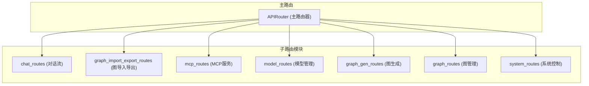

# API路由

<cite>
**本文档中引用的文件**  
- [routes.py](file://mag/app/api/routes.py)
- [graph_routes.py](file://mag/app/api/graph_routes.py)
- [mcp_routes.py](file://mag/app/api/mcp_routes.py)
- [model_routes.py](file://mag/app/api/model_routes.py)
- [chat_routes.py](file://mag/app/api/chat_routes.py)
- [system_routes.py](file://mag/app/api/system_routes.py)
- [graph_schema.py](file://mag/app/models/graph_schema.py)
- [mcp_schema.py](file://mag/app/models/mcp_schema.py)
- [model_schema.py](file://mag/app/models/model_schema.py)
- [chat_schema.py](file://mag/app/models/chat_schema.py)
</cite>

## 目录
1. [简介](#简介)
2. [项目结构与路由初始化](#项目结构与路由初始化)
3. [核心功能模块](#核心功能模块)
4. [图管理模块](#图管理模块)
5. [MCP服务器管理模块](#mcp服务器管理模块)
6. [模型配置模块](#模型配置模块)
7. [对话流模块](#对话流模块)
8. [系统控制模块](#系统控制模块)
9. [依赖注入与中间件](#依赖注入与中间件)
10. [API调用示例](#api调用示例)
11. [错误码规范与安全性](#错误码规范与安全性)
12. [结论](#结论)

## 简介
本文件为 `mcp-agent-graph-p` 后端API路由的完整参考文档，详细说明基于FastAPI框架构建的API拓扑结构。文档涵盖图管理、MCP服务器注册、模型配置、对话流处理及系统控制五大核心功能模块，解析各模块的HTTP端点设计、请求响应结构、依赖关系与异常处理机制。通过代码分析与调用示例，帮助开发者快速理解并集成该API系统。

## 项目结构与路由初始化
FastAPI应用的主路由在 `routes.py` 中通过模块化方式组织，采用子路由挂载机制实现功能解耦与清晰的API拓扑。



**图来源**
- [routes.py](file://mag/app/api/routes.py#L1-L21)

**本节来源**
- [routes.py](file://mag/app/api/routes.py#L1-L21)

## 核心功能模块
系统API划分为五大功能模块，分别对应不同的业务领域：

- **图管理模块** (`/graphs`): 负责图的增删改查、执行与README生成。
- **MCP服务器管理模块** (`/mcp`): 管理MCP工具服务器的配置、连接、注册与AI生成。
- **模型配置模块** (`/models`): 提供模型的增删改查接口，支持多种LLM参数配置。
- **对话流模块** (`/chat`): 处理聊天会话的创建、流式响应、历史记录管理与内容压缩。
- **系统控制模块** (`/system`): 提供服务优雅关闭等系统级控制接口。

## 图管理模块
该模块提供对工作流图（Graph）的全生命周期管理。

### 公开HTTP端点

| URL路径 | HTTP方法 | 功能描述 | 请求体/参数 | 响应格式 |
| :--- | :--- | :--- | :--- | :--- |
| `/graphs` | GET | 获取所有可用图的名称列表 | 无 | `List[str]` |
| `/graphs/{graph_name}` | GET | 获取指定图的完整配置 | `graph_name` (路径参数) | `Dict[str, Any]` |
| `/graphs/{graph_name}/readme` | GET | 获取指定图的README内容 | `graph_name` (路径参数) | `{"name": str, "config": Dict, "readme": str}` |
| `/graphs` | POST | 创建新图或更新现有图 | `GraphConfig` (Pydantic模型) | `{"status": "success", "message": str}` |
| `/graphs/{graph_name}` | DELETE | 删除指定图 | `graph_name` (路径参数) | `{"status": "success", "message": str}` |
| `/graphs/{old_name}/rename/{new_name}` | PUT | 重命名图 | `old_name`, `new_name` (路径参数) | `{"status": "success", "message": str}` |
| `/graphs/{graph_name}/generate_mcp` | GET | 为指定图生成MCP服务器脚本 | `graph_name` (路径参数) | `{"graph_name": str, "script": str}` |
| `/graphs/execute` | POST | 执行图并返回流式结果 | `GraphInput` (Pydantic模型) | `StreamingResponse` (SSE) |

### 核心接口设计逻辑
- **`/graphs` (POST)**: 接收 `GraphConfig` 模型，先验证图结构有效性，再持久化保存。每次保存会自动重新生成该图的 `readme.md` 文件，整合图结构、使用的MCP服务器和模型信息，便于用户理解。
- **`/graphs/execute` (POST)**: 接收 `GraphInput` 模型，支持通过 `conversation_id` 继续会话或创建新会话。返回 `text/event-stream` 类型的SSE流，通过 `StreamingResponse` 实现，确保结果能实时推送。

**本节来源**
- [graph_routes.py](file://mag/app/api/graph_routes.py#L1-L340)
- [graph_schema.py](file://mag/app/models/graph_schema.py#L1-L116)

## MCP服务器管理模块
该模块负责MCP（Model Context Protocol）服务器的配置、状态监控、连接管理及AI生成。

### 公开HTTP端点

| URL路径 | HTTP方法 | 功能描述 | 请求体/参数 | 响应格式 |
| :--- | :--- | :--- | :--- | :--- |
| `/mcp/config` | GET | 获取当前MCP配置 | 无 | `MCPConfig` (Pydantic模型) |
| `/mcp/config` | POST | 更新MCP配置并重连服务器 | `MCPConfig` (Pydantic模型) | `Dict[str, Dict[str, Any]]` |
| `/mcp/status` | GET | 获取所有MCP服务器的连接状态 | 无 | `Dict[str, Dict[str, Any]]` |
| `/mcp/add` | POST | 批量添加新的MCP服务器 | `Dict` (包含 `mcpServers`) | `{"status": str, "added_servers": List[str], ...}` |
| `/mcp/remove` | POST | 批量删除MCP服务器 | `List[str]` (服务器名列表) | `{"status": str, "removed_servers": List[str], ...}` |
| `/mcp/connect/{server_name}` | POST | 连接指定或所有MCP服务器 | `server_name` (路径参数) | `Dict[str, Any]` |
| `/mcp/disconnect/{server_name}` | POST | 断开指定MCP服务器连接 | `server_name` (路径参数) | `Dict[str, Any]` |
| `/mcp/test-tool` | POST | 测试MCP工具调用 | `MCPToolTestRequest` (Pydantic模型) | `MCPToolTestResponse` (Pydantic模型) |
| `/mcp/tools` | GET | 获取所有MCP工具的元信息 | 无 | `Dict[str, List[Dict[str, Any]]]` |
| `/mcp/ai-generator-template` | GET | 获取AI生成MCP的提示词模板 | 无 | `{"template": str, "note": str}` |
| `/mcp/generate` | POST | AI生成MCP工具（流式SSE） | `MCPGenerationRequest` (Pydantic模型) | `StreamingResponse` (SSE) |
| `/mcp/register-tool` | POST | 注册AI生成的MCP工具到系统 | `MCPToolRegistration` (Pydantic模型) | `{"status": "success", "message": str}` |
| `/mcp/ai-tools` | GET | 列出所有AI生成的MCP工具 | 无 | `List[str]` |

### 核心接口设计逻辑
- **`/mcp/add` (POST)**: 支持批量添加，会检查服务器名称是否已存在，并对配置进行规范化（如 `type` 字段映射到 `transportType`）。响应提供详细的 `added_servers`, `duplicate_servers` 等信息，实现部分成功语义。
- **`/mcp/remove` (POST)**: 区分AI生成的MCP工具和传统MCP服务器。对于AI生成的工具，会同时从配置中注销并删除其文件；对于传统服务器，仅从配置中移除。
- **`/mcp/generate` (POST)**: 核心AI功能，接收 `MCPGenerationRequest`，调用 `mcp_service.ai_generate_mcp_stream` 生成流式响应。使用 `StreamingResponse` 返回SSE，前端可实时接收生成的代码和配置。

**本节来源**
- [mcp_routes.py](file://mag/app/api/mcp_routes.py#L1-L599)
- [mcp_schema.py](file://mag/app/models/mcp_schema.py#L1-L127)

## 模型配置模块
该模块提供对LLM模型的增删改查操作。

### 公开HTTP端点

| URL路径 | HTTP方法 | 功能描述 | 请求体/参数 | 响应格式 |
| :--- | :--- | :--- | :--- | :--- |
| `/models` | GET | 获取所有模型配置（不含API密钥） | 无 | `List[Dict[str, Any]]` |
| `/models/{model_name}` | GET | 获取指定模型的配置（用于编辑） | `model_name` (路径参数) | `{"status": "success", "data": ModelConfig}` |
| `/models` | POST | 添加新模型 | `ModelConfig` (Pydantic模型) | `{"status": "success", "message": str}` |
| `/models/{model_name}` | PUT | 更新现有模型 | `ModelConfig` (Pydantic模型) | `{"status": "success", "message": str}` |
| `/models/{model_name}` | DELETE | 删除指定模型 | `model_name` (路径参数) | `{"status": "success", "message": str}` |

### 核心接口设计逻辑
- **`ModelConfig` 模型**: 定义了丰富的可选参数（如 `temperature`, `top_p`, `max_tokens` 等），并包含相应的 `@validator` 方法进行参数范围校验，确保配置的合法性。
- **`/models/{model_name}` (GET)**: 使用 `unquote` 解码URL中的模型名，支持包含特殊字符的模型名称。

**本节来源**
- [model_routes.py](file://mag/app/api/model_routes.py#L1-L152)
- [model_schema.py](file://mag/app/models/model_schema.py#L1-L88)

## 对话流模块
该模块处理聊天会话的创建、流式响应、历史记录管理与内容压缩。

### 公开HTTP端点

| URL路径 | HTTP方法 | 功能描述 | 请求体/参数 | 响应格式 |
| :--- | :--- | :--- | :--- | :--- |
| `/chat/completions` | POST | Chat completions接口（支持流式） | `ChatCompletionRequest` (Pydantic模型) | `StreamingResponse` 或完整JSON |
| `/chat/conversations` | GET | 获取对话列表 | `user_id` (查询参数) | `ConversationListResponse` (Pydantic模型) |
| `/chat/conversations/{conversation_id}` | GET | 获取对话完整内容 | `conversation_id` (路径参数) | `ConversationDetailResponse` (Pydantic模型) |
| `/chat/conversations/{conversation_id}/status` | PUT | 更新对话状态（活跃/删除/收藏） | `UpdateConversationStatusRequest` | `Dict[str, Any]` |
| `/chat/conversations/{conversation_id}/permanent` | DELETE | 永久删除对话 | `conversation_id`, `user_id` (查询参数) | `Dict[str, Any]` |
| `/chat/conversations/{conversation_id}/title` | PUT | 更新对话标题 | `UpdateConversationTitleRequest` | `Dict[str, Any]` |
| `/chat/conversations/{conversation_id}/tags` | PUT | 更新对话标签 | `UpdateConversationTagsRequest` | `Dict[str, Any]` |
| `/chat/conversations/{conversation_id}/compact` | POST | 压缩对话内容 | `ConversationCompactRequest` | `ConversationCompactResponse` |

### 核心接口设计逻辑
- **`/chat/completions` (POST)**: 核心聊天接口。根据 `stream` 参数决定返回流式SSE还是非流式JSON。非流式模式下，使用 `TrajectoryCollector` 收集流式数据，最终返回完整的OpenAI兼容响应。
- **`/chat/conversations/{conversation_id}` (GET)**: 支持多种对话类型（`chat`, `graph`, `mcp`），根据 `generation_type` 返回不同的扩展字段（如 `parsed_results`, `execution_chain`）。

**本节来源**
- [chat_routes.py](file://mag/app/api/chat_routes.py#L1-L449)
- [chat_schema.py](file://mag/app/models/chat_schema.py#L1-L174)

## 系统控制模块
该模块提供对服务本身的控制功能。

### 公开HTTP端点

| URL路径 | HTTP方法 | 功能描述 | 请求体/参数 | 响应格式 |
| :--- | :--- | :--- | :--- | :--- |
| `/system/shutdown` | POST | 优雅关闭服务 | `BackgroundTasks` (依赖注入) | `{"status": "success", "message": str, "active_sessions": int}` |

### 核心接口设计逻辑
- **`/system/shutdown` (POST)**: 执行优雅关闭。首先保存所有活跃会话，然后通过 `BackgroundTasks` 异步执行 `_perform_shutdown` 函数。该函数会通知MCP客户端关闭，清理资源，最后向自身进程发送 `SIGTERM` 信号终止服务。

**本节来源**
- [system_routes.py](file://mag/app/api/system_routes.py#L1-L62)

## 依赖注入与中间件
- **依赖注入**: 广泛使用FastAPI的依赖注入系统。例如，在 `shutdown_service` 中注入 `BackgroundTasks` 以执行后台清理任务。服务实例（如 `mcp_service`, `model_service`）作为全局单例被各路由模块直接导入使用。
- **异常处理**: 统一使用 `HTTPException` 抛出标准化的HTTP错误。所有路由函数都包裹在 `try-except` 块中，捕获未处理的异常并记录日志，然后抛出500错误。
- **中间件**: 虽然代码中未显式定义中间件，但 `StreamingResponse` 的响应头（如 `Cache-Control: no-cache`）起到了类似中间件的作用，确保SSE流的正确传输。

## API调用示例
### 使用curl测试MCP工具
```bash
curl -X POST http://localhost:8000/mcp/test-tool \
  -H "Content-Type: application/json" \
  -d '{
    "server_name": "my_mcp_server",
    "tool_name": "search_web",
    "params": {"query": "FastAPI文档"}
  }'
```

### 使用Python requests发起流式聊天
```python
import requests

url = "http://localhost:8000/chat/completions"
data = {
    "user_prompt": "你好",
    "model_name": "gpt-4o-mini",
    "stream": True
}

with requests.post(url, json=data, stream=True) as r:
    for line in r.iter_lines():
        if line:
            print(line.decode('utf-8'))
```

## 错误码规范与安全性
- **错误码规范**:
  - `4xx` 错误: 表示客户端错误。如 `400` (Bad Request) 用于参数验证失败，`404` (Not Found) 用于资源不存在，`409` (Conflict) 用于资源冲突（如名称重复）。
  - `5xx` 错误: 表示服务器内部错误。统一使用 `500 Internal Server Error`，并在响应体中提供详细的错误信息。
- **安全性措施**:
  - **CORS**: 从代码中的 `StreamingResponse` 响应头可见，系统设置了 `Access-Control-Allow-Origin: *`，允许所有来源的跨域请求。在生产环境中，建议将其限制为特定的前端域名。
  - **输入验证**: 所有请求体均通过Pydantic模型进行严格验证，防止无效或恶意数据进入系统。
  - **权限控制**: 在删除对话等敏感操作中，通过比对 `user_id` 来确保用户只能操作自己的资源。

## 结论
`mcp-agent-graph-p` 的API设计清晰、模块化，通过FastAPI的子路由机制实现了良好的功能分离。系统充分利用了Pydantic模型进行数据验证和序列化，通过SSE实现了高效的流式响应。其核心功能围绕图（Graph）、MCP服务器和模型（Model）三大实体构建，为构建复杂的AI工作流提供了强大的后端支持。开发者可依据本文档快速理解API拓扑并进行集成开发。