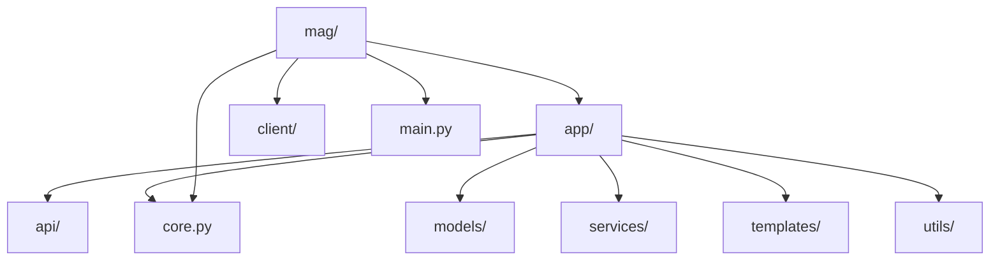
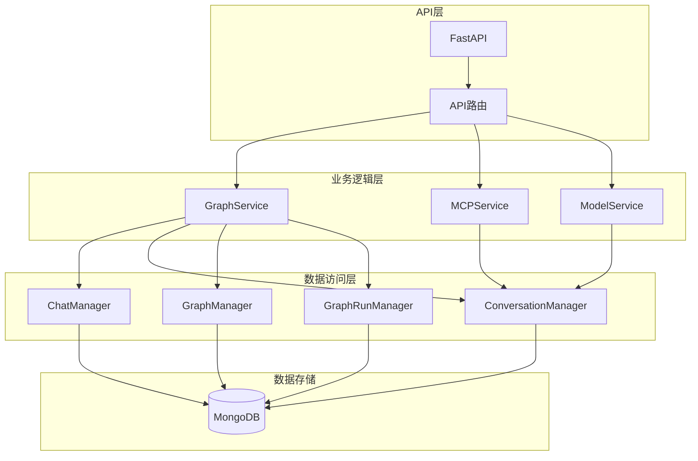
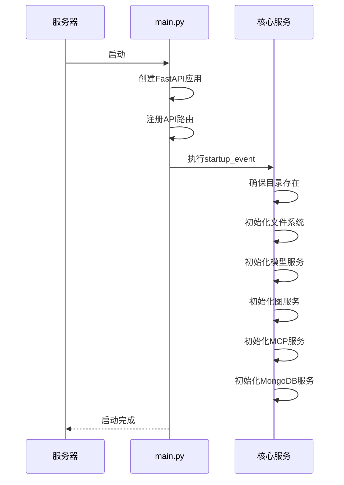
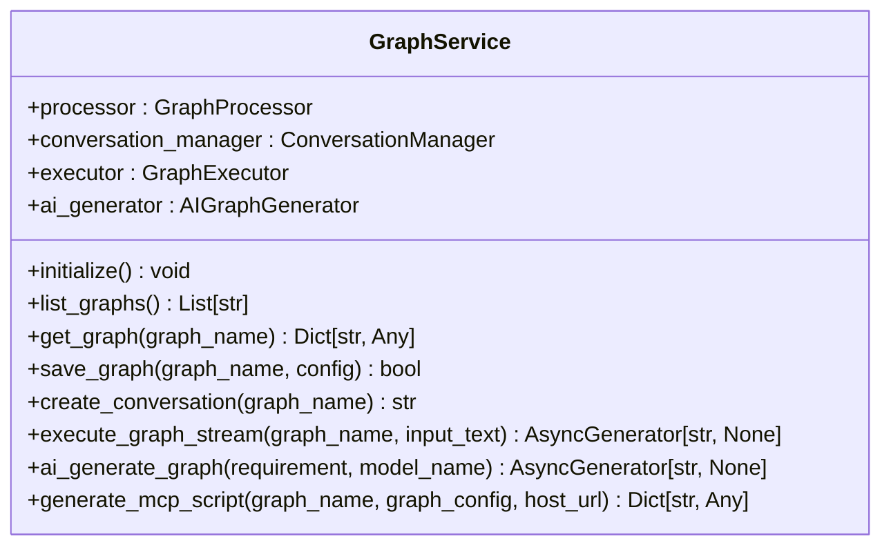
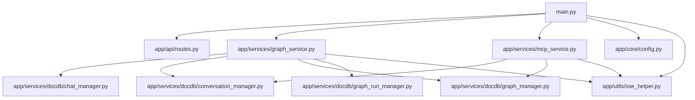

# 后端架构

<cite>
**本文档中引用的文件**  
- [main.py](file://mag/main.py)
- [routes.py](file://mag/app/api/routes.py)
- [config.py](file://mag/app/core/config.py)
- [sse_helper.py](file://mag/app/utils/sse_helper.py)
- [graph_service.py](file://mag/app/services/graph_service.py)
- [mcp_service.py](file://mag/app/services/mcp_service.py)
- [chat_manager.py](file://mag/app/services/docdb/chat_manager.py)
- [conversation_manager.py](file://mag/app/services/docdb/conversation_manager.py)
- [graph_manager.py](file://mag/app/services/docdb/graph_manager.py)
- [graph_run_manager.py](file://mag/app/services/docdb/graph_run_manager.py)
</cite>

## 目录
1. [简介](#简介)
2. [项目结构](#项目结构)
3. [核心组件](#核心组件)
4. [架构概览](#架构概览)
5. [详细组件分析](#详细组件分析)
6. [依赖分析](#依赖分析)
7. [性能考量](#性能考量)
8. [故障排除指南](#故障排除指南)
9. [结论](#结论)

## 简介
本技术文档深入解析mcp-agent-graph-p项目的后端架构，重点阐述其基于FastAPI构建的异步RESTful服务设计。文档详细分析了应用入口`main.py`的初始化流程、API路由注册机制、分层架构设计（API层、业务逻辑层、数据访问层）以及核心服务模块（`graph_service.py`、`mcp_service.py`）的实现逻辑。同时，文档还说明了配置管理、服务器推送事件（SSE）支持、异常处理与日志记录等关键工程实践，并通过架构图展示系统各模块间的交互关系。

## 项目结构
mcp-agent-graph-p项目采用清晰的分层目录结构，将前端、后端服务、配置和文档分离。后端核心位于`mag/`目录下，遵循模块化设计原则。

**图源**  
- [main.py](file://mag/main.py)
- [app/api/routes.py](file://mag/app/api/routes.py)

**本节来源**  
- [main.py](file://mag/main.py)
- [app/api/routes.py](file://mag/app/api/routes.py)

## 核心组件
项目后端的核心组件包括应用入口、API路由、配置管理、核心服务和数据访问层。`main.py`作为应用的启动点，负责初始化FastAPI应用、注册路由、加载配置并启动所有依赖服务。`app/api/routes.py`定义了API的主路由器，将不同功能的子路由聚合在一起。`app/core/config.py`提供了统一的配置管理，支持环境变量和多平台路径处理。`app/services/`目录下的`graph_service.py`和`mcp_service.py`是业务逻辑的核心，分别负责图执行和MCP工具管理。数据访问层`app/services/docdb/`封装了与MongoDB的交互。

**本节来源**  
- [main.py](file://mag/main.py)
- [routes.py](file://mag/app/api/routes.py)
- [config.py](file://mag/app/core/config.py)
- [graph_service.py](file://mag/app/services/graph_service.py)
- [mcp_service.py](file://mag/app/services/mcp_service.py)

## 架构概览
mcp-agent-graph-p后端采用典型的分层架构，分为API层、业务逻辑层和服务层。API层通过FastAPI处理HTTP请求，调用业务逻辑层的服务。业务逻辑层包含`graph_service`和`mcp_service`等核心服务，它们协调数据访问层与外部系统。数据访问层使用`docdb`模块中的管理器类与MongoDB进行交互。整个系统通过依赖注入和异步编程模型实现高内聚、低耦合。

**图源**  
- [main.py](file://mag/main.py)
- [graph_service.py](file://mag/app/services/graph_service.py)
- [mcp_service.py](file://mag/app/services/mcp_service.py)
- [chat_manager.py](file://mag/app/services/docdb/chat_manager.py)
- [conversation_manager.py](file://mag/app/services/docdb/conversation_manager.py)
- [graph_manager.py](file://mag/app/services/docdb/graph_manager.py)
- [graph_run_manager.py](file://mag/app/services/docdb/graph_run_manager.py)

## 详细组件分析

### 应用入口与初始化
`main.py`是应用的入口文件，它创建了FastAPI实例，并通过`@app.on_event("startup")`装饰器定义了启动时的初始化逻辑。初始化过程包括创建必要的目录、初始化文件系统、模型服务、图服务、MCP服务和MongoDB服务。这种集中式的初始化确保了所有依赖项在应用启动时都已准备就绪。

**图源**  
- [main.py](file://mag/main.py#L1-L119)

**本节来源**  
- [main.py](file://mag/main.py#L1-L119)

### API路由注册机制
API路由采用模块化设计。`app/api/routes.py`文件创建了一个主路由器，并通过`include_router`方法将来自`chat_routes`、`graph_routes`、`mcp_routes`等模块的子路由器聚合在一起。主应用`main.py`通过`app.include_router(router, prefix="/api")`将这个主路由器挂载到`/api`路径下，实现了清晰的URL命名空间管理。

**本节来源**  
- [routes.py](file://mag/app/api/routes.py#L1-L22)

### 分层架构设计
项目严格遵循分层架构，各层职责分明：
- **API层**：处理HTTP请求和响应，验证输入，调用业务逻辑层。
- **业务逻辑层**：包含`graph_service`、`mcp_service`等，实现核心业务规则和流程编排。
- **数据访问层**：`docdb`包中的各类Manager负责与MongoDB进行CRUD操作，封装了数据库交互的细节。

这种设计使得业务逻辑与数据存储解耦，提高了代码的可维护性和可测试性。

**本节来源**  
- [main.py](file://mag/main.py)
- [graph_service.py](file://mag/app/services/graph_service.py)
- [mcp_service.py](file://mag/app/services/mcp_service.py)
- [chat_manager.py](file://mag/app/services/docdb/chat_manager.py)

### 核心服务逻辑分析

#### 图服务 (GraphService)
`GraphService`是图执行的核心，它协调图的执行、会话管理和图生成。其主要功能包括：
- **图执行**：`execute_graph_stream`方法启动图的流式执行，通过`GraphExecutor`处理节点。
- **会话管理**：`create_conversation`和`get_conversation`方法管理图执行的会话状态。
- **图生成**：`ai_generate_graph`方法提供AI生成图的流式接口。
- **MCP脚本生成**：`generate_mcp_script`方法根据图配置生成可部署的MCP服务器脚本。

**图源**  
- [graph_service.py](file://mag/app/services/graph_service.py#L1-L221)

**本节来源**  
- [graph_service.py](file://mag/app/services/graph_service.py#L1-L221)

#### MCP服务 (MCPService)
`MCPService`作为MCP功能的协调者，管理客户端进程、服务器连接和工具调用。其核心功能包括：
- **客户端管理**：`initialize`方法启动MCP客户端进程。
- **服务器管理**：`connect_server`、`disconnect_server`和`get_server_status`方法管理与MCP服务器的连接。
- **工具执行**：`call_tool`方法执行远程MCP工具。
- **AI生成**：`ai_generate_mcp_stream`方法提供AI生成MCP工具的流式接口。

**本节来源**  
- [mcp_service.py](file://mag/app/services/mcp_service.py#L1-L155)

### 配置管理机制
`app/core/config.py`中的`Settings`类提供了强大的配置管理能力。它通过`dotenv`加载环境变量，并根据操作系统动态确定配置目录（如Windows下的`~/.mag`）。该类通过属性方法（`@property`）定义了`MAG_DIR`、`AGENT_DIR`、`MONGODB_URL`等关键路径和配置项，并通过`ensure_directories`方法确保所有必要目录的存在。

**本节来源**  
- [config.py](file://mag/app/core/config.py#L1-L102)

### 服务器推送事件 (SSE) 实现
`app/utils/sse_helper.py`中的`SSEHelper`类实现了服务器推送事件（SSE），用于向客户端实时推送执行日志和状态更新。它定义了多种事件类型，如`node_start`、`node_end`和`graph_complete`，并通过`format_sse_data`方法将数据格式化为SSE标准格式。`SSECollector`和`TrajectoryCollector`类则用于收集流式数据并转换为完整的响应。

**本节来源**  
- [sse_helper.py](file://mag/app/utils/sse_helper.py#L1-L400)

## 依赖分析
项目后端的依赖关系清晰，遵循单向依赖原则。`main.py`依赖于所有核心服务（`graph_service`、`mcp_service`等），这些服务又依赖于`docdb`数据访问层。`docdb`层直接依赖于MongoDB。`config.py`被所有需要配置的模块所依赖。这种依赖结构避免了循环依赖，保证了系统的稳定性和可维护性。

**图源**  
- [main.py](file://mag/main.py)
- [graph_service.py](file://mag/app/services/graph_service.py)
- [mcp_service.py](file://mag/app/services/mcp_service.py)
- [chat_manager.py](file://mag/app/services/docdb/chat_manager.py)
- [conversation_manager.py](file://mag/app/services/docdb/conversation_manager.py)
- [graph_manager.py](file://mag/app/services/docdb/graph_manager.py)
- [graph_run_manager.py](file://mag/app/services/docdb/graph_run_manager.py)

**本节来源**  
- [main.py](file://mag/main.py)
- [graph_service.py](file://mag/app/services/graph_service.py)
- [mcp_service.py](file://mag/app/services/mcp_service.py)
- [chat_manager.py](file://mag/app/services/docdb/chat_manager.py)
- [conversation_manager.py](file://mag/app/services/docdb/conversation_manager.py)
- [graph_manager.py](file://mag/app/services/docdb/graph_manager.py)
- [graph_run_manager.py](file://mag/app/services/docdb/graph_run_manager.py)

## 性能考量
选择FastAPI作为Web框架，主要得益于其卓越的性能和对异步I/O的原生支持。FastAPI基于Starlette和Pydantic，能够处理高并发请求，非常适合AI工作流这类I/O密集型应用。异步编程模型允许在等待数据库查询或外部API响应时释放事件循环，从而显著提高吞吐量。此外，项目通过SSE实现流式响应，避免了长时间的HTTP连接等待，提升了用户体验。

## 故障排除指南
- **服务启动失败**：检查`main.py`中的`startup_event`日志，确认`config.py`中的路径和MongoDB连接字符串是否正确。
- **API路由404**：确认`routes.py`是否正确导入了所有子路由，并在`main.py`中正确挂载。
- **MCP客户端未启动**：检查`mcp_service.py`的`initialize`方法日志，确认客户端进程是否成功启动。
- **SSE连接中断**：检查`sse_helper.py`中的错误处理逻辑，确保流式生成器正确处理了异常。

**本节来源**  
- [main.py](file://mag/main.py)
- [mcp_service.py](file://mag/app/services/mcp_service.py)
- [sse_helper.py](file://mag/app/utils/sse_helper.py)

## 结论
mcp-agent-graph-p后端架构设计精良，基于FastAPI构建了一个高性能、可扩展的异步RESTful服务。其清晰的分层结构、模块化的服务设计和对SSE的巧妙运用，为复杂的AI工作流处理提供了坚实的基础。通过深入理解`main.py`的初始化流程、`routes.py`的路由机制以及`graph_service`和`mcp_service`的核心逻辑，开发者可以高效地进行二次开发和维护。