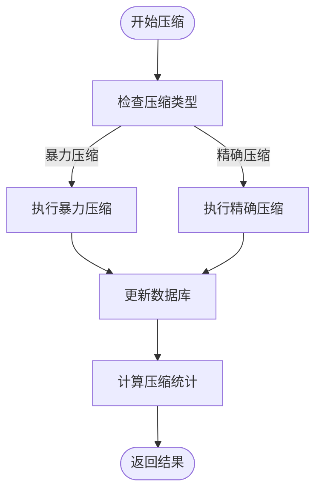
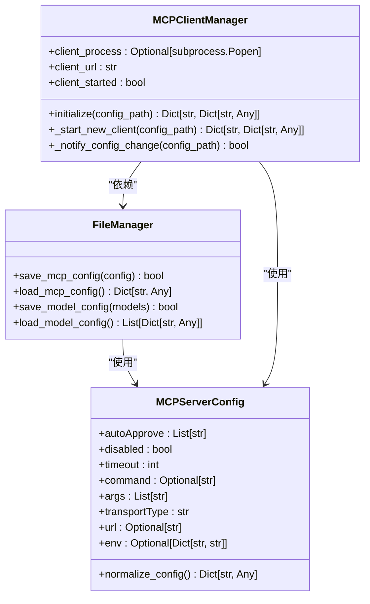
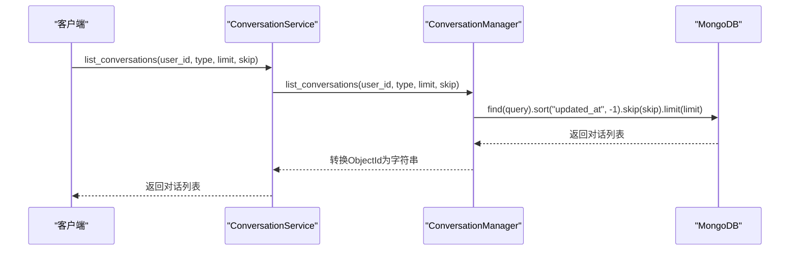

# MCP与会话数据管理

<cite>
**本文档引用的文件**  
- [mcp_manager.py](file://mag/app/services/docdb/mcp_manager.py)
- [conversation_manager.py](file://mag/app/services/docdb/conversation_manager.py)
- [chat_manager.py](file://mag/app/services/docdb/chat_manager.py)
- [mcp_schema.py](file://mag/app/models/mcp_schema.py)
- [chat_schema.py](file://mag/app/models/chat_schema.py)
- [mcp_service.py](file://mag/app/services/mcp_service.py)
- [server_manager.py](file://mag/app/services/mcp/server_manager.py)
- [client_manager.py](file://mag/app/services/mcp/client_manager.py)
- [file_manager.py](file://mag/app/core/file_manager.py)
</cite>

## 目录
1. [引言](#引言)
2. [MCP服务配置管理](#mcp服务配置管理)
3. [会话上下文组织机制](#会话上下文组织机制)
4. [消息持久化与富文本存储](#消息持久化与富文本存储)
5. [敏感信息处理与安全存储](#敏感信息处理与安全存储)
6. [会话数据查询与性能优化](#会话数据查询与性能优化)
7. [结论](#结论)

## 引言
本文档系统性地记录了MCP服务配置与用户会话数据的管理机制。重点分析了`mcp_manager.py`如何安全地存储MCP服务器连接信息，实现工具列表的缓存与同步策略；`conversation_manager.py`对多轮对话上下文的组织方式，包括会话元数据的维护与过期策略；以及`chat_manager.py`在消息持久化方面的设计，支持富文本、代码块与系统事件的混合存储。通过实际代码逻辑说明，展示如何通过会话ID高效检索完整对话历史，并强调敏感信息的脱敏处理与加密存储实践，提供针对会话数据的时间序列查询优化建议。

## MCP服务配置管理

`mcp_manager.py`模块负责MCP服务器连接信息的安全存储与管理。该模块通过`MCPManager`类实现对`mcp_messages`集合中`rounds`格式消息的管理，确保MCP生成对话的完整性和一致性。

MCP服务器的配置信息在`mcp_schema.py`中通过`MCPServerConfig`和`MCPConfig`两个Pydantic模型进行定义。`MCPServerConfig`模型定义了单个MCP服务器的配置，包括`autoApprove`（自动批准的工具列表）、`disabled`（是否禁用）、`timeout`（超时时间）、`command`（启动命令）、`args`（启动参数）、`transportType`（传输类型）、`url`（SSE服务器URL）和`env`（环境变量）等字段。通过`normalize_config`根验证器，系统能够自动处理`type`字段的转换，并根据`transportType`的值动态过滤字段，确保配置的正确性和安全性。

MCP服务的生命周期由`mcp_service.py`中的`MCPService`类协调管理。该类初始化了`MCPClientManager`和`MCPServerManager`，分别负责客户端进程和服务器连接的管理。`MCPClientManager`通过`initialize`方法启动MCP客户端进程，并通过`_start_new_client`方法构建启动命令，确保客户端在指定配置路径下运行。客户端的启动状态通过`_wait_for_client_startup`方法进行轮询检测，确保服务的可靠启动。

服务器连接管理由`server_manager.py`中的`MCPServerManager`类实现。该类通过`connect_server`和`disconnect_server`方法实现对单个服务器的连接与断开操作，并通过`connect_all_servers`方法批量连接所有已配置的MCP服务器。在连接过程中，系统会检查服务器的当前状态，避免重复连接，并记录连接结果的摘要信息，包括成功、失败和已连接的服务器数量。

工具列表的缓存与同步策略通过`get_all_tools`方法实现。该方法向MCP客户端的`/tools`端点发起HTTP请求，获取所有可用工具的信息，并按服务器名称进行分组。`prepare_chat_tools`方法则在此基础上，为聊天会话准备MCP工具列表，将工具信息格式化为OpenAI兼容的`function`调用格式，包括工具名称、描述和输入模式。

**Section sources**
- [mcp_manager.py](file://mag/app/services/docdb/mcp_manager.py#L1-L363)
- [mcp_schema.py](file://mag/app/models/mcp_schema.py#L1-L128)
- [mcp_service.py](file://mag/app/services/mcp_service.py#L1-L155)
- [server_manager.py](file://mag/app/services/mcp/server_manager.py#L1-L268)
- [client_manager.py](file://mag/app/services/mcp/client_manager.py#L1-L274)

## 会话上下文组织机制

`conversation_manager.py`模块负责管理所有类型对话的基本信息，通过`ConversationManager`类实现对`conversations`集合的通用操作。该类提供了创建、获取、更新和删除对话的完整生命周期管理。

会话元数据的维护通过`create_conversation`方法实现。该方法在创建新对话时，会初始化包括`user_id`（用户ID）、`type`（对话类型）、`title`（标题）、`created_at`（创建时间）、`updated_at`（更新时间）、`round_count`（轮次计数）、`total_token_usage`（总token使用量）和`tags`（标签）在内的完整元数据。`ensure_conversation_exists`方法则确保对话的存在性，如果对话不存在，则自动创建一个新对话，避免了因对话缺失导致的异常。

会话的过期策略通过`update_conversation_status`方法实现。该方法允许将对话状态更新为`active`（活跃）、`deleted`（已删除）或`favorite`（收藏）。系统通过`permanently_delete_conversation`方法实现对话的永久删除，确保数据的可管理性和用户隐私的保护。`list_conversations`方法支持按用户ID和对话类型查询对话列表，并按更新时间倒序排列，便于用户快速访问最近的对话。

多轮对话的上下文组织通过`rounds`结构实现。每个对话轮次包含一个`messages`列表，记录该轮次的所有消息。`update_conversation_round_count`方法在每次添加新轮次时递增轮次计数，确保对话进度的准确跟踪。`generate_conversation_title_and_tags`方法在对话创建初期，通过调用AI模型分析第一轮消息内容，自动生成对话标题和标签，提升用户体验。

**Section sources**
- [conversation_manager.py](file://mag/app/services/docdb/conversation_manager.py#L1-L438)
- [chat_schema.py](file://mag/app/models/chat_schema.py#L1-L175)

## 消息持久化与富文本存储

`chat_manager.py`模块负责聊天消息的持久化存储，通过`ChatManager`类实现对`chat_messages`集合的CRUD操作。该模块支持富文本、代码块与系统事件的混合存储，确保消息内容的完整性和可读性。

消息的持久化通过`add_round_to_chat`方法实现。该方法将消息按轮次组织，每个轮次包含一个`messages`列表，记录该轮次的所有消息。消息对象遵循OpenAI兼容的`ChatMessage`模型，包含`role`（角色）、`content`（内容）、`tool_calls`（工具调用）和`tool_call_id`（工具调用ID）等字段。`create_chat_messages_document`方法确保在添加消息前，消息文档已存在，避免了因文档缺失导致的写入失败。

消息的检索通过`get_chat_messages`方法实现。该方法根据`conversation_id`从数据库中获取完整的消息历史，并通过`_convert_objectid_to_str`方法将MongoDB的`ObjectId`转换为字符串，确保数据的可序列化性。`get_chat_round_count`和`get_chat_first_round_messages`方法分别用于获取对话的轮次数量和第一轮消息，支持对话统计和标题生成等高级功能。

消息的压缩策略通过`compact_chat_messages`方法实现。该方法支持两种压缩模式：`brutal`（暴力压缩）和`precise`（精确压缩）。`brutal_compact`方法每轮只保留`system`、`user`和最后一个`assistant`消息，大幅减少消息数量。`precise_compact`方法则对超过阈值的`tool`消息内容进行总结，通过`summarize_callback`回调函数调用AI模型生成摘要，保留关键信息的同时减少存储空间。

**Diagram sources**
- [chat_manager.py](file://mag/app/services/docdb/chat_manager.py#L1-L303)

**Section sources**
- [chat_manager.py](file://mag/app/services/docdb/chat_manager.py#L1-L303)
- [chat_schema.py](file://mag/app/models/chat_schema.py#L1-L175)

## 敏感信息处理与安全存储

系统通过多层次的机制确保敏感信息（如API密钥）的安全存储与处理。首先，MCP服务器的配置文件（`mcp.json`）由`file_manager.py`中的`FileManager`类管理。该类通过`save_mcp_config`和`load_mcp_config`方法实现配置的读写操作，确保配置文件的原子性和一致性。

在配置文件中，敏感信息如API密钥应通过环境变量注入，而非明文存储。`MCPServerConfig`模型中的`env`字段专门用于定义环境变量，系统在启动MCP服务器时，会将这些环境变量传递给子进程，避免了密钥的硬编码。`client_manager.py`中的`_start_new_client`方法在构建启动命令时，会从环境变量中读取配置，确保密钥不会出现在命令行参数中。

对于会话数据中的敏感信息，系统通过`update_conversation_title_and_tags`方法进行脱敏处理。该方法在生成对话标题和标签时，会调用AI模型分析消息内容，但仅提取非敏感的语义信息，避免了直接暴露用户输入的敏感数据。`conversation_manager.py`中的`update_conversation_status`方法允许用户将对话标记为`deleted`，系统在后续处理中会忽略这些对话，确保已删除数据的逻辑隔离。

**Diagram sources**
- [file_manager.py](file://mag/app/core/file_manager.py#L1-L721)
- [mcp_schema.py](file://mag/app/models/mcp_schema.py#L1-L128)
- [client_manager.py](file://mag/app/services/mcp/client_manager.py#L1-L274)

**Section sources**
- [file_manager.py](file://mag/app/core/file_manager.py#L1-L721)
- [mcp_schema.py](file://mag/app/models/mcp_schema.py#L1-L128)
- [client_manager.py](file://mag/app/services/mcp/client_manager.py#L1-L274)

## 会话数据查询与性能优化

系统通过优化的查询策略和索引设计，支持高效的会话数据时间序列查询。`conversation_manager.py`中的`list_conversations`方法支持按用户ID和时间范围进行分页查询，通过MongoDB的`sort`和`skip/limit`操作实现高效的数据检索。

**Diagram sources**
- [conversation_manager.py](file://mag/app/services/docdb/conversation_manager.py#L1-L438)

**Section sources**
- [conversation_manager.py](file://mag/app/services/docdb/conversation_manager.py#L1-L438)

为了进一步提升查询性能，建议在`conversations`集合的`user_id`、`type`和`updated_at`字段上创建复合索引。这将显著加速按用户ID和时间范围的查询操作。对于大规模数据集，可以考虑使用MongoDB的分片功能，将数据按用户ID进行水平分割，实现负载均衡和查询并行化。

分页查询的性能调优方法包括：
1. 使用`limit`和`skip`参数控制返回结果的数量，避免一次性加载过多数据。
2. 在查询条件中尽可能使用索引字段，减少全表扫描的开销。
3. 对于频繁查询的统计信息（如对话总数、今日对话数），可以使用缓存机制（如Redis）存储计算结果，减少数据库的计算压力。
4. 对于长时间运行的聚合查询，可以使用MongoDB的聚合管道优化，将计算任务下推到数据库层。

## 结论
本文档详细分析了MCP服务配置与用户会话数据的管理机制。通过`mcp_manager.py`、`conversation_manager.py`和`chat_manager.py`三个核心模块，系统实现了MCP服务器连接信息的安全存储、多轮对话上下文的高效组织以及富文本消息的持久化存储。敏感信息通过环境变量注入和脱敏处理得到妥善保护，会话数据的查询性能通过索引优化和分页策略得到显著提升。这些设计确保了系统的安全性、可靠性和可扩展性，为用户提供了一个高效、安全的对话管理平台。