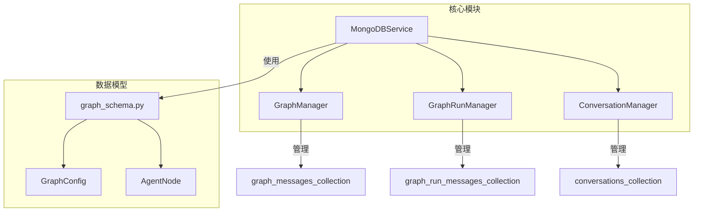

# 图数据管理

<cite>
**本文档中引用的文件**  
- [graph_manager.py](file://mag/app/services/docdb/graph_manager.py)
- [graph_run_manager.py](file://mag/app/services/docdb/graph_run_manager.py)
- [mongodb_service.py](file://mag/app/services/mongodb_service.py)
- [graph_schema.py](file://mag/app/models/graph_schema.py)
- [conversation_manager.py](file://mag/app/services/docdb/conversation_manager.py)
</cite>

## 目录
1. [项目结构](#项目结构)
2. [图配置的持久化与CRUD操作](#图配置的持久化与crud操作)
3. [图执行状态记录与查询优化](#图执行状态记录与查询优化)
4. [高并发下的性能保障](#高并发下的性能保障)
5. [图结构的存储模式](#图结构的存储模式)
6. [复杂图查询与索引优化](#复杂图查询与索引优化)
7. [图数据一致性维护](#图数据一致性维护)

## 项目结构

**图来源**  
- [mongodb_service.py](file://mag/app/services/mongodb_service.py#L12-L417)
- [graph_manager.py](file://mag/app/services/docdb/graph_manager.py#L8-L435)
- [graph_run_manager.py](file://mag/app/services/docdb/graph_run_manager.py#L8-L214)
- [graph_schema.py](file://mag/app/models/graph_schema.py#L77-L88)

**节来源**  
- [mongodb_service.py](file://mag/app/services/mongodb_service.py#L12-L417)
- [graph_manager.py](file://mag/app/services/docdb/graph_manager.py#L8-L435)
- [graph_run_manager.py](file://mag/app/services/docdb/graph_run_manager.py#L8-L214)
- [graph_schema.py](file://mag/app/models/graph_schema.py#L77-L88)

## 图配置的持久化与CRUD操作

`graph_manager.py` 中的 `GraphManager` 类负责图配置的创建、读取、更新和删除（CRUD）操作。该类通过 `graph_messages_collection` 集合管理图生成对话，其中每个文档代表一个图生成会话。

- **创建**：`create_graph_generation_conversation` 方法在 `conversations` 集合中创建对话基本信息，并在 `graph_messages` 集合中创建消息文档，包含 `rounds`、`parsed_results` 和 `final_graph_config` 字段。
- **读取**：`get_graph_generation_conversation` 方法合并 `conversations` 和 `graph_messages` 集合的数据，返回完整的对话信息。
- **更新**：`update_graph_generation_parsed_results` 方法支持节点的替换、追加和删除操作，通过 `$set`、`$push` 和 `$pull` 操作符实现。
- **删除**：`delete_graph_generation_messages` 方法从 `graph_messages` 集合中删除指定对话的消息。

图版本控制通过 `parsed_results` 字段中的 `nodes` 列表实现，每次更新时会检查节点名称，决定是替换现有节点还是追加新节点。用户权限校验在 `conversation_manager.py` 中的 `update_conversation_title` 和 `update_conversation_tags` 方法中实现，通过验证 `user_id` 确保用户有权修改对话。

**节来源**  
- [graph_manager.py](file://mag/app/services/docdb/graph_manager.py#L8-L435)
- [conversation_manager.py](file://mag/app/services/docdb/conversation_manager.py#L8-L437)

## 图执行状态记录与查询优化

`graph_run_manager.py` 中的 `GraphRunManager` 类负责图执行过程中运行时状态的记录与查询。该类通过 `graph_run_messages_collection` 集合管理图运行数据，包含 `rounds`、`global_outputs`、`execution_chain` 和 `handoffs_status` 等字段。

- **状态记录**：`add_round_to_graph_run` 方法向 `rounds` 数组添加新的执行轮次；`update_global_outputs` 方法更新全局输出；`update_execution_chain` 方法记录执行链。
- **查询优化**：`get_graph_run_conversation` 方法直接从 `graph_run_messages_collection` 集合中查询数据，避免了复杂的聚合操作。`mongodb_service.py` 中的 `_create_indexes` 方法为 `conversation_id` 和 `graph_name` 字段创建了索引，提高了查询效率。

**节来源**  
- [graph_run_manager.py](file://mag/app/services/docdb/graph_run_manager.py#L8-L214)
- [mongodb_service.py](file://mag/app/services/mongodb_service.py#L12-L417)

## 高并发下的性能保障

`mongodb_service.py` 中的 `MongoDBService` 类通过连接池机制保障高并发图操作的性能。该类使用 `AsyncIOMotorClient` 实现异步连接，支持高并发操作。

- **连接池**：`initialize` 方法创建 `AsyncIOMotorClient` 实例，自动管理连接池。
- **索引优化**：`_create_indexes` 方法为常用查询字段创建索引，如 `conversation_id`、`graph_name` 和 `user_id`。
- **异步操作**：所有数据库操作均使用 `async/await` 语法，避免阻塞主线程。

**节来源**  
- [mongodb_service.py](file://mag/app/services/mongodb_service.py#L12-L417)

## 图结构的存储模式

图结构在数据库中采用嵌套文档方式存储，以支持原子性更新与快速加载。`GraphConfig` 模型定义了图的结构，包含 `name`、`description`、`nodes` 和 `end_template` 字段。

- **嵌套文档**：`nodes` 字段是一个 `AgentNode` 对象列表，每个 `AgentNode` 包含 `name`、`model_name`、`input_nodes` 等属性。
- **原子性更新**：通过 `update_graph_generation_final_config` 方法，可以一次性更新整个图配置，确保数据一致性。
- **快速加载**：`get_graph_generation_conversation` 方法通过一次查询即可获取完整的图配置，减少了数据库交互次数。

**节来源**  
- [graph_schema.py](file://mag/app/models/graph_schema.py#L77-L88)
- [graph_manager.py](file://mag/app/services/docdb/graph_manager.py#L8-L435)

## 复杂图查询与索引优化

系统支持复杂图查询，如子图检索和路径遍历。`graph_processor.py` 中的 `detect_graph_cycles` 方法可以检测图引用中的循环，确保图的正确性。

- **子图检索**：通过 `subgraph_name` 字段检索子图，支持递归查询。
- **路径遍历**：`execution_chain` 字段记录了图的执行路径，可用于分析执行流程。
- **索引优化**：为 `graph_id` 和 `status` 字段建立复合索引，提高查询效率。`mongodb_service.py` 中的 `_create_indexes` 方法为 `conversation_id` 和 `graph_name` 字段创建了索引。

**节来源**  
- [graph_processor.py](file://mag/app/services/graph/graph_processor.py#L425-L466)
- [mongodb_service.py](file://mag/app/services/mongodb_service.py#L12-L417)

## 图数据一致性维护

系统通过多种机制维护图数据的一致性，特别是在执行中断时的状态恢复。

- **状态恢复**：`GraphRunManager` 中的 `start_time` 和 `completed` 字段记录了图执行的开始时间和完成状态，可用于恢复中断的执行。
- **数据校验**：`graph_schema.py` 中的 `AgentNode` 和 `GraphConfig` 模型定义了数据校验规则，如 `name` 字段不能包含特殊字符，`model_name` 字段不能为空。
- **事务支持**：虽然 MongoDB 不支持传统事务，但通过原子性操作（如 `$set`、`$push`）确保了单个文档的更新一致性。

**节来源**  
- [graph_run_manager.py](file://mag/app/services/docdb/graph_run_manager.py#L8-L214)
- [graph_schema.py](file://mag/app/models/graph_schema.py#L40-L81)