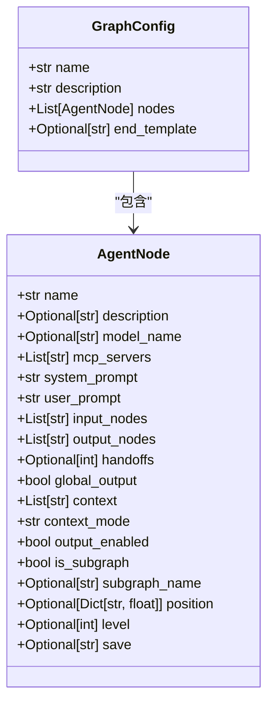
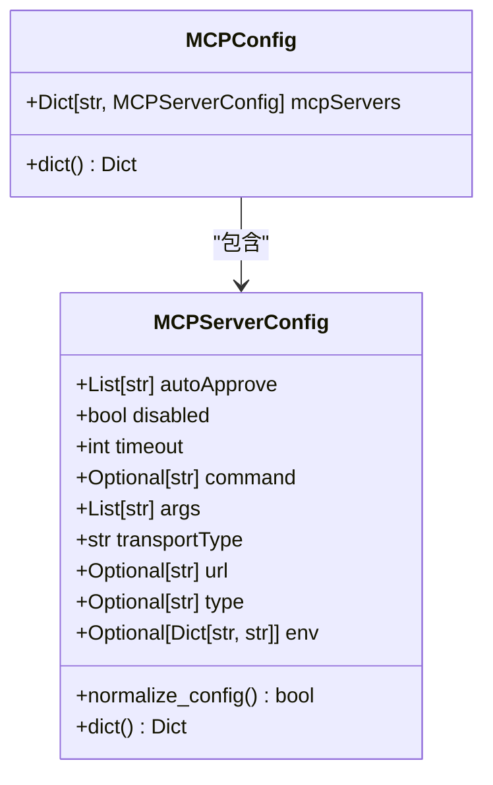
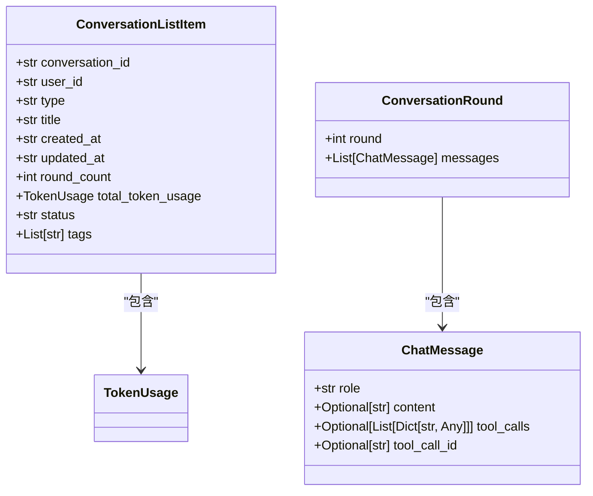

# 数据模型与集合结构

<cite>
**本文档中引用的文件**  
- [graph_schema.py](file://mag/app/models/graph_schema.py)
- [mcp_schema.py](file://mag/app/models/mcp_schema.py)
- [chat_schema.py](file://mag/app/models/chat_schema.py)
- [conversation_manager.py](file://mag/app/services/docdb/conversation_manager.py)
- [graph_manager.py](file://mag/app/services/docdb/graph_manager.py)
- [mcp_manager.py](file://mag/app/services/docdb/mcp_manager.py)
</cite>

## 目录
1. [引言](#引言)
2. [图结构数据模型](#图结构数据模型)
3. [MCP服务器与工具配置模型](#mcp服务器与工具配置模型)
4. [对话与消息模型](#对话与消息模型)
5. [MongoDB集合映射与索引设计](#mongodb集合映射与索引设计)
6. [数据序列化流程与默认值处理](#数据序列化流程与默认值处理)
7. [结论](#结论)

## 引言
本项目通过Pydantic定义了一套结构化数据模型，用于描述图结构、MCP服务器配置及对话记录等核心功能。这些模型不仅定义了数据的字段与验证规则，还通过MongoDB实现了持久化存储。本文档将深入解析各核心数据模型的设计原理、嵌套关系及其在数据库中的映射方式，阐明其如何支持图嵌套、动态配置与时间序列组织。

## 图结构数据模型

### GraphConfig与AgentNode模型设计
`GraphConfig` 模型作为图结构的顶层容器，包含图名称、描述及节点列表。其核心字段 `nodes` 为 `AgentNode` 对象的列表，形成图的主体结构。`AgentNode` 模型则定义了每个节点的详细配置，包括名称、模型选择、MCP服务器绑定、提示词、输入输出节点、层级、位置等。



**图来源**  
- [graph_schema.py](file://mag/app/models/graph_schema.py#L1-L116)

**节来源**  
- [graph_schema.py](file://mag/app/models/graph_schema.py#L1-L116)

### 图嵌套与动态配置支持
`AgentNode` 模型通过 `is_subgraph` 和 `subgraph_name` 字段实现图嵌套功能。当 `is_subgraph` 为 `True` 时，该节点被视为子图节点，其执行将触发另一个图的运行。`context` 和 `context_mode` 字段支持动态上下文管理，允许节点引用其他节点的输出。`context_mode` 可设置为 "all" 或正整数字符串（如 "1"），分别表示获取全部历史输出或仅获取最近n次输出。

### 字段验证规则
模型通过Pydantic的 `@validator` 装饰器实现严格的字段验证：
- `name` 字段禁止包含 `/`, `\`, `.` 等特殊字符。
- 非子图节点必须指定 `model_name`。
- 子图节点必须指定 `subgraph_name`。
- `level` 字段被强制转换为整数。
- `save` 字段被标准化为小写且仅包含字母数字字符。
- `context_mode` 必须为 "all" 或正整数字符串。

这些规则确保了图配置的合法性与一致性。

**节来源**  
- [graph_schema.py](file://mag/app/models/graph_schema.py#L1-L116)

## MCP服务器与工具配置模型

### MCPServerConfig模型与加密存储
`MCPServerConfig` 模型定义了MCP服务器的各项配置，包括传输类型、超时、启动命令、环境变量等。其核心字段 `transportType` 决定了服务器的通信方式（stdio, sse, streamable_http）。模型通过 `@root_validator` 实现了配置的规范化：
- `type` 字段（旧版）会自动映射到 `transportType`。
- 根据 `transportType` 的值，自动推断并设置 `url` 或 `command`。
- 对于 `sse` 和 `streamable_http` 类型，必须提供 `url`；对于 `stdio` 类型，必须提供 `command`。

该模型的 `dict()` 方法会根据 `transportType` 过滤掉无关字段（如 `stdio` 类型时移除 `url`），确保输出的JSON结构简洁且符合协议要求。虽然模型本身未直接处理加密，但其 `env` 字段可用于存储加密后的环境变量，实际的加密逻辑在更高层的服务中实现。



**图来源**  
- [mcp_schema.py](file://mag/app/models/mcp_schema.py#L1-L127)

**节来源**  
- [mcp_schema.py](file://mag/app/models/mcp_schema.py#L1-L127)

### 工具注册与测试模型
`MCPToolRegistration` 模型用于注册新的MCP工具，包含文件夹名、脚本文件内容、README和依赖声明。`MCPToolTestRequest` 和 `MCPToolTestResponse` 模型则定义了工具测试的请求与响应格式，支持参数传递和执行结果返回，便于开发和调试。

**节来源**  
- [mcp_schema.py](file://mag/app/models/mcp_schema.py#L1-L127)

## 对话与消息模型

### Conversation与Message模型的时间序列组织
对话数据采用分层存储策略。`ConversationListItem` 模型定义了 `conversations` 集合的结构，包含对话ID、用户ID、类型、标题、创建/更新时间、轮次计数、Token使用量和状态等元信息。这是一个扁平化的记录，便于快速列表查询。



**图来源**  
- [chat_schema.py](file://mag/app/models/chat_schema.py#L1-L174)

**节来源**  
- [chat_schema.py](file://mag/app/models/chat_schema.py#L1-L174)

对于不同类型对话的详细消息，则存储在专用集合中：
- **图生成对话**：消息存储在 `graph_messages` 集合，由 `GraphManager` 管理。其结构包含 `rounds` 数组，每个 `round` 代表一次用户-助手交互循环，内含 `messages` 列表。此外，`parsed_results` 字段存储AI解析出的图结构信息，`final_graph_config` 存储最终生成的图配置。
- **MCP生成对话**：消息存储在 `mcp_messages` 集合，由 `MCPManager` 管理，结构与 `graph_messages` 类似，但 `parsed_results` 存储的是MCP工具的代码、依赖等信息。

这种设计将高频访问的元数据（`conversations`）与低频访问的详细内容（`graph_messages`, `mcp_messages`）分离，优化了查询性能。

**节来源**  
- [chat_schema.py](file://mag/app/models/chat_schema.py#L1-L174)
- [conversation_manager.py](file://mag/app/services/docdb/conversation_manager.py#L1-L437)
- [graph_manager.py](file://mag/app/services/docdb/graph_manager.py#L1-L435)
- [mcp_manager.py](file://mag/app/services/docdb/mcp_manager.py#L1-L362)

## MongoDB集合映射与索引设计

### 集合命名与分片考量
项目遵循清晰的集合命名规范：
- `conversations`：存储所有对话的元信息。
- `graph_messages`：存储图生成对话的详细消息。
- `mcp_messages`：存储MCP生成对话的详细消息。
- `mcp_servers`：存储MCP服务器的配置（根据 `mcp_schema.py` 推断）。

从数据访问模式看，`conversations` 集合是读写最频繁的，查询主要基于 `user_id` 和 `updated_at`。因此，合理的分片策略是按 `user_id` 进行分片，将同一用户的数据分布到同一分片上，以支持高效的用户级查询。`graph_messages` 和 `mcp_messages` 集合的数据量可能非常大，但由于其访问通常通过 `conversation_id` 关联，且 `conversation_id` 是唯一的，因此可以考虑不进行分片，或按 `conversation_id` 的哈希值分片以实现负载均衡。

### 索引设计
关键索引应包括：
- `conversations` 集合：
  - `{ user_id: 1, updated_at: -1 }`：支持按用户和更新时间排序的列表查询。
  - `{ user_id: 1, status: 1 }`：支持按用户和状态过滤。
  - `{ _id: 1 }`：主键索引。
- `graph_messages` / `mcp_messages` 集合：
  - `{ conversation_id: 1 }`：主键索引，用于通过ID快速查找。

这些索引能有效支撑核心业务场景，如获取用户对话列表、查询特定对话详情等。

**节来源**  
- [conversation_manager.py](file://mag/app/services/docdb/conversation_manager.py#L1-L437)
- [graph_manager.py](file://mag/app/services/docdb/graph_manager.py#L1-L435)
- [mcp_manager.py](file://mag/app/services/docdb/mcp_manager.py#L1-L362)

## 数据序列化流程与默认值处理

### Python对象到BSON的转换
数据序列化流程由Pydantic模型和MongoDB驱动共同完成。当一个Pydantic模型实例（如 `GraphConfig`）需要存入数据库时，首先调用其 `dict()` 方法（或 `model_dump()`）将其转换为Python字典。此过程会：
1.  **应用默认值**：对于未显式赋值的可选字段，使用模型定义中的 `default` 或 `default_factory` 提供默认值（如 `AgentNode` 的 `output_enabled` 默认为 `True`）。
2.  **执行验证**：在转换前，Pydantic会自动触发所有 `@validator` 和 `@root_validator`，确保数据符合规则。
3.  **自定义处理**：对于有自定义 `dict()` 方法的模型（如 `MCPServerConfig`），会执行额外的逻辑（如字段过滤）。
4.  **BSON转换**：得到的Python字典被MongoDB驱动（如PyMongo）转换为BSON格式并存入相应集合。

例如，一个 `AgentNode` 对象在序列化时，其 `position` 字段（如果存在）会被原样保留，而 `save` 字段会被标准化为小写。

### 实际序列化示例
假设有一个 `AgentNode` 实例：
```python
node = AgentNode(
    name="DataProcessor",
    model_name="gpt-4",
    system_prompt="你是一个数据处理专家。",
    input_nodes=["InputNode"],
    output_nodes=["OutputNode"],
    context=["GlobalState"],
    context_mode="1"
)
```
经过 `node.dict()` 后，输出的字典将包含所有字段，并为 `output_enabled`、`global_output` 等字段填充默认值 `True` 和 `False`。最终存入MongoDB的BSON文档将与该字典结构一致。

**节来源**  
- [graph_schema.py](file://mag/app/models/graph_schema.py#L1-L116)
- [mcp_schema.py](file://mag/app/models/mcp_schema.py#L1-L127)

## 结论
本项目通过精心设计的Pydantic模型，构建了一个灵活且健壮的数据层。`GraphConfig` 和 `AgentNode` 模型通过丰富的字段和验证规则，完美支持了复杂的图结构和嵌套逻辑。`MCPServerConfig` 模型通过规范化逻辑，简化了配置管理。对话数据采用分层存储策略，结合 `conversations`、`graph_messages` 和 `mcp_messages` 等集合，实现了高性能的时间序列数据组织。整体设计体现了清晰的职责分离和对MongoDB特性的有效利用，为上层应用提供了坚实的数据基础。