# 数据访问机制

<cite>
**本文档引用的文件**
- [mongodb_service.py](file://mag/app/services/mongodb_service.py)
- [graph_manager.py](file://mag/app/services/docdb/graph_manager.py)
- [mcp_manager.py](file://mag/app/services/docdb/mcp_manager.py)
- [conversation_manager.py](file://mag/app/services/docdb/conversation_manager.py)
- [graph_run_manager.py](file://mag/app/services/docdb/graph_run_manager.py)
- [graph_schema.py](file://mag/app/models/graph_schema.py)
- [mcp_schema.py](file://mag/app/models/mcp_schema.py)
</cite>

## 目录
1. [数据访问层架构](#数据访问层架构)
2. [MongoDB连接与会话管理](#mongodb连接与会话管理)
3. [核心管理器职责分析](#核心管理器职责分析)
4. [数据持久化与序列化流程](#数据持久化与序列化流程)
5. [图结构存储与查询机制](#图结构存储与查询机制)
6. [性能优化策略](#性能优化策略)
7. [数据一致性保障](#数据一致性保障)
8. [错误处理与恢复机制](#错误处理与恢复机制)

## 数据访问层架构

本系统采用分层的数据访问架构，通过`MongoDBService`统一管理数据库连接，并通过多个专用Manager类实现不同业务场景的数据操作。整体架构遵循单一职责原则，将对话管理、图生成、MCP生成和图运行等不同功能的数据操作分离。

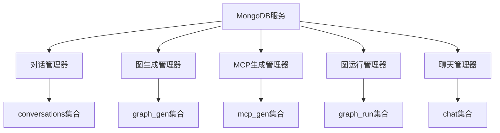

**图来源**
- [mongodb_service.py](file://mag/app/services/mongodb_service.py#L1-L50)
- [conversation_manager.py](file://mag/app/services/docdb/conversation_manager.py#L1-L20)
- [graph_manager.py](file://mag/app/services/docdb/graph_manager.py#L1-L20)

## MongoDB连接与会话管理

`MongoDBService`类负责管理与MongoDB数据库的连接和会话，采用异步驱动`motor.motor_asyncio`实现高并发下的稳定连接。

### 连接池配置

系统通过`AsyncIOMotorClient`建立连接池，配置了多项超时参数以确保连接稳定性：

```python
self.client = AsyncIOMotorClient(
    connection_string,
    serverSelectionTimeoutMS=5000,
    connectTimeoutMS=5000,
    socketTimeoutMS=5000
)
```

这种配置确保了在服务器选择、连接建立和套接字通信三个关键环节都有明确的超时限制，防止连接长时间阻塞。

### 连接生命周期管理

连接的生命周期通过`initialize`和`disconnect`方法进行管理：

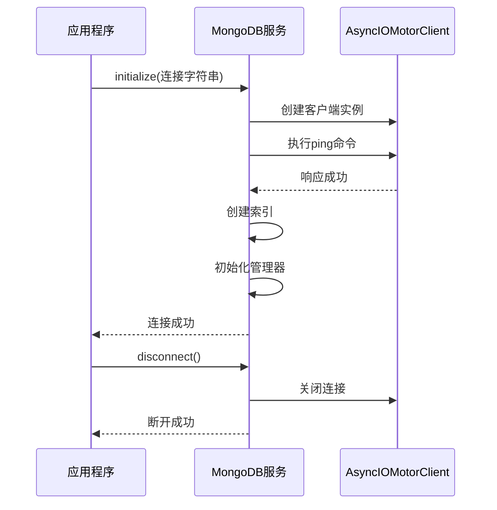

**图来源**
- [mongodb_service.py](file://mag/app/services/mongodb_service.py#L25-L50)

**节来源**
- [mongodb_service.py](file://mag/app/services/mongodb_service.py#L25-L65)

## 核心管理器职责分析

系统通过多个Manager类实现不同业务场景的数据操作，每个Manager负责特定集合的CRUD操作。

### ConversationManager

`ConversationManager`负责`conversations`集合的通用操作，管理所有类型对话的基础信息。

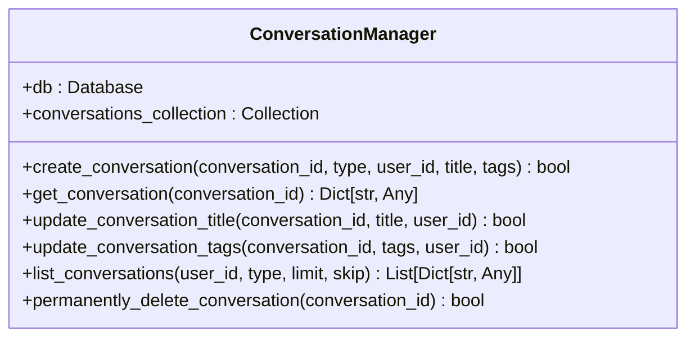

**图来源**
- [conversation_manager.py](file://mag/app/services/docdb/conversation_manager.py#L15-L80)

**节来源**
- [conversation_manager.py](file://mag/app/services/docdb/conversation_manager.py#L15-L80)

### GraphManager

`GraphManager`负责`graph_gen`集合的图生成对话管理，处理图配置的生成过程。

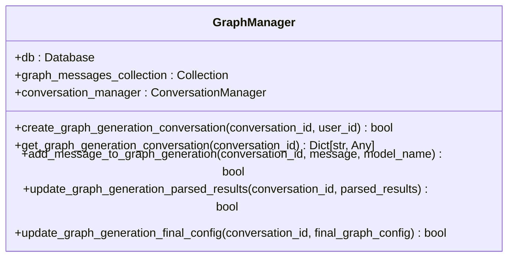

**图来源**
- [graph_manager.py](file://mag/app/services/docdb/graph_manager.py#L15-L45)

**节来源**
- [graph_manager.py](file://mag/app/services/docdb/graph_manager.py#L15-L80)

### MCPManager

`MCPManager`负责`mcp_gen`集合的MCP生成对话管理，处理MCP服务器配置的生成过程。

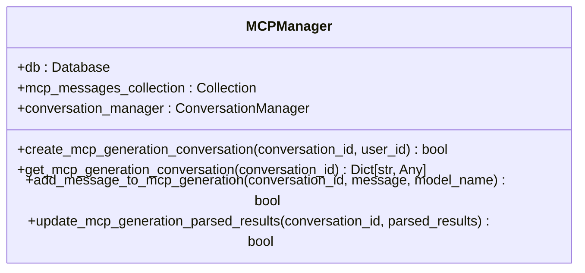

**图来源**
- [mcp_manager.py](file://mag/app/services/docdb/mcp_manager.py#L15-L45)

**节来源**
- [mcp_manager.py](file://mag/app/services/docdb/mcp_manager.py#L15-L80)

### GraphRunManager

`GraphRunManager`负责`graph_run`集合的图运行数据管理，记录图执行过程中的状态变化。

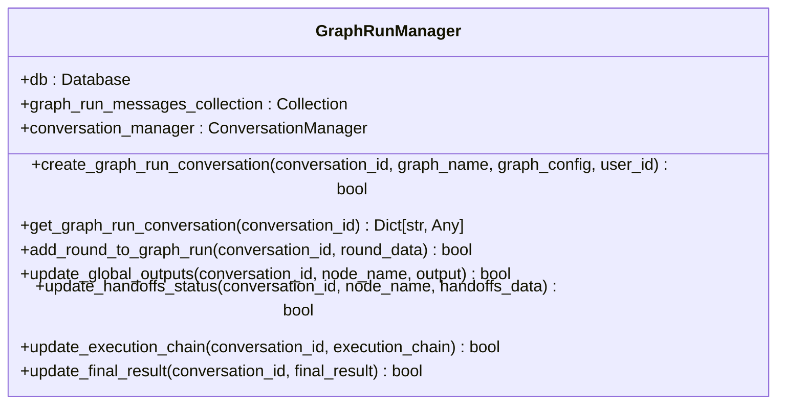

**图来源**
- [graph_run_manager.py](file://mag/app/services/docdb/graph_run_manager.py#L15-L45)

**节来源**
- [graph_run_manager.py](file://mag/app/services/docdb/graph_run_manager.py#L15-L80)

## 数据持久化与序列化流程

系统使用Pydantic模型定义数据结构，并在持久化时进行序列化/反序列化处理。

### Pydantic模型定义

`graph_schema.py`和`mcp_schema.py`文件定义了核心数据模型：

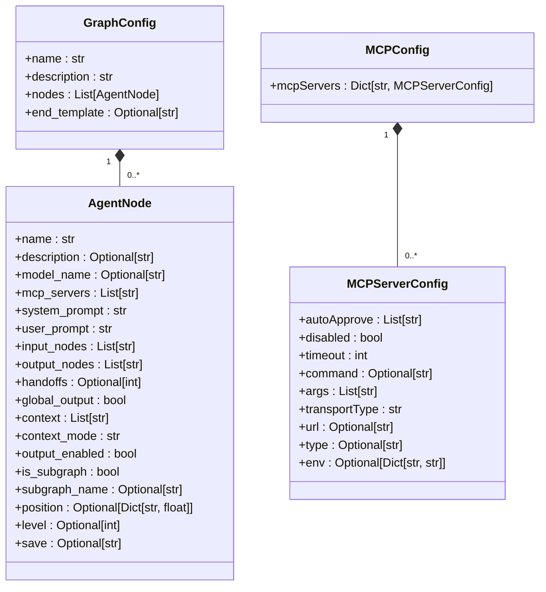

**图来源**
- [graph_schema.py](file://mag/app/models/graph_schema.py#L15-L45)
- [mcp_schema.py](file://mag/app/models/mcp_schema.py#L15-L45)

**节来源**
- [graph_schema.py](file://mag/app/models/graph_schema.py#L15-L80)
- [mcp_schema.py](file://mag/app/models/mcp_schema.py#L15-L80)

### 序列化验证规则

Pydantic模型包含多项验证规则，确保数据完整性：

- **名称验证**：节点名称不能包含特殊字符（/, \\, .）
- **模型验证**：普通节点必须指定模型名称
- **子图验证**：子图节点必须指定子图名称
- **层级验证**：层级必须为正整数
- **保存格式验证**：保存文件扩展名必须为字母数字

这些验证规则在数据持久化前自动执行，确保存储的数据符合业务逻辑要求。

## 图结构存储与查询机制

系统采用嵌套文档的方式存储图结构，将完整的图配置作为嵌套文档存储在`graph_run`集合中。

### 存储模式

图结构采用嵌套文档模式存储，主要优势包括：

1. **原子性操作**：整个图配置的读写操作是原子的
2. **查询效率**：单次查询即可获取完整图结构
3. **数据一致性**：避免了多文档更新的一致性问题

```json
{
  "_id": "conversation_123",
  "graph_name": "example_graph",
  "graph_config": {
    "name": "example_graph",
    "description": "示例图",
    "nodes": [
      {
        "name": "node1",
        "model_name": "gpt-4",
        "input_nodes": ["start"],
        "output_nodes": ["node2"],
        "level": 1
      },
      {
        "name": "node2",
        "model_name": "gpt-3.5",
        "input_nodes": ["node1"],
        "output_nodes": ["end"],
        "level": 2
      }
    ],
    "end_template": "最终结果：{node2}"
  },
  "execution_chain": ["node1", "node2"],
  "global_outputs": {
    "node1": ["输出1", "输出2"],
    "node2": ["输出3"]
  }
}
```

### 高效查询嵌套关系

系统通过MongoDB的点号表示法和数组操作符高效查询嵌套图关系：

- **节点查询**：`graph_config.nodes.name` 可用于查询特定节点
- **层级查询**：`graph_config.nodes.level` 可用于按执行顺序查询节点
- **输入输出查询**：`graph_config.nodes.input_nodes` 和 `graph_config.nodes.output_nodes` 可用于构建执行链

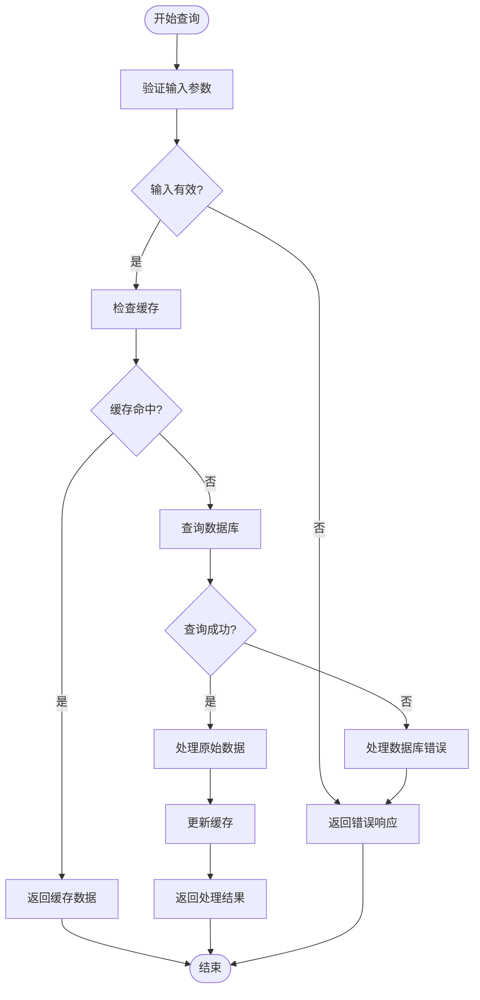

**图来源**
- [graph_run_manager.py](file://mag/app/services/docdb/graph_run_manager.py#L150-L180)

**节来源**
- [graph_run_manager.py](file://mag/app/services/docdb/graph_run_manager.py#L150-L200)

## 性能优化策略

系统实施了多项性能优化策略，确保高并发下的稳定运行。

### 索引策略

系统在关键字段上创建了复合索引，优化查询性能：

```python
# conversations集合索引
await self.conversations_collection.create_index([("user_id", 1), ("type", 1), ("created_at", -1)])
await self.conversations_collection.create_index([("status", 1)])
await self.conversations_collection.create_index([("updated_at", -1)])

# graph_run集合索引
await self.graph_run_messages_collection.create_index([("conversation_id", 1)])
await self.graph_run_messages_collection.create_index([("graph_name", 1)])
```

这些索引支持以下常见查询模式：
- 按用户ID和类型查询对话列表
- 按状态过滤对话
- 按更新时间排序
- 按会话ID快速查找运行数据
- 按图名称查找运行实例

### 批量操作使用场景

系统在以下场景中使用批量操作提高性能：

1. **批量更新节点状态**：在图执行过程中，批量更新多个节点的输出状态
2. **批量插入轮次数据**：当需要一次性添加多个对话轮次时
3. **批量删除对话**：在清理过期对话时

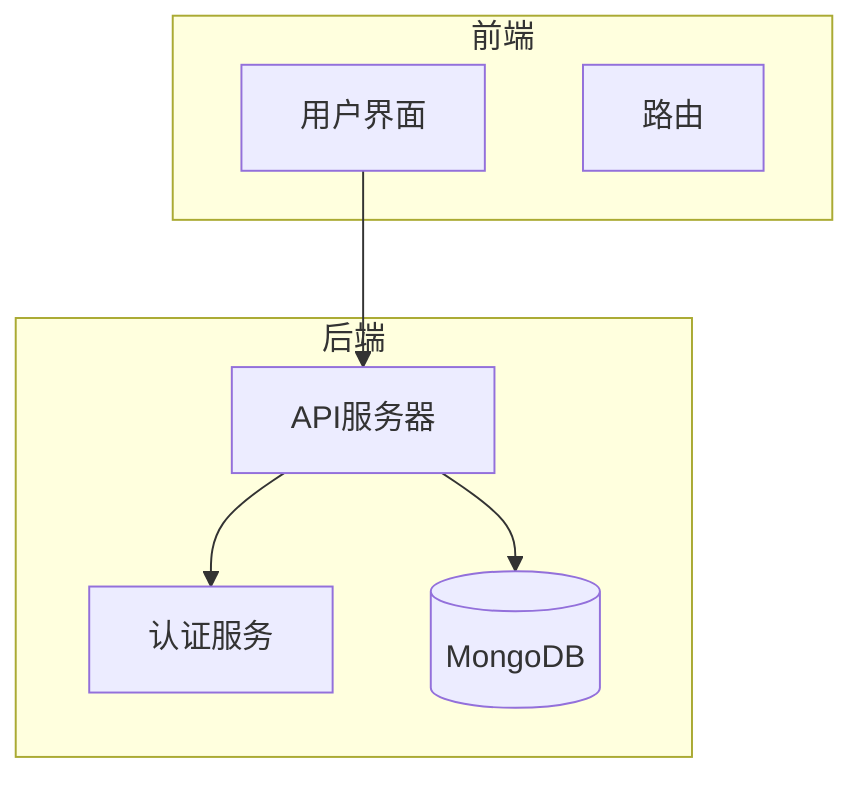

**图来源**
- [mongodb_service.py](file://mag/app/services/mongodb_service.py#L100-L120)

**节来源**
- [mongodb_service.py](file://mag/app/services/mongodb_service.py#L100-L150)

## 数据一致性保障

系统通过多种机制确保数据一致性，特别是在图执行过程中的状态更新。

### 原子性处理

图执行过程中的状态更新采用原子性操作，确保数据一致性：

```python
# 更新全局输出
result = await self.graph_run_messages_collection.update_one(
    {"conversation_id": conversation_id},
    {
        "$push": {f"global_outputs.{node_name}": output},
        "$set": {"updated_at": datetime.utcnow().isoformat()}
    }
)
```

这种更新模式确保了：
1. **原子性**：`$push`和`$set`操作在同一文档上原子执行
2. **版本控制**：每次更新都包含时间戳，便于追踪变更历史
3. **幂等性**：相同的操作可以安全重试

### 事务处理

虽然系统主要使用单文档原子操作，但在需要跨集合更新的场景中，通过业务逻辑层实现类似事务的行为：

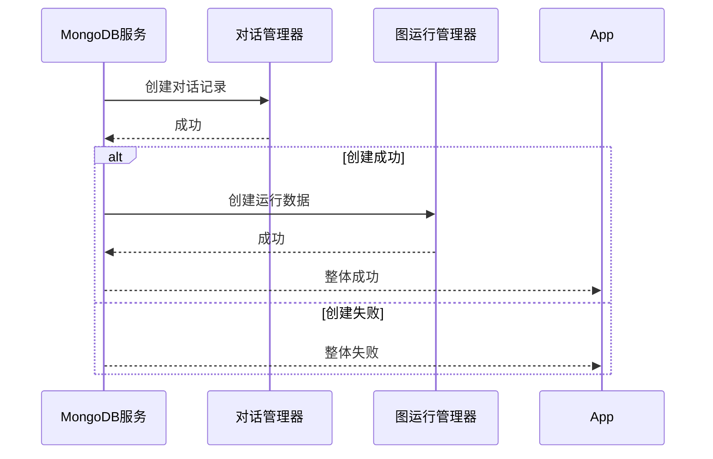

**图来源**
- [graph_run_manager.py](file://mag/app/services/docdb/graph_run_manager.py#L30-L60)

**节来源**
- [graph_run_manager.py](file://mag/app/services/docdb/graph_run_manager.py#L30-L100)

## 错误处理与恢复机制

系统实现了完善的错误处理与恢复机制，确保在异常情况下的数据安全。

### 连接中断重试逻辑

虽然当前代码中未显式实现重试逻辑，但`motor`驱动本身具有连接重试机制。系统通过以下方式处理连接问题：

1. **连接超时设置**：明确设置连接超时参数，防止无限等待
2. **异常捕获**：捕获并记录所有数据库异常
3. **状态标记**：标记连接状态，避免在断开状态下执行操作

```python
try:
    await self.client.admin.command('ping')
    self.is_connected = True
    logger.info("MongoDB连接成功建立")
except Exception as e:
    logger.error(f"MongoDB连接失败: {str(e)}")
    self.is_connected = False
    raise
```

### 数据损坏恢复策略

系统通过以下策略应对可能的数据损坏情况：

1. **数据验证**：在读取数据后进行验证，确保数据结构完整
2. **默认值处理**：对缺失字段提供合理的默认值
3. **日志记录**：详细记录数据操作日志，便于问题追踪

```python
def _convert_objectid_to_str(self, doc: Dict[str, Any]) -> Dict[str, Any]:
    """将ObjectId转换为字符串"""
    if isinstance(doc.get("_id"), ObjectId):
        doc["_id"] = str(doc["_id"])
    return doc
```

这种转换方法确保了即使在ObjectId转换失败的情况下，也能返回可处理的数据结构。

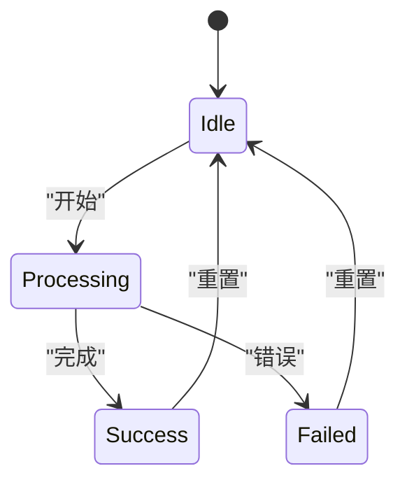

**图来源**
- [conversation_manager.py](file://mag/app/services/docdb/conversation_manager.py#L400-L420)

**节来源**
- [conversation_manager.py](file://mag/app/services/docdb/conversation_manager.py#L400-L430)