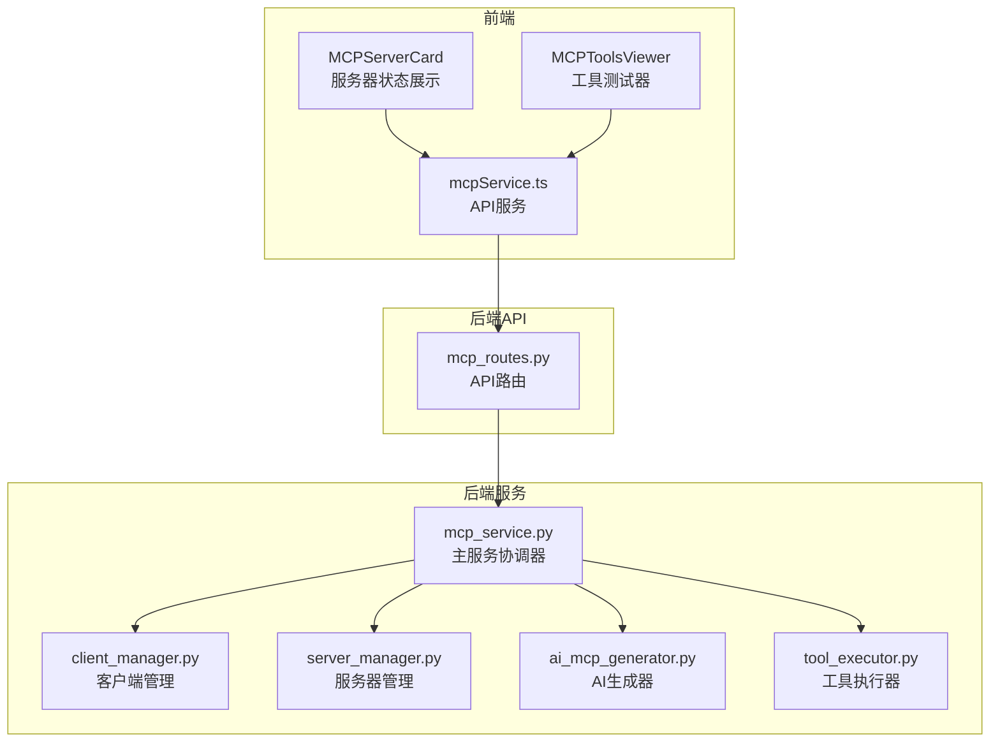
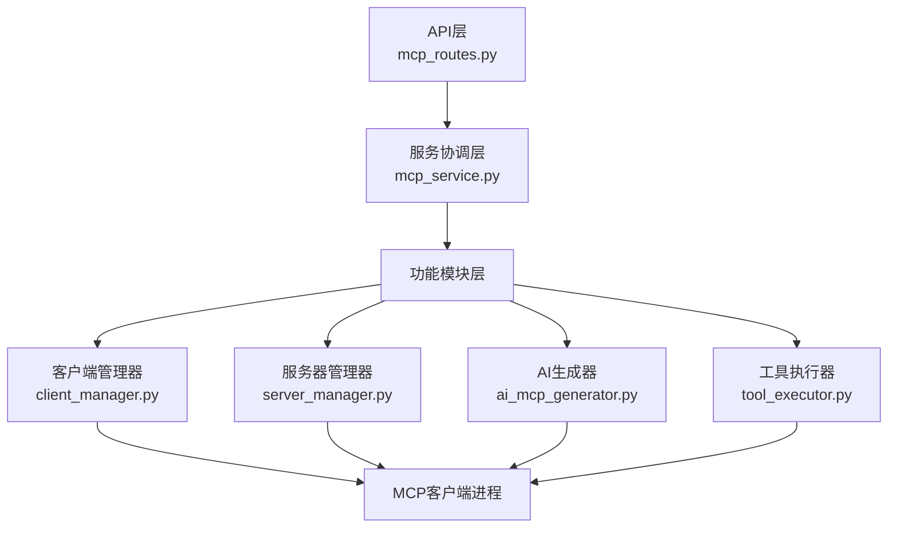
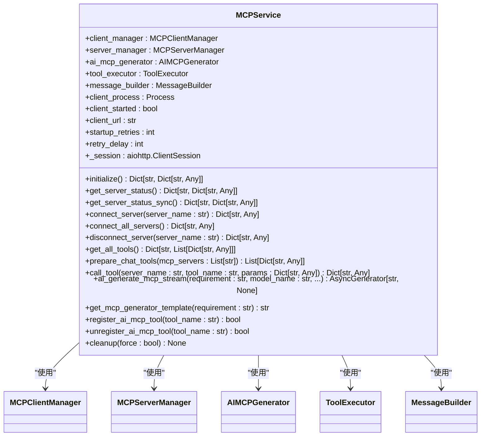
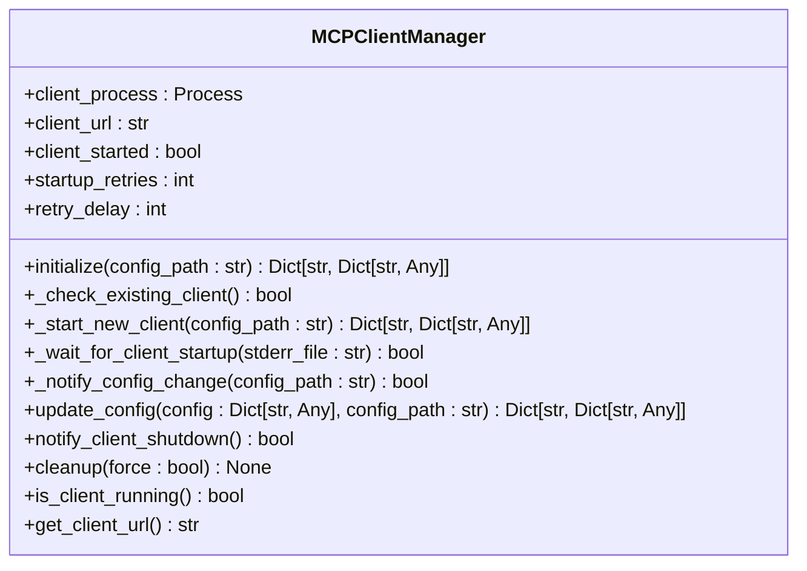
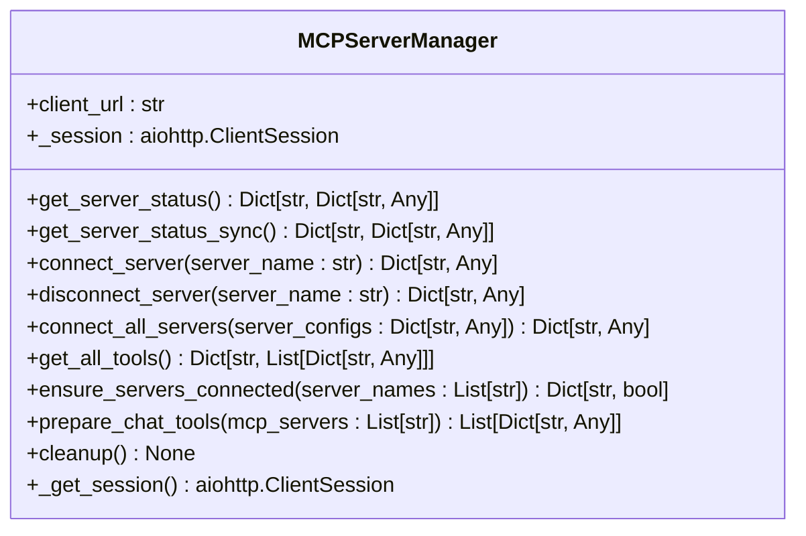
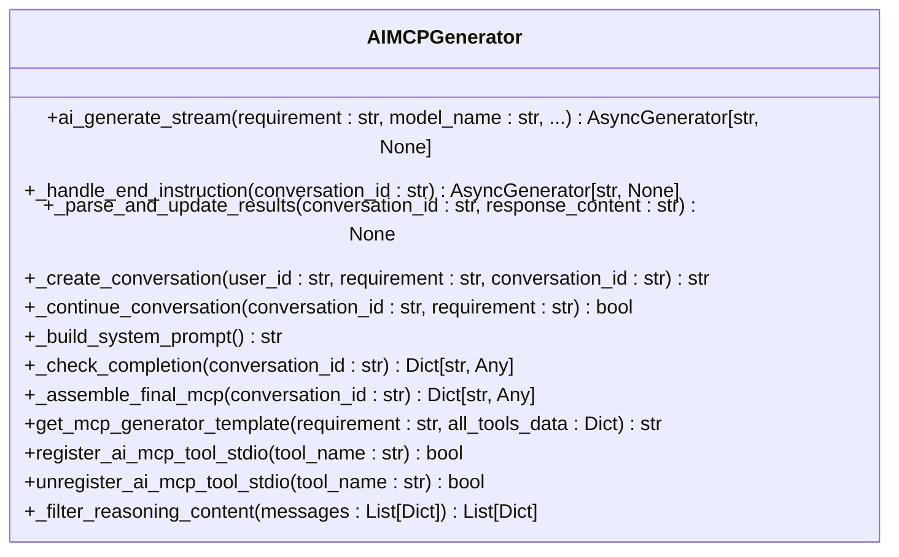
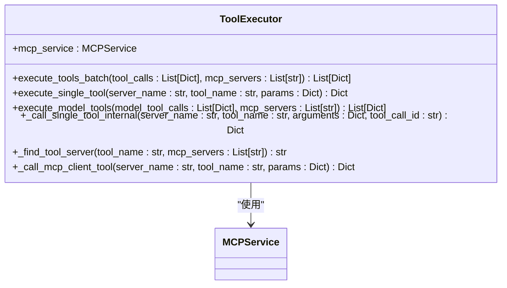
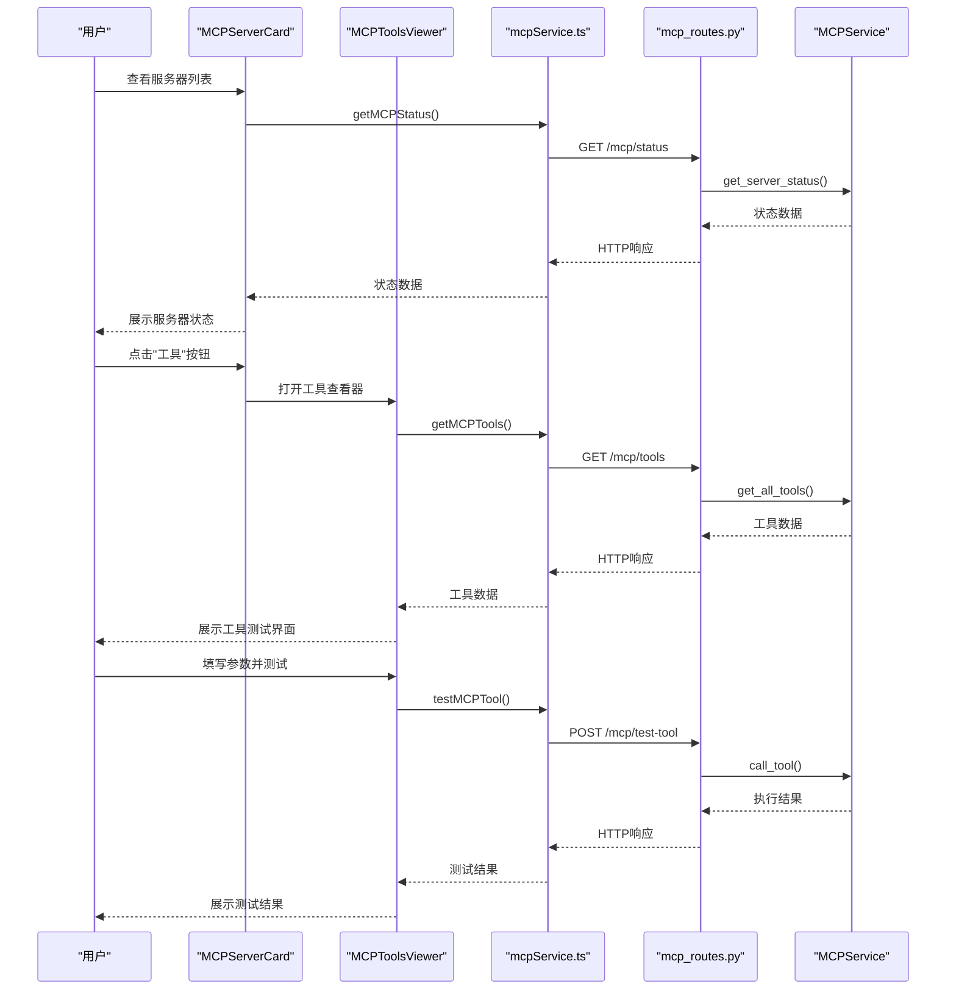
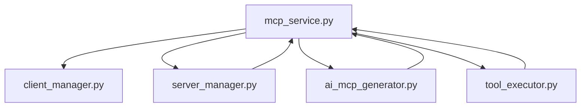

# MCP服务

<cite>
**本文档引用的文件**   
- [mcp_service.py](file://mag/app/services/mcp_service.py)
- [ai_mcp_generator.py](file://mag/app/services/mcp/ai_mcp_generator.py)
- [server_manager.py](file://mag/app/services/mcp/server_manager.py)
- [client_manager.py](file://mag/app/services/mcp/client_manager.py)
- [tool_executor.py](file://mag/app/services/mcp/tool_executor.py)
- [MCPServerCard.tsx](file://frontend/src/components/mcp-manager/MCPServerCard.tsx)
- [MCPToolsViewer.tsx](file://frontend/src/components/mcp-manager/MCPToolsViewer.tsx)
- [mcp_routes.py](file://mag/app/api/mcp_routes.py)
- [mcpService.ts](file://frontend/src/services/mcpService.ts)
</cite>

## 目录
1. [简介](#简介)
2. [项目结构](#项目结构)
3. [核心组件](#核心组件)
4. [架构概述](#架构概述)
5. [详细组件分析](#详细组件分析)
6. [依赖分析](#依赖分析)
7. [性能考虑](#性能考虑)
8. [故障排除指南](#故障排除指南)
9. [结论](#结论)

## 简介
MCP服务是MAG系统中的核心模块，负责管理MCP（Model Control Protocol）服务器的生命周期、工具生成与执行。该服务通过协调客户端进程、服务器连接、AI生成工具和运行时执行，实现了对多个MCP服务器的统一管理。系统支持手动配置的传统MCP服务器和由AI自动生成的MCP工具，提供了完整的工具发现、连接管理和执行能力。前端组件MCPServerCard和MCPToolsViewer为用户提供直观的服务器状态展示和工具测试界面，而后端API则暴露了add_mcp_server、generate_mcp_tools、execute_tool等关键功能，形成了从前端交互到后端执行的完整链路。

## 项目结构
MCP服务的代码分布在多个模块中，形成了清晰的分层架构。核心服务逻辑位于`mag/app/services/mcp/`目录下，包括主协调器`mcp_service.py`以及负责特定功能的子模块。客户端生命周期由`client_manager.py`管理，服务器连接和状态查询由`server_manager.py`处理，AI生成工具的功能在`ai_mcp_generator.py`中实现，而工具的实际执行则由`tool_executor.py`负责。API路由在`mag/app/api/mcp_routes.py`中定义，将内部服务功能暴露为HTTP端点。前端组件位于`frontend/src/components/mcp-manager/`目录，包括`MCPServerCard.tsx`用于展示服务器状态和`MCPToolsViewer.tsx`用于工具测试。这种结构实现了前后端分离，各组件职责明确，便于维护和扩展。

**图源**
- [mcp_service.py](file://mag/app/services/mcp_service.py)
- [ai_mcp_generator.py](file://mag/app/services/mcp/ai_mcp_generator.py)
- [server_manager.py](file://mag/app/services/mcp/server_manager.py)
- [client_manager.py](file://mag/app/services/mcp/client_manager.py)
- [tool_executor.py](file://mag/app/services/mcp/tool_executor.py)
- [MCPServerCard.tsx](file://frontend/src/components/mcp-manager/MCPServerCard.tsx)
- [MCPToolsViewer.tsx](file://frontend/src/components/mcp-manager/MCPToolsViewer.tsx)
- [mcp_routes.py](file://mag/app/api/mcp_routes.py)
- [mcpService.ts](file://frontend/src/services/mcpService.ts)

**本节来源**
- [mcp_service.py](file://mag/app/services/mcp_service.py)
- [ai_mcp_generator.py](file://mag/app/services/mcp/ai_mcp_generator.py)
- [server_manager.py](file://mag/app/services/mcp/server_manager.py)
- [client_manager.py](file://mag/app/services/mcp/client_manager.py)
- [tool_executor.py](file://mag/app/services/mcp/tool_executor.py)
- [MCPServerCard.tsx](file://frontend/src/components/mcp-manager/MCPServerCard.tsx)
- [MCPToolsViewer.tsx](file://frontend/src/components/mcp-manager/MCPToolsViewer.tsx)
- [mcp_routes.py](file://mag/app/api/mcp_routes.py)
- [mcpService.ts](file://frontend/src/services/mcpService.ts)

## 核心组件
MCP服务的核心组件包括MCPService主协调器、MCPClientManager客户端管理器、MCPServerManager服务器管理器、AIMCPGenerator AI生成器和ToolExecutor工具执行器。MCPService作为系统的中枢，初始化并协调所有子模块，提供统一的接口供外部调用。MCPClientManager负责MCP客户端进程的启动、监控和清理，确保底层通信服务的正常运行。MCPServerManager通过HTTP API与MCP客户端交互，管理服务器的连接状态和工具发现。AIMCPGenerator利用大语言模型，根据自然语言描述自动生成符合MCP协议的工具定义和代码实现。ToolExecutor则负责在运行时调用MCP工具，处理参数解析和结果返回。这些组件共同构成了MCP服务的完整功能体系。

**本节来源**
- [mcp_service.py](file://mag/app/services/mcp_service.py)
- [client_manager.py](file://mag/app/services/mcp/client_manager.py)
- [server_manager.py](file://mag/app/services/mcp/server_manager.py)
- [ai_mcp_generator.py](file://mag/app/services/mcp/ai_mcp_generator.py)
- [tool_executor.py](file://mag/app/services/mcp/tool_executor.py)

## 架构概述
MCP服务采用分层架构设计，从上到下分为API层、服务协调层、功能模块层和客户端层。API层（mcp_routes.py）接收HTTP请求，将其转换为服务调用。服务协调层（mcp_service.py）作为中央协调器，整合各个功能模块的服务。功能模块层包含四个核心组件：客户端管理器负责进程生命周期，服务器管理器处理连接和状态查询，AI生成器实现智能工具创建，工具执行器负责运行时调用。最底层是MCP客户端进程，通过HTTP API与上层服务通信。这种架构实现了关注点分离，使得每个组件可以独立开发和测试，同时通过清晰的接口定义保证了系统的整体性和可维护性。

**图源**
- [mcp_service.py](file://mag/app/services/mcp_service.py)
- [client_manager.py](file://mag/app/services/mcp/client_manager.py)
- [server_manager.py](file://mag/app/services/mcp/server_manager.py)
- [ai_mcp_generator.py](file://mag/app/services/mcp/ai_mcp_generator.py)
- [tool_executor.py](file://mag/app/services/mcp/tool_executor.py)
- [mcp_routes.py](file://mag/app/api/mcp_routes.py)

## 详细组件分析

### MCP服务协调器分析
MCPService类是整个MCP服务的核心协调器，负责初始化和协调所有子模块。它在初始化时创建客户端管理器、服务器管理器、AI生成器和工具执行器的实例，并提供统一的接口供外部调用。该服务处理MCP客户端的启动和配置更新，管理所有MCP服务器的连接状态，并作为AI生成工具和运行时执行的桥梁。通过将复杂性封装在内部，MCPService为上层应用提供了简洁的API，使得其他模块无需关心底层实现细节。

#### MCP服务协调器类图

**图源**
- [mcp_service.py](file://mag/app/services/mcp_service.py)

**本节来源**
- [mcp_service.py](file://mag/app/services/mcp_service.py)

### MCP客户端管理器分析
MCPClientManager负责MCP客户端进程的完整生命周期管理，包括启动、状态检查和清理。它通过subprocess模块启动mcp_client.py进程，并监控其运行状态。管理器实现了健壮的启动逻辑，能够检测现有进程、处理启动失败和重试机制。它还提供了通知机制，当MCP配置发生变化时，可以通知客户端重新加载配置。在系统关闭时，管理器能够优雅地关闭客户端进程，确保资源的正确释放。

#### MCP客户端管理器类图

**图源**
- [client_manager.py](file://mag/app/services/mcp/client_manager.py)

**本节来源**
- [client_manager.py](file://mag/app/services/mcp/client_manager.py)

### MCP服务器管理器分析
MCPServerManager专门负责与MCP客户端通信，管理服务器的连接状态和工具发现。它通过HTTP API与运行中的MCP客户端交互，实现了连接、断开、状态查询和工具获取等功能。管理器提供了同步和异步两种接口，以适应不同的使用场景。它还实现了批量操作功能，可以一次性连接所有配置的服务器，并返回详细的连接结果摘要。工具发现功能将原始的工具列表按服务器分组，便于上层应用使用。

#### MCP服务器管理器类图

**图源**
- [server_manager.py](file://mag/app/services/mcp/server_manager.py)

**本节来源**
- [server_manager.py](file://mag/app/services/mcp/server_manager.py)

### AI MCP生成器分析
AIMCPGenerator是MCP服务的智能核心，负责根据自然语言描述自动生成MCP工具。它采用流式响应模式，与大语言模型进行多轮交互，逐步构建工具的完整实现。生成器实现了复杂的对话管理，能够创建、继续和结束生成会话。它使用预定义的提示词模板，结合现有工具列表，引导模型生成符合MCP协议的代码。生成过程包括需求分析、待办事项、文件结构、依赖关系和README文档的生成，最终组装成完整的MCP工具并注册到系统中。

#### AI MCP生成器类图

**图源**
- [ai_mcp_generator.py](file://mag/app/services/mcp/ai_mcp_generator.py)

**本节来源**
- [ai_mcp_generator.py](file://mag/app/services/mcp/ai_mcp_generator.py)

### 工具执行器分析
ToolExecutor是MCP工具的运行时执行引擎，负责调用已连接服务器上的工具。它提供了单个工具调用和批量工具调用两种模式，支持异步执行和结果聚合。执行器实现了智能的服务器查找功能，能够根据工具名称自动确定其所属的MCP服务器。在调用前，它会确保目标服务器已连接，必要时自动建立连接。执行器还处理了参数解析、错误处理和结果格式化，为上层应用提供了统一的调用接口。

#### 工具执行器类图

**图源**
- [tool_executor.py](file://mag/app/services/mcp/tool_executor.py)

**本节来源**
- [tool_executor.py](file://mag/app/services/mcp/tool_executor.py)

### 前端组件分析
前端MCP管理组件提供了用户友好的界面来管理MCP服务器和测试工具。MCPServerCard组件以卡片形式展示每个MCP服务器的状态，包括连接状态、传输类型、超时设置和可用工具等信息，并提供连接、断开、编辑和删除等操作按钮。MCPToolsViewer组件则提供了一个交互式工具测试器，允许用户选择服务器和工具，填写参数并执行测试，实时查看执行结果。这些组件通过mcpService.ts与后端API通信，实现了完整的前后端交互链路。

#### MCP前端组件交互流程

**图源**
- [MCPServerCard.tsx](file://frontend/src/components/mcp-manager/MCPServerCard.tsx)
- [MCPToolsViewer.tsx](file://frontend/src/components/mcp-manager/MCPToolsViewer.tsx)
- [mcpService.ts](file://frontend/src/services/mcpService.ts)
- [mcp_routes.py](file://mag/app/api/mcp_routes.py)
- [mcp_service.py](file://mag/app/services/mcp_service.py)

**本节来源**
- [MCPServerCard.tsx](file://frontend/src/components/mcp-manager/MCPServerCard.tsx)
- [MCPToolsViewer.tsx](file://frontend/src/components/mcp-manager/MCPToolsViewer.tsx)
- [mcpService.ts](file://frontend/src/services/mcpService.ts)

## 依赖分析
MCP服务的组件之间存在清晰的依赖关系。MCPService作为核心协调器，直接依赖于所有其他功能模块：它使用MCPClientManager来管理客户端进程，通过MCPServerManager获取服务器状态和工具信息，调用AIMCPGenerator进行AI生成，以及使用ToolExecutor执行工具调用。MCPServerManager和ToolExecutor都依赖于MCPService提供的客户端URL和会话管理。AIMCPGenerator在构建提示词和注册工具时，需要调用MCPService的其他功能。前端组件通过API与后端服务通信，形成了从前端到后端的完整依赖链。这种依赖结构确保了功能的集中管理和接口的统一性。

**图源**
- [mcp_service.py](file://mag/app/services/mcp_service.py)
- [client_manager.py](file://mag/app/services/mcp/client_manager.py)
- [server_manager.py](file://mag/app/services/mcp/server_manager.py)
- [ai_mcp_generator.py](file://mag/app/services/mcp/ai_mcp_generator.py)
- [tool_executor.py](file://mag/app/services/mcp/tool_executor.py)

**本节来源**
- [mcp_service.py](file://mag/app/services/mcp_service.py)
- [client_manager.py](file://mag/app/services/mcp/client_manager.py)
- [server_manager.py](file://mag/app/services/mcp/server_manager.py)
- [ai_mcp_generator.py](file://mag/app/services/mcp/ai_mcp_generator.py)
- [tool_executor.py](file://mag/app/services/mcp/tool_executor.py)

## 性能考虑
MCP服务在处理多个MCP服务器连接时采用了多种性能优化策略。首先，它实现了资源隔离，每个MCP服务器的连接和工具调用都在独立的上下文中处理，避免了相互干扰。其次，服务采用了异步非阻塞I/O模型，通过aiohttp和asyncio实现了高并发处理能力，能够同时处理多个服务器的连接和工具调用请求。对于AI生成等耗时操作，服务提供了流式响应，避免了长时间的请求等待。在超时控制方面，每个MCP服务器配置中都包含了timeout参数，确保长时间运行的工具调用不会阻塞系统。此外，服务还实现了连接池和会话复用，减少了HTTP连接的创建开销，提高了整体性能。

## 故障排除指南
当MCP服务出现问题时，可以从以下几个方面进行排查：首先检查MCP客户端进程是否正常运行，可以通过查看日志文件或使用ps命令确认进程状态。其次，验证MCP配置文件的正确性，确保服务器配置格式正确且路径有效。对于连接问题，检查客户端URL和端口是否正确，以及防火墙设置是否允许通信。对于AI生成失败，确认指定的模型配置存在且可访问。工具调用失败时，检查参数是否符合工具的输入模式，并查看服务器端的错误日志。系统提供了详细的日志记录，所有关键操作都会在日志中留下记录，这是排查问题的重要依据。此外，前端工具测试器提供了一个便捷的界面来测试工具调用，可以帮助快速定位问题。

**本节来源**
- [mcp_service.py](file://mag/app/services/mcp_service.py)
- [client_manager.py](file://mag/app/services/mcp/client_manager.py)
- [server_manager.py](file://mag/app/services/mcp/server_manager.py)
- [ai_mcp_generator.py](file://mag/app/services/mcp/ai_mcp_generator.py)
- [tool_executor.py](file://mag/app/services/mcp/tool_executor.py)
- [mcp_routes.py](file://mag/app/api/mcp_routes.py)

## 结论
MCP服务通过精心设计的架构和清晰的组件划分，实现了对MCP服务器的全面管理。它不仅支持传统的手动配置服务器，还创新性地引入了AI生成工具的能力，大大降低了创建新工具的门槛。服务的分层设计和异步处理模型确保了高性能和可扩展性，而完善的API和前端组件则提供了良好的用户体验。通过MCPService的协调作用，各个功能模块紧密协作，形成了一个完整、健壮的MCP生态系统。未来可以进一步优化AI生成的准确性和效率，并增强多服务器环境下的资源管理和监控能力。