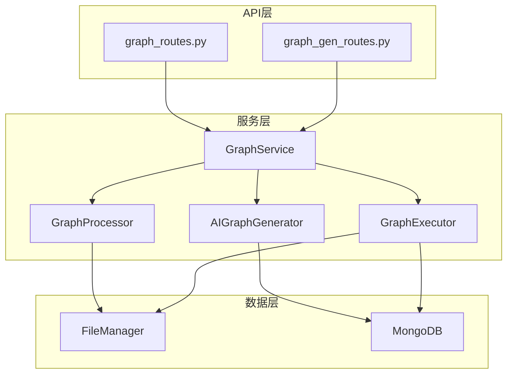
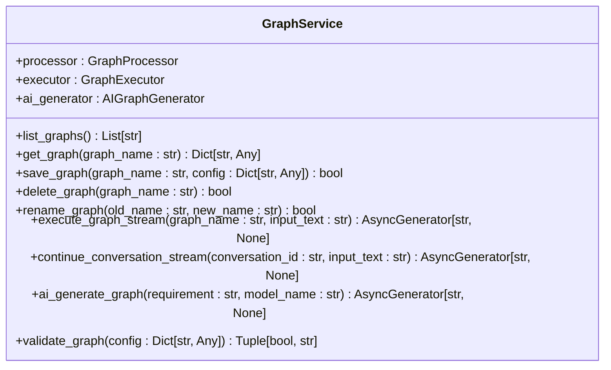
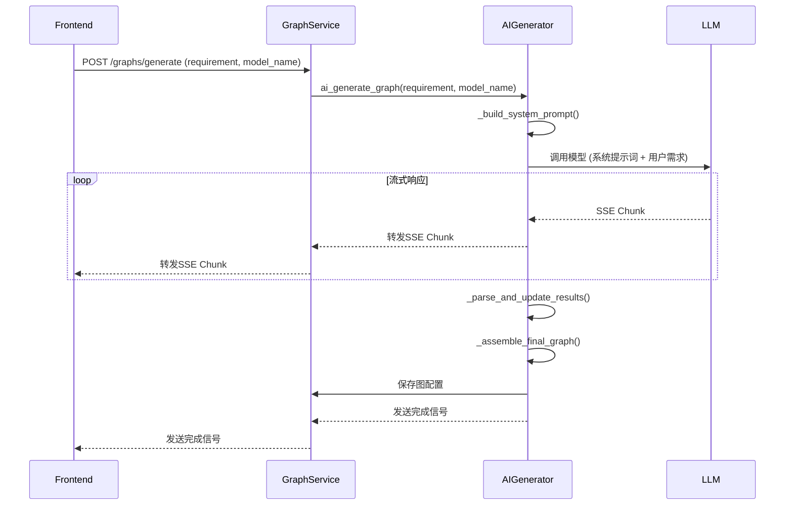
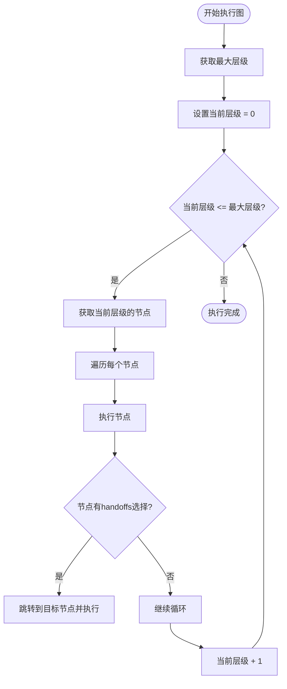
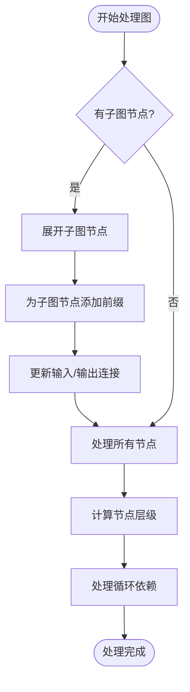
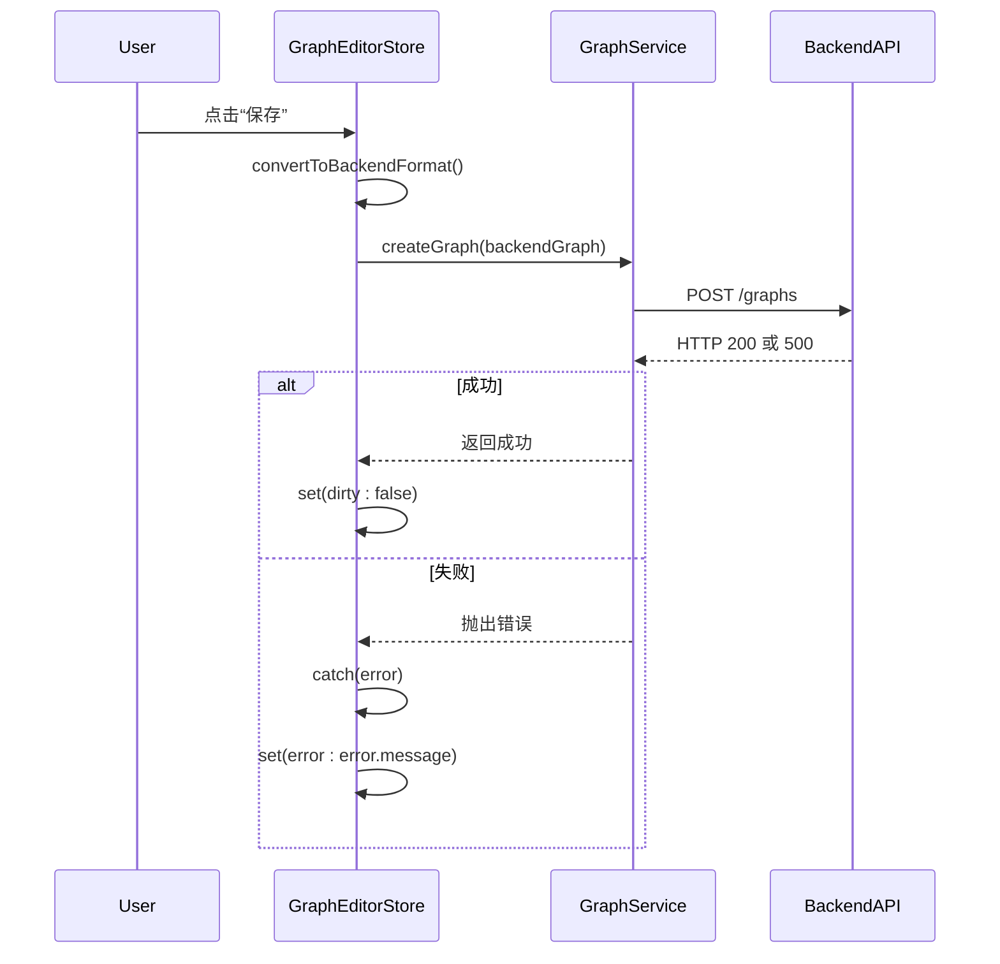
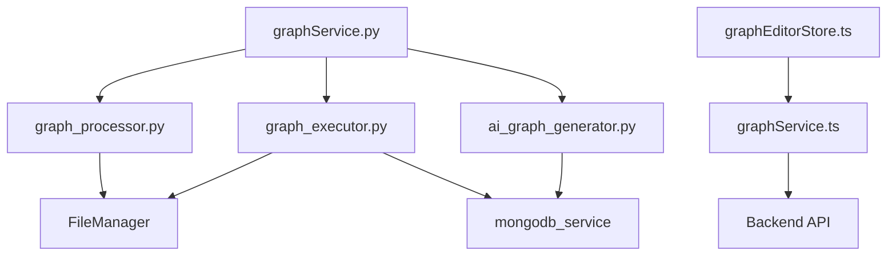

# 图服务

<cite>
**本文档引用的文件**
- [graph_service.py](file://mag/app/services/graph_service.py)
- [ai_graph_generator.py](file://mag/app/services/graph/ai_graph_generator.py)
- [graph_executor.py](file://mag/app/services/graph/graph_executor.py)
- [graph_processor.py](file://mag/app/services/graph/graph_processor.py)
- [graphService.ts](file://frontend/src/services/graphService.ts)
- [graphEditorStore.ts](file://frontend/src/store/graphEditorStore.ts)
- [graph_schema.py](file://mag/app/models/graph_schema.py)
- [graph_routes.py](file://mag/app/api/graph_routes.py)
- [graph_gen_routes.py](file://mag/app/api/graph_gen_routes.py)
</cite>

## 目录
1. [简介](#简介)
2. [项目结构](#项目结构)
3. [核心组件](#核心组件)
4. [架构概览](#架构概览)
5. [详细组件分析](#详细组件分析)
6. [依赖分析](#依赖分析)
7. [性能考虑](#性能考虑)
8. [故障排除指南](#故障排除指南)
9. [结论](#结论)

## 简介
本文档深入解析了图服务（Graph Service）的架构设计与核心功能。该服务是MAG（Multi-Agent Graph）系统的核心，负责管理Agent图的全生命周期，包括创建、读取、更新、删除、执行与导入导出。服务通过与大模型（LLM）集成，实现了从自然语言需求到结构化Agent图的自动化生成。其核心功能由`graph_service.py`协调，依赖`ai_graph_generator.py`进行AI生成、`graph_executor.py`进行图执行、`graph_processor.py`进行图结构处理，并通过`graph_routes.py`和`graph_gen_routes.py`提供RESTful API。前端通过`graphService.ts`和`graphEditorStore.ts`与后端交互，实现了一个完整的图编辑与执行工作流。

## 项目结构
图服务的代码分布在后端Python应用和前端TypeScript应用中。后端逻辑主要位于`mag/app/services/graph/`目录下，包含核心的`graph_service.py`及其依赖的生成器、执行器和处理器。前端交互逻辑位于`frontend/src/services/`和`frontend/src/store/`目录下，通过API与后端通信。

```mermaid
graph TD
subgraph "后端 (Python)"
A[graph_service.py] --> B[ai_graph_generator.py]
A --> C[graph_executor.py]
A --> D[graph_processor.py]
A --> E[graph_routes.py]
A --> F[graph_gen_routes.py]
B --> G[graph_schema.py]
C --> G
D --> G
end
subgraph "前端 (TypeScript)"
H[graphService.ts] --> I[graphEditorStore.ts]
I --> J[GraphCanvas.tsx]
I --> K[NodePropertiesPanel.tsx]
end
E < --> H
F < --> H
```

**图来源**
- [graph_service.py](file://mag/app/services/graph_service.py)
- [ai_graph_generator.py](file://mag/app/services/graph/ai_graph_generator.py)
- [graph_executor.py](file://mag/app/services/graph/graph_executor.py)
- [graph_processor.py](file://mag/app/services/graph/graph_processor.py)
- [graph_routes.py](file://mag/app/api/graph_routes.py)
- [graph_gen_routes.py](file://mag/app/api/graph_gen_routes.py)
- [graphService.ts](file://frontend/src/services/graphService.ts)
- [graphEditorStore.ts](file://frontend/src/store/graphEditorStore.ts)

**章节来源**
- [graph_service.py](file://mag/app/services/graph_service.py)
- [project_structure](file://project_structure)

## 核心组件
图服务的核心功能由`GraphService`类提供，它作为协调者，整合了图生成、执行、处理和持久化等子服务。`GraphService`通过`ai_generator`、`executor`、`processor`等字段与`ai_graph_generator.py`、`graph_executor.py`和`graph_processor.py`中的具体实现进行交互，为上层API提供统一的接口。

**章节来源**
- [graph_service.py](file://mag/app/services/graph_service.py)

## 架构概览
图服务采用分层架构，将图的生命周期管理分为数据层、服务层和API层。数据层由`FileManager`负责，通过文件系统持久化图配置。服务层是核心，`GraphService`协调`GraphProcessor`进行图结构处理（如展开子图、计算层级），`AIGraphGenerator`进行AI驱动的图生成，`GraphExecutor`进行图的流式执行。API层通过FastAPI路由暴露这些功能，前端通过`graphService.ts`调用这些API，`graphEditorStore.ts`则作为前端的状态管理容器，维护当前编辑的图的状态。



**图来源**
- [graph_service.py](file://mag/app/services/graph_service.py)
- [graph_processor.py](file://mag/app/services/graph/graph_processor.py)
- [ai_graph_generator.py](file://mag/app/services/graph/ai_graph_generator.py)
- [graph_executor.py](file://mag/app/services/graph/graph_executor.py)
- [graph_routes.py](file://mag/app/api/graph_routes.py)
- [graph_gen_routes.py](file://mag/app/api/graph_gen_routes.py)

**章节来源**
- [graph_service.py](file://mag/app/services/graph_service.py)
- [graph_processor.py](file://mag/app/services/graph/graph_processor.py)
- [ai_graph_generator.py](file://mag/app/services/graph/ai_graph_generator.py)
- [graph_executor.py](file://mag/app/services/graph/graph_executor.py)

## 详细组件分析
### 图服务 (GraphService) 分析
`GraphService`是图功能的总入口，封装了所有核心操作。它负责图的CRUD（创建、读取、更新、删除）、执行、AI生成和MCP脚本生成。

#### 核心方法
- `list_graphs`, `get_graph`, `save_graph`, `delete_graph`, `rename_graph`: 提供图的持久化管理。
- `execute_graph_stream`, `continue_conversation_stream`: 提供图的流式执行接口，返回SSE（Server-Sent Events）数据。
- `ai_generate_graph`: 提供AI生成图的流式接口，是自然语言到图的关键入口。
- `validate_graph`: 在保存前验证图的完整性，确保执行的可行性。



**图来源**
- [graph_service.py](file://mag/app/services/graph_service.py)

**章节来源**
- [graph_service.py](file://mag/app/services/graph_service.py)

### AI图生成器 (AIGraphGenerator) 分析
`AIGraphGenerator`实现了从自然语言需求到结构化Agent图的自动化生成。它通过多轮对话与大模型交互，逐步构建图的各个部分。

#### 集成机制与流程
1.  **提示词模板构建**: `AIGraphGenerator`在`_build_system_prompt`方法中动态构建系统提示词。它从`model_service`获取所有可用模型，从`mcp_service`获取所有可用的MCP工具，并将这些信息格式化后注入到`prompt_template.md`模板中。这确保了大模型在生成图时，知道系统中有哪些资源可用。
2.  **流式生成与响应解析**: `ai_generate_stream`方法调用大模型进行流式生成。它将用户需求和构建好的系统提示词发送给模型，并实时接收和转发SSE数据。当模型返回完整的响应后，`_parse_and_update_results`方法使用`parse_ai_generation_response`函数解析响应，提取出如`graph_name`、`nodes`等关键信息，并将其保存到MongoDB中。
3.  **图结构验证**: 在生成流程的最后，`_assemble_final_graph`方法会将解析出的节点信息组装成`GraphConfig`对象。Pydantic的`GraphConfig`模型会自动进行数据验证，确保生成的图符合预定义的结构规范。验证通过后，图才会被保存到文件系统。



**图来源**
- [ai_graph_generator.py](file://mag/app/services/graph/ai_graph_generator.py)
- [graph_schema.py](file://mag/app/models/graph_schema.py)
- [graph_gen_routes.py](file://mag/app/api/graph_gen_routes.py)

**章节来源**
- [ai_graph_generator.py](file://mag/app/services/graph/ai_graph_generator.py)

### 图执行器 (GraphExecutor) 分析
`GraphExecutor`负责图的实际执行流程，它根据图的层级和连接关系，按顺序调度节点执行。

#### 调度逻辑
`GraphExecutor`的核心是`_execute_graph_by_level_sequential_stream`方法。它首先通过`_get_max_level`获取图的最大层级，然后从层级0开始，逐层执行该层级的所有节点。对于每个节点，它会调用`_execute_node_stream`进行执行。这种基于层级的调度确保了依赖关系的正确性，即一个节点的输入节点必须在它之前执行完毕。



**图来源**
- [graph_executor.py](file://mag/app/services/graph/graph_executor.py)

**章节来源**
- [graph_executor.py](file://mag/app/services/graph/graph_executor.py)

### 图处理器 (GraphProcessor) 分析
`GraphProcessor`负责处理图的复杂结构，特别是子图（嵌套图）的展开和层级计算。

#### 子图支持机制
`GraphProcessor`通过`_flatten_all_subgraphs`和`preprocess_graph`方法支持图嵌套。当一个节点被标记为`is_subgraph`时，`_flatten_all_subgraphs`会递归地将该子图的所有节点展开，并为子图内的节点添加前缀（如`parent_node.child_node`），以避免命名冲突。同时，它会处理连接关系，将子图的`start`输入替换为父图中指向它的节点，将`end`输出替换为父图中它指向的节点。`_calculate_node_levels`方法则负责计算展开后所有节点的执行层级，它会智能地处理`handoffs`等可能引起循环依赖的情况。



**图来源**
- [graph_processor.py](file://mag/app/services/graph/graph_processor.py)

**章节来源**
- [graph_processor.py](file://mag/app/services/graph/graph_processor.py)

### 前端交互分析
前端通过`graphService.ts`和`graphEditorStore.ts`与后端图服务进行交互，实现了图的可视化编辑和操作。

#### 交互协议与错误处理
- **交互协议**: `graphService.ts`中的函数（如`getGraph`, `createGraph`）直接对应后端的API端点。`graphEditorStore.ts`作为状态管理器，维护当前图的状态（`currentGraph`），并在用户操作（如`addNode`, `updateNode`）后，通过调用`graphService`中的方法与后端同步。`convertToBackendFormat`和`convertFromBackendFormat`函数负责在前端数据格式和后端API要求的格式之间进行转换。
- **错误处理**: 前端采用了统一的错误处理策略。在`graphEditorStore`的每个异步操作中，都使用了`try-catch`块。捕获到的错误会被设置到`error`状态中，然后通过UI组件（如`ErrorMessage.tsx`）展示给用户。例如，在`saveGraph`方法中，如果`createGraph` API调用失败，错误信息会被捕获并显示。



**图来源**
- [graphService.ts](file://frontend/src/services/graphService.ts)
- [graphEditorStore.ts](file://frontend/src/store/graphEditorStore.ts)

**章节来源**
- [graphService.ts](file://frontend/src/services/graphService.ts)
- [graphEditorStore.ts](file://frontend/src/store/graphEditorStore.ts)

## 依赖分析
图服务的组件之间存在清晰的依赖关系。`GraphService`是顶层协调者，直接依赖`GraphProcessor`、`GraphExecutor`和`AIGraphGenerator`。`GraphExecutor`和`GraphProcessor`都依赖`FileManager`进行数据持久化，`AIGraphGenerator`依赖`mongodb_service`进行对话状态管理。前端`graphEditorStore.ts`依赖`graphService.ts`，而`graphService.ts`则依赖后端的API。



**图来源**
- [graph_service.py](file://mag/app/services/graph_service.py)
- [graph_processor.py](file://mag/app/services/graph/graph_processor.py)
- [graph_executor.py](file://mag/app/services/graph/graph_executor.py)
- [ai_graph_generator.py](file://mag/app/services/graph/ai_graph_generator.py)
- [graphService.ts](file://frontend/src/services/graphService.ts)
- [graphEditorStore.ts](file://frontend/src/store/graphEditorStore.ts)

**章节来源**
- [graph_service.py](file://mag/app/services/graph_service.py)
- [graph_processor.py](file://mag/app/services/graph/graph_processor.py)
- [graph_executor.py](file://mag/app/services/graph/graph_executor.py)
- [ai_graph_generator.py](file://mag/app/services/graph/ai_graph_generator.py)
- [graphService.ts](file://frontend/src/services/graphService.ts)
- [graphEditorStore.ts](file://frontend/src/store/graphEditorStore.ts)

## 性能考虑
图服务在性能方面采取了多项措施：
- **异步并发**: 整个执行流程基于`asyncio`，从API层到执行层都使用异步非阻塞I/O，能够高效处理多个并发的图执行请求。
- **流式传输**: 使用SSE（Server-Sent Events）进行流式传输，允许前端在后端处理的同时实时接收结果，提升了用户体验。
- **缓存与预加载**: `FileManager`在初始化时会扫描文件系统，`model_service`和`mcp_service`也会在启动时加载配置，减少了运行时的I/O开销。
- **层级调度**: `GraphExecutor`的层级调度算法避免了不必要的重复计算，确保了执行顺序的高效性。

**章节来源**
- [graph_service.py](file://mag/app/services/graph_service.py)
- [graph_executor.py](file://mag/app/services/graph/graph_executor.py)

## 故障排除指南
- **图执行失败**: 检查`GraphExecutor`的日志，确认是节点执行错误还是连接问题。确保所有引用的模型和MCP服务器都已正确配置并连接。
- **AI生成图无响应**: 检查`AIGraphGenerator`的日志，确认大模型API调用是否成功。检查`prompt_template.md`是否存在，以及模型和工具列表是否正确注入。
- **前端无法保存图**: 检查`graphService.ts`中的`createGraph`方法，确认提交的数据结构是否正确。检查`graphEditorStore.ts`中的错误处理，查看具体的错误信息。
- **子图展开错误**: 检查`GraphProcessor`的`_flatten_all_subgraphs`方法，确认子图名称是否正确，是否存在循环引用。

**章节来源**
- [graph_service.py](file://mag/app/services/graph_service.py)
- [ai_graph_generator.py](file://mag/app/services/graph/ai_graph_generator.py)
- [graph_executor.py](file://mag/app/services/graph/graph_executor.py)
- [graph_processor.py](file://mag/app/services/graph/graph_processor.py)
- [graphService.ts](file://frontend/src/services/graphService.ts)
- [graphEditorStore.ts](file://frontend/src/store/graphEditorStore.ts)

## 结论
图服务是一个功能强大且架构清晰的系统，它成功地将复杂的多Agent工作流管理与大模型的自然语言理解能力相结合。通过分层设计和模块化组件，它实现了图的全生命周期管理。其与`ai_graph_generator.py`的深度集成，使得非技术用户也能通过自然语言创建复杂的自动化流程。`graph_executor.py`和`graph_processor.py`确保了图执行的可靠性和对复杂结构（如子图）的支持。前后端通过定义良好的API和状态管理机制进行高效交互。未来可以进一步优化图的可视化和调试工具，以提升用户体验。