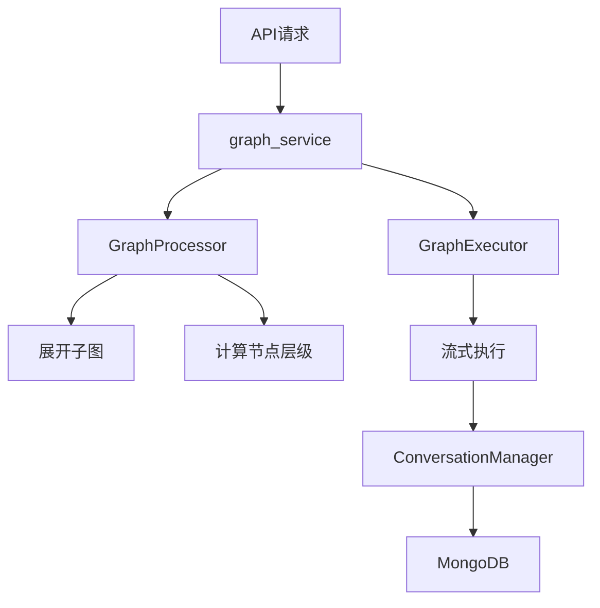
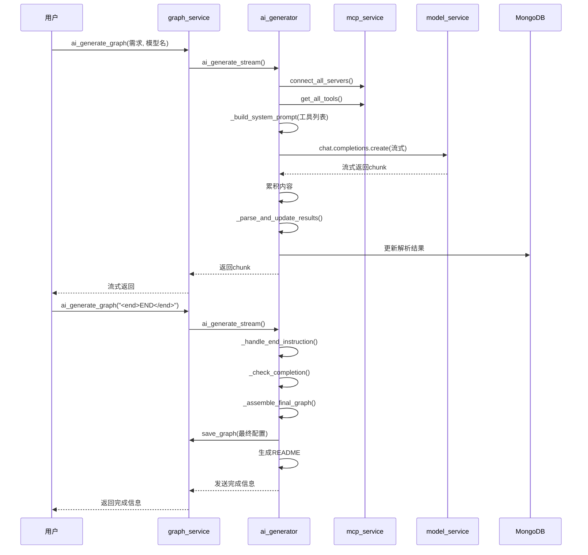
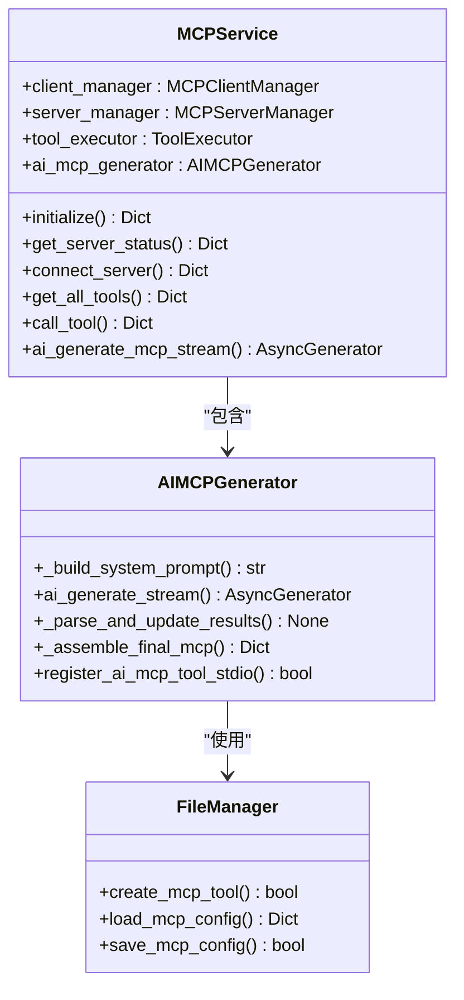
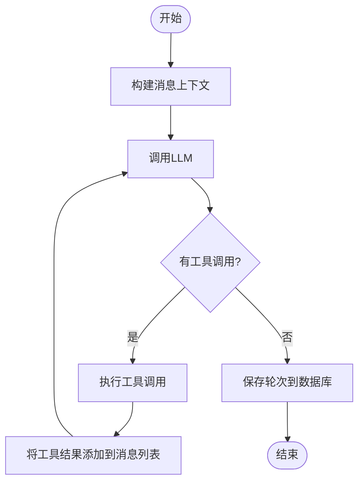
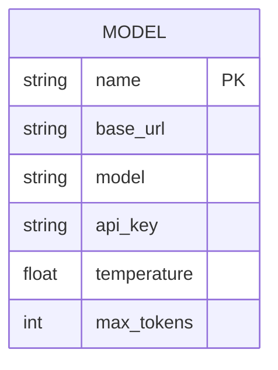
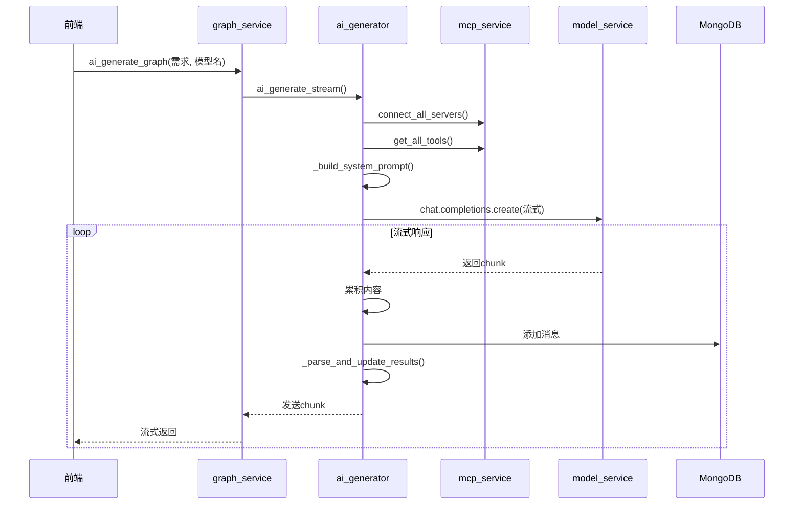
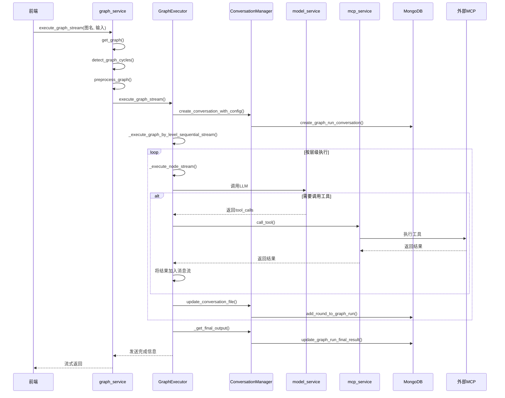

# 服务层架构

<cite>
**本文档中引用的文件**  
- [graph_service.py](file://mag/app/services/graph_service.py)
- [ai_graph_generator.py](file://mag/app/services/graph/ai_graph_generator.py)
- [mcp_service.py](file://mag/app/services/mcp_service.py)
- [ai_mcp_generator.py](file://mag/app/services/mcp/ai_mcp_generator.py)
- [chat_service.py](file://mag/app/services/chat_service.py)
- [model_service.py](file://mag/app/services/model_service.py)
- [graph_processor.py](file://mag/app/services/graph/graph_processor.py)
- [graph_executor.py](file://mag/app/services/graph/graph_executor.py)
- [conversation_manager.py](file://mag/app/services/graph/conversation_manager.py)
</cite>

## 目录
1. [引言](#引言)
2. [图服务层架构与核心流程](#图服务层架构与核心流程)
3. [AI生成Agent图流程](#ai生成agent图流程)
4. [MCP服务管理与AI工具生成](#mcp服务管理与ai工具生成)
5. [对话服务与上下文管理](#对话服务与上下文管理)
6. [模型服务与LLM配置管理](#模型服务与llm配置管理)
7. [关键调用时序分析](#关键调用时序分析)
8. [异步I/O与性能优化](#异步io与性能优化)
9. [总结](#总结)

## 引言

`mcp-agent-graph-p` 是一个基于图结构的智能代理系统，其后端服务层通过多个核心服务类协同工作，实现从用户需求到可执行Agent图的完整闭环。本文档深入解析其服务层的架构设计与实现细节，重点阐述 `graph_service.py` 如何协调图的创建、读取、更新、执行与嵌套逻辑，`mcp_service.py` 在MCP服务器生命周期管理中的核心作用，`chat_service.py` 的对话上下文管理机制，以及 `model_service.py` 对LLM模型的配置管理。

## 图服务层架构与核心流程

`graph_service.py` 是整个Agent图系统的核心协调者，它封装了图的全生命周期管理，包括创建、读取、更新、执行和嵌套处理。该服务通过依赖注入的方式，与 `ai_graph_generator.py`、`mcp_service.py`、`model_service.py` 等组件紧密协作，向API层提供简洁的接口。

其核心功能由以下几个关键组件构成：
- **GraphProcessor**: 负责图的预处理，包括将包含子图的复杂图展开为扁平化结构（`preprocess_graph`），以及计算节点的执行层级（`_calculate_node_levels`）。
- **GraphExecutor**: 负责图的实际执行流程，通过 `execute_graph_stream` 方法实现流式执行。
- **ConversationManager**: 负责管理图执行过程中的会话状态，将执行结果持久化到MongoDB。
- **AIGraphGenerator**: 负责与AI模型交互，实现“需求到Agent图”的生成。

图的执行流程如下：当用户请求执行一个图时，`graph_service` 首先通过 `get_graph` 从文件系统加载图的原始配置，然后使用 `GraphProcessor` 将其展开并计算层级，最后将处理后的扁平化配置交给 `GraphExecutor` 进行流式执行。

**图来源**
- [graph_service.py](file://mag/app/services/graph_service.py#L1-L220)
- [graph_processor.py](file://mag/app/services/graph/graph_processor.py#L1-L554)
- [graph_executor.py](file://mag/app/services/graph/graph_executor.py#L1-L799)
- [conversation_manager.py](file://mag/app/services/graph/conversation_manager.py#L1-L425)

**本节来源**
- [graph_service.py](file://mag/app/services/graph_service.py#L1-L220)

## AI生成Agent图流程

`ai_graph_generator.py` 实现了“需求到Agent图”的AI生成流程。该流程是一个多轮交互式的流式对话，旨在引导AI模型逐步生成一个结构完整、逻辑清晰的Agent图。

其核心流程如下：
1.  **初始化对话**：`ai_generate_stream` 方法首先检查是否为结束指令。若不是，则验证用户指定的模型是否存在。
2.  **构建系统提示词**：通过 `_build_system_prompt` 方法构建一个包含当前可用模型和MCP工具列表的系统提示词。该提示词会动态地从 `mcp_service` 获取所有已连接服务器的工具信息，并将其格式化为文本描述，作为AI生成图的上下文。
3.  **流式调用模型**：使用 `model_service` 的客户端，以流式方式调用LLM模型。在调用前，会将对话历史、系统提示词和用户需求构建成消息列表。
4.  **解析与更新结果**：当模型流式返回响应时，`_parse_and_update_results` 方法会解析AI的输出，提取出如 `nodes`（节点）、`graph_name`（图名称）等关键信息，并将这些解析结果更新到MongoDB中的对话记录里。
5.  **完成与组装**：当用户发送 `<end>END</end>` 指令时，`_handle_end_instruction` 会触发 `_assemble_final_graph` 方法。该方法会检查所有必需字段（如 `nodes`, `graph_name` 等）是否齐全，如果完整，则使用 `graph_service` 的 `save_graph` 方法将最终的图配置保存到文件系统，并生成相应的 `readme.md` 文件。

此流程的关键在于其与 `mcp_service` 的深度集成。在构建系统提示词时，它会主动调用 `mcp_service.connect_all_servers()` 确保所有工具可用，并通过 `get_all_tools()` 获取完整的工具列表，从而让AI模型能够基于真实的工具环境来设计Agent图。

**图来源**
- [ai_graph_generator.py](file://mag/app/services/graph/ai_graph_generator.py#L1-L587)
- [mcp_service.py](file://mag/app/services/mcp_service.py#L1-L155)
- [graph_service.py](file://mag/app/services/graph_service.py#L1-L220)

**本节来源**
- [ai_graph_generator.py](file://mag/app/services/graph/ai_graph_generator.py#L1-L587)

## MCP服务管理与AI工具生成

`mcp_service.py` 是MCP（Model Context Protocol）服务器的生命周期管理核心。它作为一个协调者，整合了 `client_manager`、`server_manager` 和 `tool_executor` 等子模块，负责MCP客户端的启动、服务器的连接与断开、工具的发现与调用。

其核心作用体现在：
- **生命周期管理**：`initialize` 方法负责启动MCP客户端进程，`cleanup` 方法负责清理资源。
- **工具发现**：`get_all_tools` 方法会查询所有已连接服务器的工具列表，这是AI生成Agent图和对话服务调用工具的基础。
- **工具调用**：`call_tool` 方法通过 `tool_executor` 执行具体的工具调用，实现了与外部MCP服务的I/O交互。

`ai_mcp_generator.py` 则实现了AI自动生成MCP工具的内部机制。其流程与AI生成Agent图类似，但目标是生成一个完整的MCP工具包（包含Python脚本、依赖和README）。
1.  **构建提示词**：`_build_system_prompt` 方法会获取现有工具列表，作为新工具设计的参考。
2.  **流式生成**：`ai_generate_stream` 方法驱动一个多轮对话，引导AI生成工具的代码、依赖和文档。
3.  **组装与注册**：当对话结束时，`_assemble_final_mcp` 方法会调用 `FileManager.create_mcp_tool` 创建工具文件，并通过 `register_ai_mcp_tool_stdio` 方法将新工具的配置动态注册到MCP服务器列表中，使其立即可用。

**图来源**
- [mcp_service.py](file://mag/app/services/mcp_service.py#L1-L155)
- [ai_mcp_generator.py](file://mag/app/services/mcp/ai_mcp_generator.py#L1-L619)
- [FileManager](file://mag/app/core/file_manager.py)

**本节来源**
- [mcp_service.py](file://mag/app/services/mcp_service.py#L1-L155)
- [ai_mcp_generator.py](file://mag/app/services/mcp/ai_mcp_generator.py#L1-L619)

## 对话服务与上下文管理

`chat_service.py` 负责处理独立的对话会话，其核心在于对话上下文的管理与消息流的编排。它与 `graph_service` 不同，不执行预定义的图，而是根据用户的实时输入和可选的MCP工具，动态地与LLM进行多轮交互。

其关键机制包括：
- **上下文构建**：`build_chat_messages` 方法会从MongoDB中加载历史消息，构建完整的对话上下文，确保LLM能理解对话的完整历史。
- **消息流编排**：`_execute_complete_flow` 方法实现了一个完整的“思考-行动”循环。它首先调用LLM，如果LLM返回了工具调用（`tool_calls`），则通过 `tool_executor` 执行这些工具，并将工具结果作为 `tool` 角色的消息添加回上下文，然后进行下一轮调用，直到LLM不再请求工具调用为止。
- **持久化**：对于非临时对话，`_save_complete_round` 方法会将每一轮的完整消息（包括用户输入、AI回复和工具结果）作为一个“轮次”（round）保存到MongoDB中，实现了对话状态的持久化。

**图来源**
- [chat_service.py](file://mag/app/services/chat_service.py#L1-L447)

**本节来源**
- [chat_service.py](file://mag/app/services/chat_service.py#L1-L447)

## 模型服务与LLM配置管理

`model_service.py` 负责对LLM模型的配置进行持久化与检索。它提供了一个统一的接口来管理多个模型的配置，包括API密钥、基础URL和各种生成参数。

其核心功能包括：
- **配置持久化**：模型配置存储在文件系统中（通过 `FileManager`），`add_model`、`update_model` 和 `delete_model` 方法会相应地修改配置文件并同步到内存中的 `self.models` 列表。
- **客户端管理**：`_initialize_clients` 方法会为每个模型配置初始化一个 `AsyncOpenAI` 异步客户端，并存储在 `self.clients` 字典中，供其他服务直接调用。
- **参数处理**：`prepare_api_params` 方法负责将模型配置中的参数（如 `temperature`, `max_tokens`）合并到API调用参数中，确保调用时使用正确的配置。

**图来源**
- [model_service.py](file://mag/app/services/model_service.py#L1-L401)

**本节来源**
- [model_service.py](file://mag/app/services/model_service.py#L1-L401)

## 关键调用时序分析

### `generate_graph_from_prompt` 调用时序

此流程描述了从用户需求生成Agent图的完整调用链。

**图来源**
- [graph_service.py](file://mag/app/services/graph_service.py#L200-L215)
- [ai_graph_generator.py](file://mag/app/services/graph/ai_graph_generator.py#L20-L100)

### `execute_graph` 调用时序

此流程描述了执行一个已定义Agent图的完整调用链。

**图来源**
- [graph_service.py](file://mag/app/services/graph_service.py#L150-L195)
- [graph_executor.py](file://mag/app/services/graph/graph_executor.py#L20-L100)
- [conversation_manager.py](file://mag/app/services/graph/conversation_manager.py#L20-L100)

## 异步I/O与性能优化

整个服务层大量使用了 `async/await` 异步编程模型，这对于提升I/O密集型操作的性能至关重要。

- **非阻塞调用**：当 `graph_executor` 调用外部MCP服务时，`await mcp_service.call_tool()` 不会阻塞整个事件循环，允许其他任务（如处理其他用户的请求）继续执行。
- **流式响应**：`execute_graph_stream` 和 `ai_generate_stream` 等方法返回 `AsyncGenerator`，前端可以实时接收数据，无需等待整个流程结束，极大地提升了用户体验。
- **并发执行**：虽然当前的图执行是按层级顺序执行的，但异步模型为未来实现同一层级内节点的并发执行提供了基础，可以进一步缩短执行时间。

## 总结

`mcp-agent-graph-p` 的服务层架构设计精巧，各服务职责清晰，通过异步编程和流式处理实现了高性能和良好的用户体验。`graph_service` 作为核心，协调了图的生成、执行与状态管理；`mcp_service` 作为桥梁，连接了内部逻辑与外部工具；`chat_service` 和 `model_service` 则提供了灵活的对话能力和模型管理能力。整个系统通过MongoDB实现了状态的持久化，确保了服务的可靠性和可恢复性。