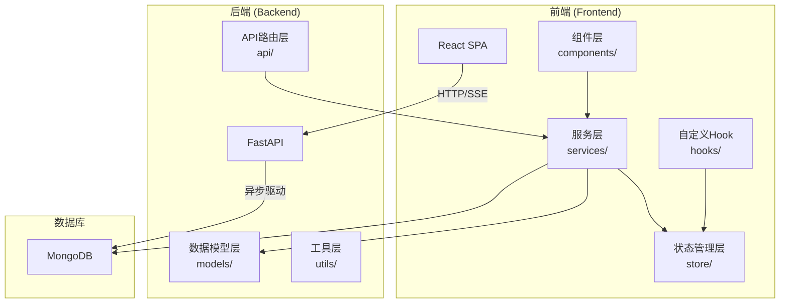
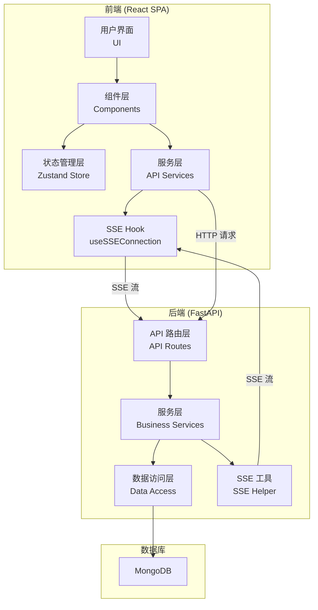
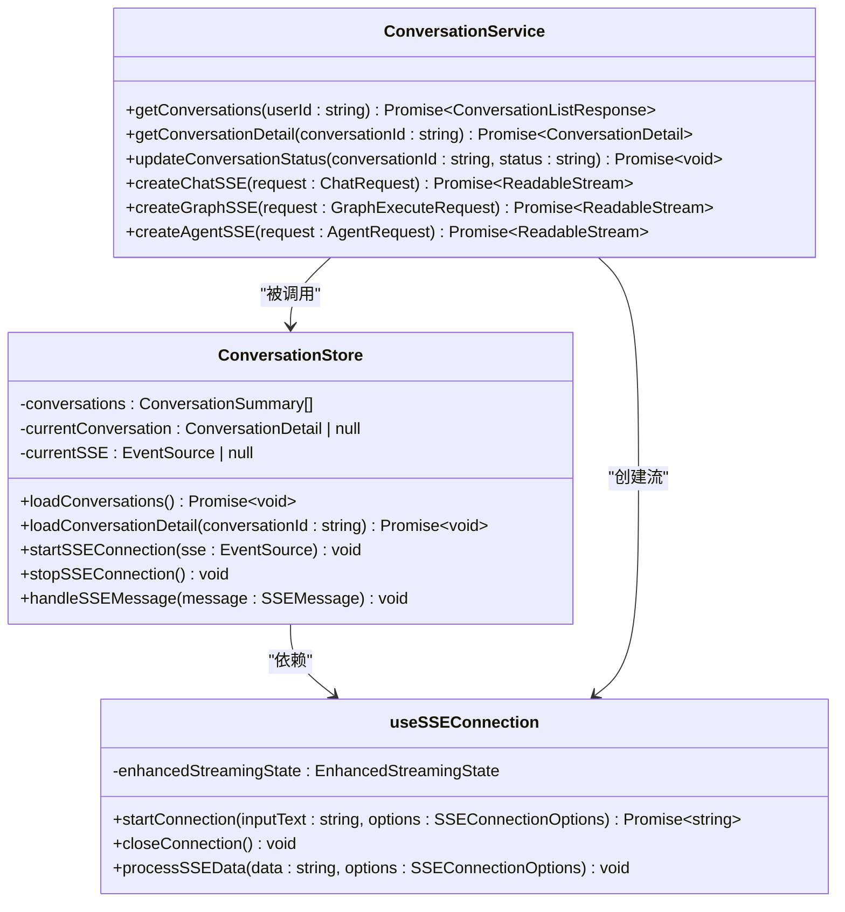
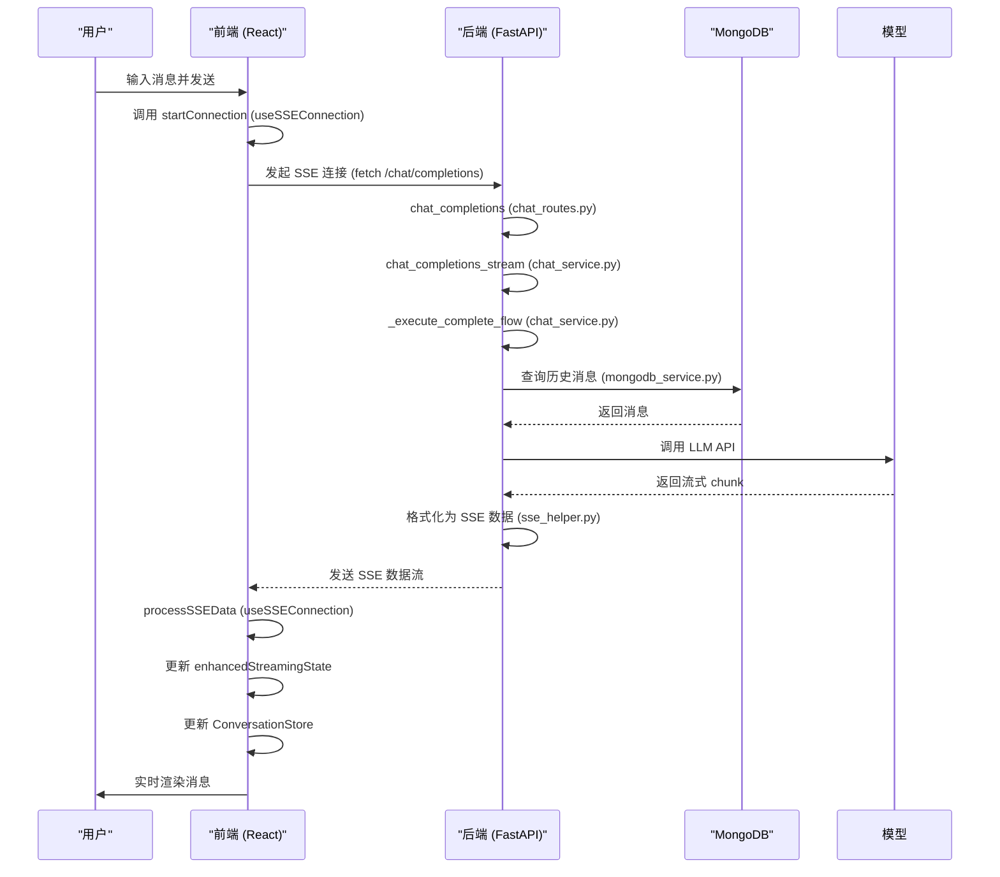
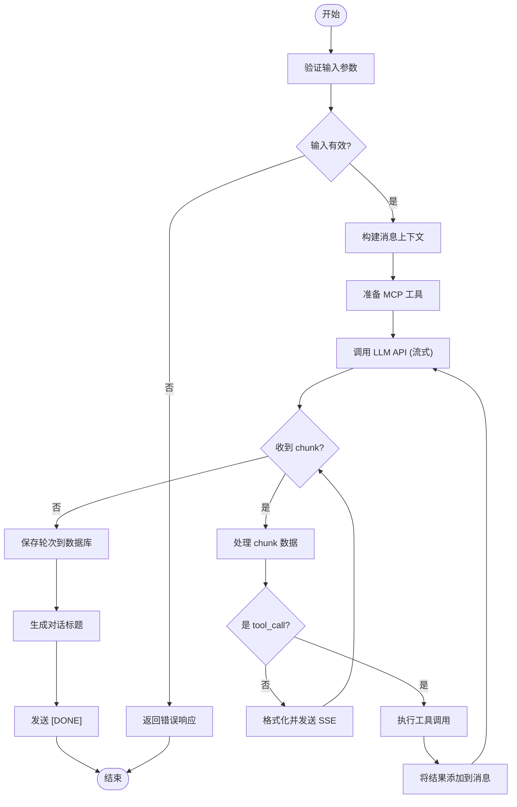
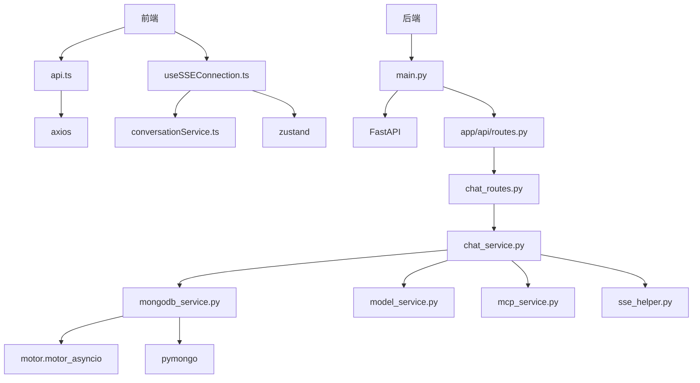

# 系统架构

<cite>
**本文档引用的文件**
- [api.ts](file://frontend/src/services/api.ts)
- [main.py](file://mag/main.py)
- [useSSEConnection.ts](file://frontend/src/hooks/useSSEConnection.ts)
- [sse_helper.py](file://mag/app/utils/sse_helper.py)
- [chat_routes.py](file://mag/app/api/chat_routes.py)
- [chat_service.py](file://mag/app/services/chat_service.py)
- [mongodb_service.py](file://mag/app/services/mongodb_service.py)
- [conversationStore.ts](file://frontend/src/store/conversationStore.ts)
- [conversationService.ts](file://frontend/src/services/conversationService.ts)
</cite>

## 目录
1. [简介](#简介)
2. [项目结构](#项目结构)
3. [核心组件](#核心组件)
4. [架构概述](#架构概述)
5. [详细组件分析](#详细组件分析)
6. [依赖分析](#依赖分析)
7. [性能考虑](#性能考虑)
8. [故障排除指南](#故障排除指南)
9. [结论](#结论)

## 简介
mcp-agent-graph-p 是一个前后端分离的系统，前端采用 React 单页应用（SPA）架构，后端采用 FastAPI 构建的 RESTful 服务。系统旨在通过 MCP（Model-Controller-Presenter）模式和图（Graph）结构来构建智能 Agent 系统。前端通过 `api.ts` 中定义的 API 客户端与后端进行通信，并利用 Server-Sent Events (SSE) 实现从服务器到客户端的实时消息推送。系统采用分层架构，前端包含组件层、状态管理层（使用 Zustand）和服务层；后端则包含 API 路由层、服务层和数据访问层。系统各组件（前端、后端、MongoDB）之间通过明确定义的数据流和控制流进行交互。选择 FastAPI 是因为其高性能和对异步操作的原生支持，选择 React Flow 是为了实现图的可视化编辑，选择 Zustand 是为了提供轻量级的状态管理。

## 项目结构

**图来源**
- [main.py](file://mag/main.py#L1-L120)
- [api.ts](file://frontend/src/services/api.ts#L1-L14)

## 核心组件

系统的核心组件包括前端的 React 应用、后端的 FastAPI 服务以及 MongoDB 数据库。前端通过 `api.ts` 文件中的 `axios` 实例与后端建立通信，后端通过 `main.py` 中定义的 FastAPI 应用暴露 RESTful API 接口。`useSSEConnection.ts` 钩子负责管理前端的 SSE 连接，实现流式数据接收。后端的 `sse_helper.py` 提供了格式化 SSE 数据的工具类，确保消息能够被前端正确解析。`chat_routes.py` 定义了聊天相关的 API 路由，`chat_service.py` 实现了聊天业务逻辑，而 `mongodb_service.py` 则封装了与 MongoDB 的所有数据交互。

**节来源**
- [api.ts](file://frontend/src/services/api.ts#L1-L14)
- [main.py](file://mag/main.py#L1-L120)
- [useSSEConnection.ts](file://frontend/src/hooks/useSSEConnection.ts#L1-L523)
- [sse_helper.py](file://mag/app/utils/sse_helper.py#L1-L400)

## 架构概述

**图来源**
- [main.py](file://mag/main.py#L1-L120)
- [chat_routes.py](file://mag/app/api/chat_routes.py#L1-L450)
- [chat_service.py](file://mag/app/services/chat_service.py#L1-L447)
- [mongodb_service.py](file://mag/app/services/mongodb_service.py#L1-L421)
- [useSSEConnection.ts](file://frontend/src/hooks/useSSEConnection.ts#L1-L523)

## 详细组件分析

### 前端通信与状态管理分析

#### 对象导向组件分析

**图来源**
- [conversationService.ts](file://frontend/src/services/conversationService.ts#L1-L255)
- [conversationStore.ts](file://frontend/src/store/conversationStore.ts#L1-L365)
- [useSSEConnection.ts](file://frontend/src/hooks/useSSEConnection.ts#L1-L523)

#### API/服务组件分析

**图来源**
- [useSSEConnection.ts](file://frontend/src/hooks/useSSEConnection.ts#L1-L523)
- [chat_routes.py](file://mag/app/api/chat_routes.py#L1-L450)
- [chat_service.py](file://mag/app/services/chat_service.py#L1-L447)
- [mongodb_service.py](file://mag/app/services/mongodb_service.py#L1-L421)

### 后端服务与数据流分析

#### 复杂逻辑组件分析

**图来源**
- [chat_service.py](file://mag/app/services/chat_service.py#L1-L447)
- [mongodb_service.py](file://mag/app/services/mongodb_service.py#L1-L421)
- [sse_helper.py](file://mag/app/utils/sse_helper.py#L1-L400)

**节来源**
- [conversationService.ts](file://frontend/src/services/conversationService.ts#L1-L255)
- [conversationStore.ts](file://frontend/src/store/conversationStore.ts#L1-L365)
- [useSSEConnection.ts](file://frontend/src/hooks/useSSEConnection.ts#L1-L523)
- [chat_routes.py](file://mag/app/api/chat_routes.py#L1-L450)
- [chat_service.py](file://mag/app/services/chat_service.py#L1-L447)
- [mongodb_service.py](file://mag/app/services/mongodb_service.py#L1-L421)

## 依赖分析

**图来源**
- [main.py](file://mag/main.py#L1-L120)
- [chat_routes.py](file://mag/app/api/chat_routes.py#L1-L450)
- [chat_service.py](file://mag/app/services/chat_service.py#L1-L447)
- [mongodb_service.py](file://mag/app/services/mongodb_service.py#L1-L421)

**节来源**
- [main.py](file://mag/main.py#L1-L120)
- [chat_routes.py](file://mag/app/api/chat_routes.py#L1-L450)
- [chat_service.py](file://mag/app/services/chat_service.py#L1-L447)
- [mongodb_service.py](file://mag/app/services/mongodb_service.py#L1-L421)

## 性能考虑
该系统在性能方面进行了多项优化。后端采用 FastAPI 和异步编程模型，能够高效处理高并发的 SSE 连接，避免阻塞。`mongodb_service.py` 中使用了 `motor` 异步驱动，确保数据库 I/O 操作不会成为瓶颈。前端通过 `useSSEConnection.ts` 实现了分块渲染（chunked rendering），可以实时更新 UI 而无需等待整个响应完成，提升了用户体验。此外，`conversationStore.ts` 中实现了对话列表的本地缓存，减少了不必要的网络请求。后端的 `chat_service.py` 在处理工具调用时采用批处理方式，优化了与 MCP 服务的交互效率。

## 故障排除指南
当系统出现通信问题时，首先检查前端 `api.ts` 中的 `API_BASE_URL` 是否与后端 `main.py` 中的 `uvicorn.run` 端口（9999）匹配。如果 SSE 连接无法建立，检查后端路由是否正确注册（`main.py` 中的 `app.include_router`）以及 CORS 配置（`main.py` 中的 `CORSMiddleware`）。对于流式消息解析错误，应检查 `sse_helper.py` 的 `format_sse_data` 方法和前端 `useSSEConnection.ts` 的 `processSSEData` 方法，确保双方对 SSE 数据格式的理解一致。若出现数据库连接问题，请确认 `mongodb_service.py` 的 `initialize` 方法中的连接字符串和数据库名称配置正确。

**节来源**
- [api.ts](file://frontend/src/services/api.ts#L1-L14)
- [main.py](file://mag/main.py#L1-L120)
- [useSSEConnection.ts](file://frontend/src/hooks/useSSEConnection.ts#L1-L523)
- [sse_helper.py](file://mag/app/utils/sse_helper.py#L1-L400)
- [mongodb_service.py](file://mag/app/services/mongodb_service.py#L1-L421)

## 结论
mcp-agent-graph-p 系统通过清晰的前后端分离架构，实现了高效、实时的智能 Agent 交互。前端 React 应用提供了现代化的用户界面和流畅的用户体验，后端 FastAPI 服务凭借其高性能和异步特性，可靠地处理复杂的业务逻辑和数据流。通过 SSE 技术，系统实现了服务器到客户端的低延迟、高效率的消息推送。分层的架构设计使得代码结构清晰，易于维护和扩展。Zustand、React Flow 等技术选型体现了对开发效率和功能需求的综合考量。整体架构设计合理，为构建复杂的 Agent 系统提供了坚实的基础。