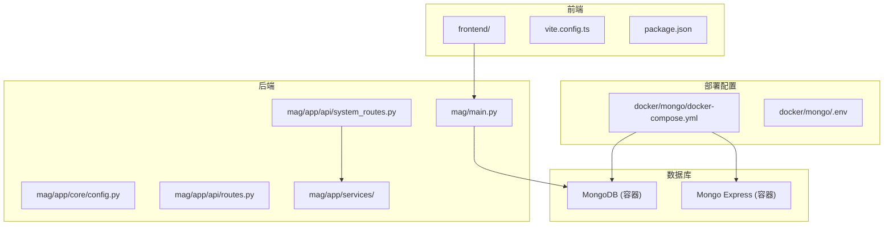
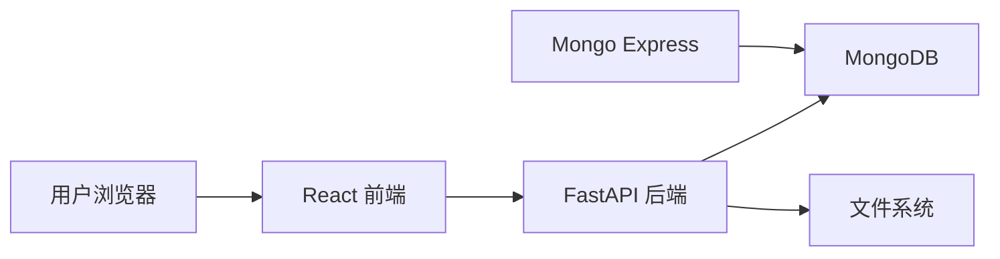
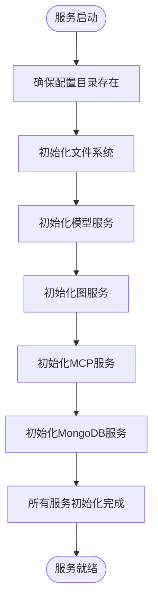
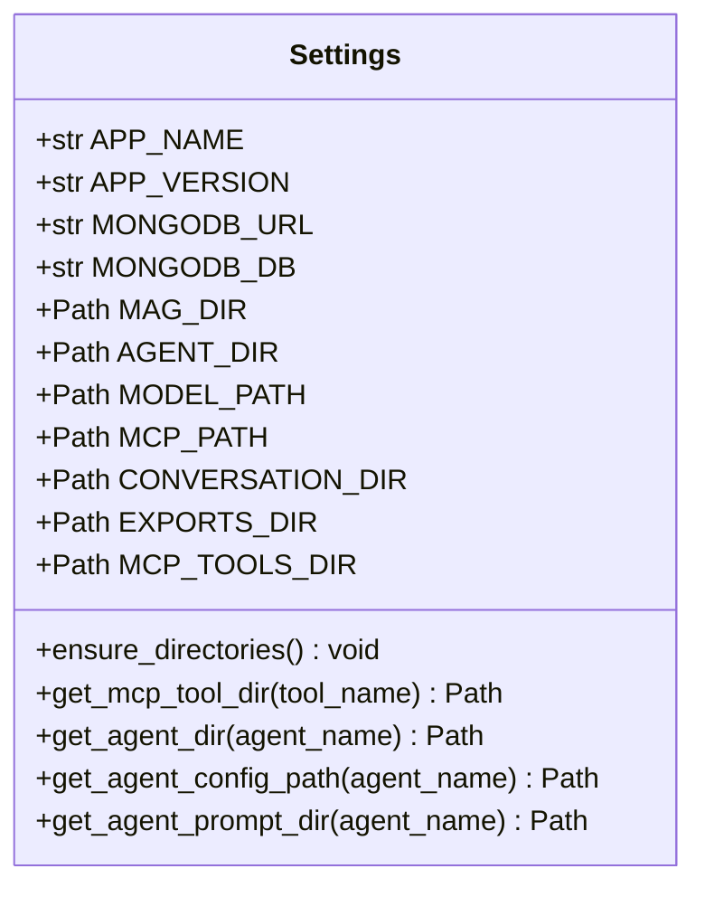
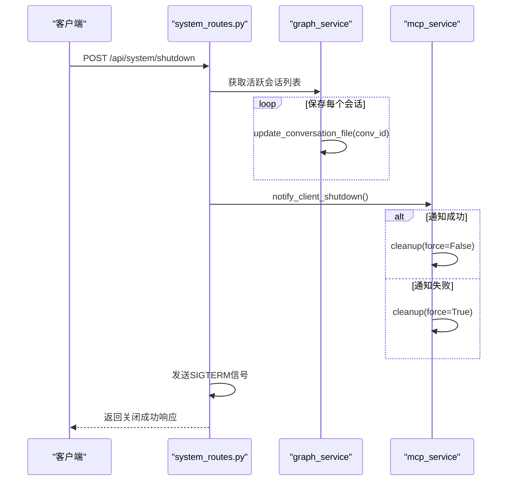
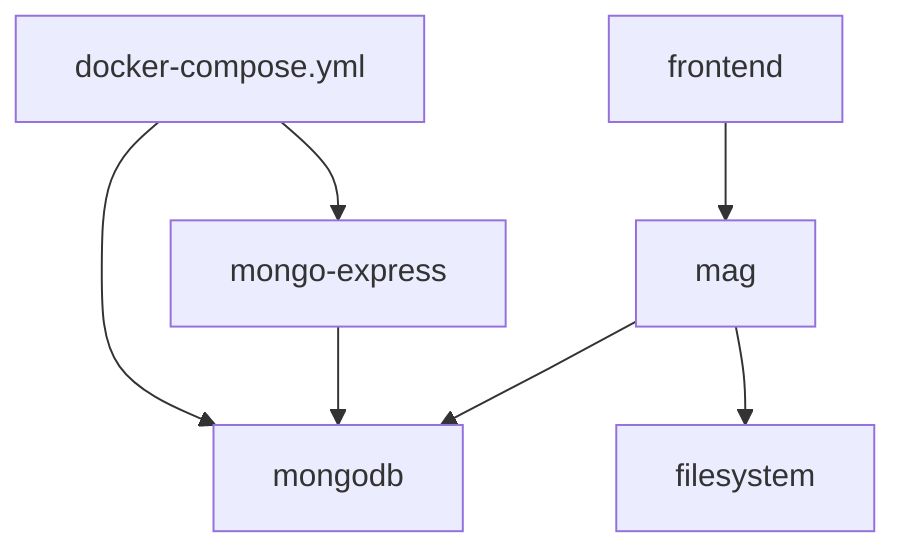

# 部署与运维

<cite>
**本文档引用的文件**  
- [docker-compose.yml](file://docker/mongo/docker-compose.yml)
- [main.py](file://mag/main.py)
- [config.py](file://mag/app/core/config.py)
- [system_routes.py](file://mag/app/api/system_routes.py)
</cite>

## 目录
1. [简介](#简介)
2. [项目结构](#项目结构)
3. [核心组件](#核心组件)
4. [架构概览](#架构概览)
5. [详细组件分析](#详细组件分析)
6. [依赖分析](#依赖分析)
7. [性能考虑](#性能考虑)
8. [故障排除指南](#故障排除指南)
9. [结论](#结论)

## 简介
本文档旨在为 `mcp-agent-graph-p` 项目的生产环境部署与运维提供全面指导。文档重点介绍基于 Docker Compose 的容器化部署流程，涵盖前端、后端及 MongoDB 数据库服务的配置方法。同时，详细说明环境变量的设置方式（如数据库连接字符串和 API 密钥），并针对单机部署与云服务器部署等不同场景提供优化建议。此外，文档还包含系统监控、管理功能（如通过 API 关闭系统）、性能调优策略以及数据备份与恢复方案。

## 项目结构
`mcp-agent-graph-p` 项目采用模块化设计，主要由前端（`frontend`）、后端（`mag`）、Docker 配置（`docker/mongo`）和示例（`sdk_demo`）四大部分构成。后端服务基于 FastAPI 框架开发，使用 MongoDB 作为持久化存储。Docker Compose 配置文件位于 `docker/mongo` 目录下，用于统一编排后端服务、数据库及管理界面。

**Diagram sources**
- [docker-compose.yml](file://docker/mongo/docker-compose.yml)
- [main.py](file://mag/main.py)
- [config.py](file://mag/app/core/config.py)

**Section sources**
- [docker-compose.yml](file://docker/mongo/docker-compose.yml)
- [main.py](file://mag/main.py)

## 核心组件
本项目的核心组件包括：基于 FastAPI 的后端服务、MongoDB 数据库、Mongo Express 管理界面以及 React 前端应用。后端服务负责处理所有业务逻辑，包括图生成、会话管理、MCP 工具集成等，并通过 RESTful API 与前端交互。MongoDB 用于存储图结构、会话记录和配置信息。前端应用提供用户友好的图形化操作界面。

**Section sources**
- [main.py](file://mag/main.py#L1-L120)
- [config.py](file://mag/app/core/config.py#L1-L102)

## 架构概览
系统采用典型的前后端分离架构。前端通过 HTTP 请求与后端 API 通信，后端服务处理请求并与 MongoDB 数据库交互。所有服务通过 Docker Compose 进行容器化部署，确保了环境的一致性和部署的便捷性。

**Diagram sources**
- [main.py](file://mag/main.py#L1-L120)
- [docker-compose.yml](file://docker/mongo/docker-compose.yml)

## 详细组件分析

### 后端服务分析
后端服务是整个系统的核心，由 `main.py` 文件启动，通过 `app.include_router(router, prefix="/api")` 注册所有 API 路由。服务启动时，通过 `@app.on_event("startup")` 事件处理器初始化文件系统、模型服务、图服务、MCP 服务和 MongoDB 服务。

#### 服务初始化流程

**Diagram sources**
- [main.py](file://mag/main.py#L50-L90)

**Section sources**
- [main.py](file://mag/main.py#L50-L90)

### 配置管理分析
系统的配置由 `config.py` 文件中的 `Settings` 类集中管理。该类通过读取 `.env` 文件中的环境变量来构建配置，支持跨平台（Windows、macOS、Linux）的目录路径管理。关键配置项包括数据库连接 URL、数据库名称以及各类数据存储目录。

#### 配置项依赖关系

**Diagram sources**
- [config.py](file://mag/app/core/config.py#L1-L102)

**Section sources**
- [config.py](file://mag/app/core/config.py#L1-L102)

### 系统管理功能分析
系统提供了通过 API 进行管理的功能，其中 `/system/shutdown` 接口允许用户优雅地关闭服务。该接口在关闭前会尝试保存所有活跃会话，确保数据不丢失。

#### 优雅关闭流程

**Diagram sources**
- [system_routes.py](file://mag/app/api/system_routes.py#L1-L62)

**Section sources**
- [system_routes.py](file://mag/app/api/system_routes.py#L1-L62)

## 依赖分析
项目的主要依赖关系清晰。后端服务（`mag`）依赖于 MongoDB 数据库和本地文件系统。前端服务依赖于后端提供的 API。Docker Compose 文件定义了服务间的依赖关系，确保 `mongo-express` 在 `mongodb` 服务启动后才启动。

**Diagram sources**
- [docker-compose.yml](file://docker/mongo/docker-compose.yml)
- [main.py](file://mag/main.py)

**Section sources**
- [docker-compose.yml](file://docker/mongo/docker-compose.yml)
- [main.py](file://mag/main.py)

## 性能考虑
在生产环境中，应根据实际负载调整 Docker 资源限制。`docker-compose.yml` 文件中已为 MongoDB 和 Mongo Express 服务设置了 CPU 和内存的限制与预留。建议在高并发场景下，增加 MongoDB 的内存分配，并考虑使用 MongoDB 的副本集以提高可用性和读取性能。此外，定期清理过期的会话和导出文件有助于维持系统性能。

## 故障排除指南
- **服务无法启动**：检查 `.env` 文件中的环境变量是否正确，特别是数据库用户名、密码和端口。
- **数据库连接失败**：确认 MongoDB 容器是否正常运行，并检查 `MONGODB_URL` 配置是否与容器端口映射匹配。
- **API 调用失败**：查看后端服务日志，通常位于容器的日志输出中，可使用 `docker logs` 命令查看。
- **前端无法加载**：确认前端构建是否成功，并检查其是否正确指向后端 API 地址。

**Section sources**
- [config.py](file://mag/app/core/config.py#L1-L102)
- [main.py](file://mag/main.py#L1-L120)

## 结论
`mcp-agent-graph-p` 项目通过 Docker Compose 实现了便捷的容器化部署，其模块化设计和清晰的配置管理使得系统易于维护和扩展。通过遵循本文档的指导，用户可以顺利地将该系统部署到生产环境，并利用其提供的 API 进行有效的系统管理和监控。