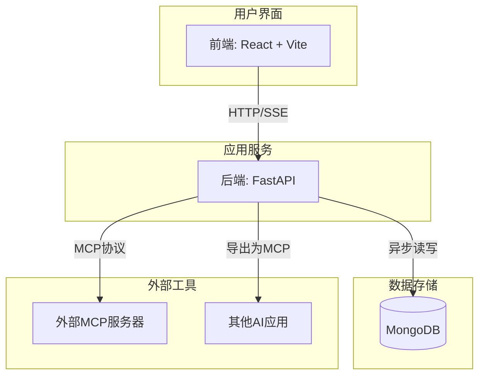

# 项目概述

<cite>
**本文档引用的文件**  
- [README_CN.md](file://README_CN.md)
- [package.json](file://frontend/package.json)
- [pyproject.toml](file://pyproject.toml)
- [main.py](file://mag/main.py)
- [config.py](file://mag/app/core/config.py)
- [mongodb_service.py](file://mag/app/services/mongodb_service.py)
- [ai_graph_generator.py](file://mag/app/services/graph/ai_graph_generator.py)
- [ai_mcp_generator.py](file://mag/app/services/mcp/ai_mcp_generator.py)
- [graph_executor.py](file://mag/app/services/graph/graph_executor.py)
- [graph_processor.py](file://mag/app/services/graph/graph_processor.py)
</cite>

## 目录
1. [简介](#简介)
2. [核心功能](#核心功能)
3. [系统架构](#系统架构)
4. [典型用户场景](#典型用户场景)
5. [技术栈](#技术栈)
6. [系统上下文图](#系统上下文图)
7. [结论](#结论)

## 简介

mcp-agent-graph-p（简称MAG）是一个高效、轻量且易于上手的智能体（Agent）开发框架，旨在通过可视化工作流编排和AI驱动的自动化，显著降低构建复杂智能体系统的门槛。该项目的核心理念是“需求到智能体”（need -> agent），即用户只需用自然语言描述其需求，系统便能自动生成一个完整的、可执行的智能体工作流。

与传统的代码开发框架（如langgraph、crewai）或通用的可视化编排平台不同，MAG通过深度集成MCP（Model Context Protocol）协议，实现了智能体与外部工具生态的无缝连接。它不仅是一个设计工具，更是一个完整的开发、执行和部署平台。其“从需求到Agent”一键生成的核心能力，使得无论是技术专家还是业务人员，都能在几分钟内将抽象的想法转化为功能强大的自动化解决方案，极大地加速了企业级AI应用的开发周期。

**Section sources**
- [README_CN.md](file://README_CN.md#L1-L234)

## 核心功能

mcp-agent-graph-p 提供了一系列创新且强大的功能，使其在智能体开发领域脱颖而出。

### 从需求到智能体（From need to Agent）

这是MAG最核心的功能。用户无需手动拖拽节点或编写代码，只需在前端界面输入对智能体的需求（例如：“创建一个能分析网页内容并生成摘要的智能体”），系统便会启动一个AI驱动的图生成流程。后端的`ai_graph_generator.py`服务会与大语言模型交互，将用户需求解析为一个包含多个节点的有向无环图（DAG）。该图定义了智能体的完整工作流，包括每个节点的角色、使用的模型、调用的工具以及节点间的执行顺序。整个过程通常在3分钟内完成，生成的图可直接在可视化编辑器中查看、修改和运行。

**Section sources**
- [README_CN.md](file://README_CN.md#L100-L113)
- [ai_graph_generator.py](file://mag/app/services/graph/ai_graph_generator.py)

### AI生成MCP工具（From need to MCP）

此功能面向未来，旨在实现工具开发的民主化。用户可以通过自然语言描述来创建定制的MCP工具（例如：“创建一个能计算任意数字阶乘的工具”）。`ai_mcp_generator.py`服务会引导AI生成符合MCP标准的完整Python代码，包括工具的实现、依赖管理、配置文件和文档。生成的工具会被自动部署到本地MCP服务器，并注册到系统配置中，使其可以立即被任何智能体调用。这使得非专业开发者也能轻松扩展智能体的能力边界。

**Section sources**
- [README_CN.md](file://README_CN.md#L115-L127)
- [ai_mcp_generator.py](file://mag/app/services/mcp/ai_mcp_generator.py)

### 图嵌套图（分层世界）

MAG引入了“图嵌套图”的架构创新，允许将一个完整的智能体图封装成一个节点，并在另一个更大的图中使用。这实现了“智能体中的智能体”（Agent-in-Agent）的分层设计。例如，可以先构建一个“文档分析”子图，然后将其作为一个节点集成到“知识管理”主图中。这种模块化设计极大地提升了系统的可维护性和可扩展性，使得构建复杂的大型系统成为可能。

**Section sources**
- [README_CN.md](file://README_CN.md#L129-L141)

### 图转MCP服务

此功能实现了智能体的标准化和生态化。用户可以将任何在MAG中设计的智能体图一键导出为一个标准的MCP Server Python脚本。导出的脚本包含了完整的依赖、配置和安装说明，完全符合MCP协议。这意味着该智能体可以被其他支持MCP的应用（如Claude Desktop、Cline等）直接调用，实现了“构建一次，处处运行”的愿景，促进了智能体在不同平台间的互操作性。

**Section sources**
- [README_CN.md](file://README_CN.md#L143-L155)

### 可视化图编辑器

MAG提供了一个基于React的可视化图编辑器，实现了“画布即代码”的理念。用户可以通过拖拽节点、连接线条来直观地构建和修改工作流。每个节点都可配置详细的参数，如提示词、模型、工具调用等。所见即所得的设计方式，让复杂的逻辑变得一目了然，极大地提升了开发效率和协作体验。

**Section sources**
- [README_CN.md](file://README_CN.md#L157-L169)
- [package.json](file://frontend/package.json)

## 系统架构

mcp-agent-graph-p 采用前后端分离的全栈架构，各组件职责清晰，协同工作。

### 前端（Frontend）

前端位于`frontend`目录，使用现代化的React + Vite技术栈构建。它依赖于`reactflow`库来实现可视化图编辑功能，并使用`antd`作为UI组件库。前端通过HTTP和SSE（Server-Sent Events）与后端进行通信，实现请求发送和实时流式响应的接收。其主要职责是提供用户交互界面，包括图编辑、MCP工具管理、模型配置和会话管理。

**Section sources**
- [package.json](file://frontend/package.json)

### 后端（Backend）

后端位于`mag`目录，是一个基于Python的FastAPI应用。`main.py`是应用的入口点，负责初始化FastAPI实例、注册路由和启动服务。后端通过定义清晰的API路由（如`graph_gen_routes.py`、`mcp_routes.py`）来处理前端的各种请求。

**Section sources**
- [main.py](file://mag/main.py)
- [pyproject.toml](file://pyproject.toml)

### 数据存储

项目使用MongoDB作为主要的数据存储。`mongodb_service.py`服务封装了所有与MongoDB的交互，包括会话管理、图生成记录、MCP工具生成记录和图执行日志的存储。它使用`motor`库进行异步操作，确保了高并发下的性能。数据被组织在不同的集合（collections）中，如`conversations`、`chat`、`graph_gen`等。

**Section sources**
- [mongodb_service.py](file://mag/app/services/mongodb_service.py)
- [config.py](file://mag/app/core/config.py)

### 核心服务

后端的核心服务由`app/services`目录下的模块实现：
- **图生成服务**：`ai_graph_generator.py`负责处理AI生成图的流式请求，与大模型交互并解析响应。
- **图执行服务**：`graph_executor.py`负责执行已生成的智能体图。它根据图的层级结构，按顺序或根据handoffs指令执行各个节点，并通过SSE将执行过程和结果实时推送给前端。
- **图处理服务**：`graph_processor.py`负责图的预处理，包括展开嵌套的子图和计算节点的执行层级，为图的执行提供扁平化的、有序的节点列表。

**Section sources**
- [ai_graph_generator.py](file://mag/app/services/graph/ai_graph_generator.py)
- [graph_executor.py](file://mag/app/services/graph/graph_executor.py)
- [graph_processor.py](file://mag/app/services/graph/graph_processor.py)

## 典型用户场景

### 新建工作流

用户进入前端的“图编辑器”页面，点击“新建图”或“AI生成图”。在AI生成模式下，输入需求后，后端`ai_graph_generator`服务被调用，与大模型交互生成图的配置。生成的图被保存到文件系统和MongoDB，并实时推送到前端画布上。

### AI生成Agent图

用户在聊天界面描述需求。前端通过`/api/graph_gen/stream` API发送流式请求。后端`ai_graph_generator.py`服务接收请求，调用大模型，并将模型的流式响应通过SSE转发给前端。当用户发送结束指令时，系统调用`_assemble_final_graph`方法，将解析结果组装成最终的图配置并保存。

### 集成外部工具

用户在“MCP管理器”中添加一个外部MCP服务器（如一个天气查询工具）。该服务器的配置被保存在`mcp.json`文件中。当用户在智能体图中配置一个节点使用该工具时，`graph_executor.py`在执行该节点时，会通过`mcp_service`调用该工具的API，并将结果返回给智能体。

## 技术栈

mcp-agent-graph-p 项目的技术栈选择体现了其现代化和高效的特点。

### 前端技术栈
- **框架**: React 19
- **构建工具**: Vite 6
- **UI库**: Ant Design 5
- **图可视化**: React Flow 11
- **状态管理**: Zustand
- **包管理**: npm

### 后端技术栈
- **框架**: FastAPI
- **编程语言**: Python 3.11+
- **异步库**: asyncio, aiohttp
- **数据库驱动**: motor (MongoDB异步驱动)
- **MCP协议库**: fastmcp, mcp[cli]
- **包管理**: uv (推荐), pip

### 数据库
- **数据库**: MongoDB

**Section sources**
- [package.json](file://frontend/package.json)
- [pyproject.toml](file://pyproject.toml)

## 系统上下文图

以下Mermaid图展示了mcp-agent-graph-p系统的整体上下文，包括前端、后端、数据库和外部工具之间的关系。

**Diagram sources**
- [main.py](file://mag/main.py)
- [mongodb_service.py](file://mag/app/services/mongodb_service.py)
- [ai_graph_generator.py](file://mag/app/services/graph/ai_graph_generator.py)
- [ai_mcp_generator.py](file://mag/app/services/mcp/ai_mcp_generator.py)

## 结论

mcp-agent-graph-p 是一个功能强大且极具创新性的智能体开发框架。它通过“从需求到Agent”的核心能力，将复杂的智能体开发过程简化为自然语言交互，极大地降低了技术门槛。其前后端分离的全栈架构（React + Vite + FastAPI + MongoDB）确保了系统的高性能和可维护性。项目不仅支持AI驱动的图生成和MCP工具创建，还通过图嵌套和图转MCP服务，实现了智能体的模块化、分层化和生态化。这些特性共同使得MAG成为构建企业级自动化解决方案的理想平台，能够快速响应业务需求，加速AI应用的落地。